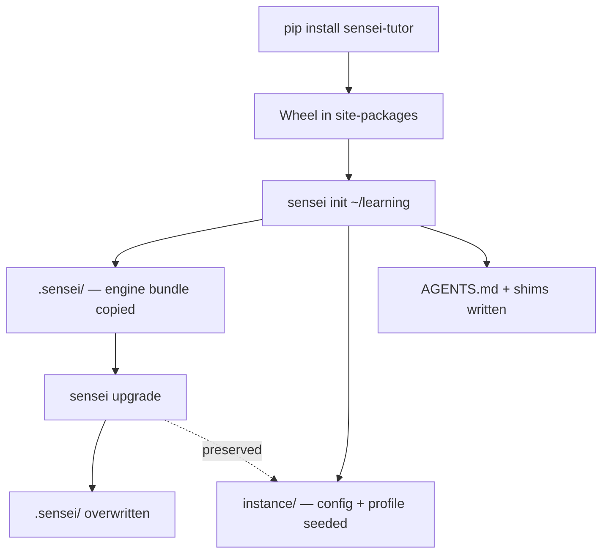

# ADR-0004: Sensei Distribution Model — pip + Local Engine Copy

## Context

Sensei is conceived as a pip-installable CLI that scaffolds a learning-environment folder. The user then opens that folder with any LLM agent and the agent becomes an adaptive mentor guided by prose-as-code context files.

This creates a fundamental tension: pip packages install into site-packages (opaque to LLM agents browsing a project), but the LLM needs local, browsable files to act on. The engine's markdown protocols, config, and prompts must be readable at runtime, which means they must live in the user's working directory, not in `site-packages/`.

## Decision

Sensei is distributed as a pip-installable Python package. Installation provides a CLI for scaffolding and mechanical operations. The engine's markdown and configuration files are copied into each instance as a local `.sensei/` directory so the LLM agent can read them directly from the instance root.

The split:

- **pip package (`pip install sensei-tutor`)** — CLI entry point (`sensei init/status/upgrade/verify`), engine bundle shipped inside the wheel, scaffolding templates. The distribution name is `sensei-tutor` per [ADR-0010](0010-pypi-distribution-name.md); the CLI, imports, and product identity remain `sensei`.
- **Distributed instance (after `sensei init <path>`)** — `.sensei/` directory (engine copy), `instance/` directory (user config), tool-specific shim files (per [ADR-0003](0003-tool-specific-agent-hooks.md)), `AGENTS.md` boot document.

Upgrades are explicit via `sensei upgrade`. The engine files in `.sensei/` are committed to the instance's git history so instances are portable (clone and run) and upgrades are visible in version history.

Packaging details:

- Build backend: hatchling.
- Runtime file access: `importlib.resources.files("sensei.engine")`.
- Dependencies: `click`, `pyyaml`.
- Python: ≥3.10.
- Entry point: `[project.scripts] sensei = "sensei.cli:main"`.
- Schema versioning: `schema_version` in `defaults.yaml`, incremented independently of the pip package SemVer.

<!-- Diagram: illustrates §Decision -->

*Figure 1. Distribution flow: install delivers the wheel; init copies the engine; upgrade overwrites engine only.*

## Alternatives Considered

- **Pure pip (engine in site-packages, accessed via `importlib.resources`).** Rejected because the LLM agent cannot browse site-packages; path resolution breaks when scripts live in site-packages while state lives in the user's working directory; and the "folder is the program" product identity requires local files.
- **Git submodule for the engine.** Rejected because submodules are painful for non-git-expert users and the update workflow is error-prone.
- **Hybrid: pip CLI + local file copy (Copier model).** Accepted. Files are local and LLM-readable; upgrades are deliberate (not silent); existing scaffolding patterns from sibling projects are proven.

## Consequences

The user experience is: `pip install sensei-tutor`, then `sensei init ~/learning`, then open `~/learning/` with any LLM agent. The folder is fully self-contained and portable.

The engine bundle is small (markdown + yaml + a handful of Python helpers). Copying it into every instance is cheap.

Upgrades use an overwrite-with-warning model. `.sensei/.sensei-version` tracks which package version was copied. If the user has locally modified engine files, the upgrade warns and lets them reconcile via `git diff`. Migration tooling for schema version bumps will be printed guided instructions for v1; automated migration scripts may be added later.

`sensei init` is idempotent — running it in a directory with an existing `.sensei/` errors out with a message pointing to `sensei upgrade` or `sensei init --force`.

## References

- [ADR-0002: Agent Bootstrap](0002-agent-bootstrap.md) — the `.sensei/engine.md` path used by the bootstrap chain
- [ADR-0003: Tool-Specific Agent Hook Files](0003-tool-specific-agent-hooks.md) — shims generated by `sensei init`
