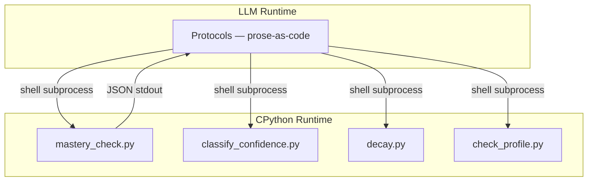

# ADR-0006: Hybrid Runtime — Scripts Compute, Protocols Judge

## Context

Sensei's product vision is "a program written in prose, executed by any LLM, with persistent state stored in yaml and markdown." At the same time, the ideation (§3.6, §8.1, §8.5, §8.6) specifies behaviors that require reliable arithmetic: mastery-threshold gates that must hold deterministically for the assessor exception, FSRS review scheduling with a 21-parameter ML model, FIRe fractional-credit propagation across a knowledge graph, decay arithmetic on the forgetting curve, and confidence×correctness quadrant classification.

LLMs are unreliable at exactly this kind of work. Across sessions and models, arithmetic drifts; thresholds flicker; graph propagation is essentially unreachable. An earlier analyst review flagged this as the single largest blocker to shipping a correct pedagogical product: "Without a validation layer and a home for the math, profiles will rot within days."

The question is not whether Sensei needs computation — the ideation answers that. The question is **where the computation runs**: in the LLM's head (pure scaffolding, every agent rolls its own arithmetic) or in a shipped runtime (Sensei ships deterministic helpers that protocols invoke).

## Decision

Sensei adopts a **hybrid runtime**: the pip package ships both prose-as-code protocols (executed by the LLM) and deterministic Python helpers (executed by CPython). Protocols invoke helpers via shell subprocess when they need arithmetic or validation. The split is captured in one sentence:

> **Scripts compute what can be computed; protocols judge what requires understanding.**

### V1 scope — helpers that ship with the first protocol

1. **Config deep-merge** (already shipped: `scripts/config.py`).
2. **Mastery threshold check** — given a profile + topic + threshold, return pass/fail. Powers the assessor exception hard rule (§3.6).
3. **Confidence × correctness classification** — given a confidence label and a correctness label, return the quadrant label (mastered / misconception / fragile / gap) per §8.5.
4. **Forgetting-curve decay** — given a last-seen timestamp, decay parameters, and `now`, return a fresh-score or days-until-stale.
5. **Schema validators** (`scripts/check-*.py`) — assert agent-written yaml conforms to registered schemas. One check per state file once schemas land.

### V2 scope — deferred to a later ADR

1. **FSRS full scheduler** — 21-parameter ML model, requires training data and per-learner calibration.
2. **FIRe fractional credit propagation** — requires the prerequisite graph and the encompassing graph (two independent structures per §8.6).
3. **Per-student-per-topic speed calibration** — requires multi-session history accumulation.
4. **Affect detection** — inherently non-deterministic; if it ships, it will be a prompt-based subroutine, not a Python helper.

> **Note (v0.1.0a15):** Emotional state tracking was promoted to v1 and shipped — see [docs/specs/emotional-state-tracking.md](../specs/emotional-state-tracking.md). Cross-goal intelligence (concept tags) was promoted to v1 — see [docs/specs/cross-goal-intelligence.md](../specs/cross-goal-intelligence.md).

The v1 / v2 split follows a clean line: **v1 ships only arithmetic that works from a single profile snapshot**; **v2 ships anything requiring cross-session history, graph reasoning, or ML calibration.**

### Invocation style

Protocols call helpers via raw shell subprocess, e.g.:

```
python .sensei/scripts/mastery-check.py --profile instance/profile.yaml --topic recursion --threshold 0.9
```

The helper prints a JSON line to stdout and exits 0 on success, non-zero on violation. Each helper is importable as a library function AND exposed as a thin CLI wrapper, so Python code can use the function directly while protocols use the CLI.

A unified `sensei compute <op>` facade is explicitly **deferred**. If the script inventory grows past ~10 helpers and the bare paths become noisy in protocols, a later ADR can introduce the facade without breaking existing protocols.

### MCP deferred

An MCP tool-server path is considered but not adopted at v1. Shell subprocess is the lowest common denominator across the target agents (Claude Code, Cursor, Kiro, Aider, Copilot agent mode). MCP adds a running-server requirement that complicates the "open a folder" product promise and excludes Aider, which does not support MCP natively. A later ADR may add MCP as an alternate invocation path if demand materializes.

<!-- Diagram: illustrates §Decision -->

*Figure 1. Hybrid runtime: protocols (LLM) invoke scripts (CPython) via subprocess. Scripts compute; protocols judge.*

## Alternatives Considered

- **Pure scaffolding (LLM does all arithmetic).** Rejected because LLM arithmetic is unreliable in exactly the places Sensei needs determinism (mastery gates, scheduling, graph propagation). The assessor exception would not survive contact with a real session. The analyst review's "profiles will rot within days" finding is load-bearing here.
- **Full ML stack at v1 (FSRS, FIRe, affect detection all shipped immediately).** Rejected because it blocks shipping. Each of those pieces is a research-grade component that requires careful validation; loading them into v1 guarantees that v1 doesn't ship.
- **MCP tool server as the only invocation path.** Rejected at v1 because it excludes Aider and adds a running-process requirement. Shell subprocess works in more places with less ceremony.
- **CLI facade (`sensei compute ...`) at v1.** Rejected as premature. The v1 helper set is small (4–5 scripts); a dispatch layer adds complexity without proportional benefit. Revisit when the helper count grows.

## Consequences

Sensei's "works with any LLM agent" promise narrows to **"works with any LLM agent that can invoke a shell subprocess"** — which is every major coding-agent target (Claude Code, Cursor, Kiro, Aider, Copilot in agent mode). Pure-web agents without shell access (ChatGPT custom GPTs, Claude web UI) are explicitly not a v1 target; a later pass can consider them via MCP.

Protocols become testable: a schema validator's output is deterministic, so `pytest` can assert protocol behavior via the helpers protocols invoke. This directly addresses the analyst's "how do we verify the mentor behaves correctly" gap.

`docs/sensei-implementation.md` is updated to mark "Open Design Question" as resolved by this ADR and to add a concrete v1 helper inventory.

`src/sensei/engine/scripts/` becomes the home for the v1 helpers. Each helper ships with unit tests under `tests/scripts/`.

The assessor exception (§3.6) becomes enforceable: mastery checks run through `scripts/mastery-check.py`, not through the LLM's arithmetic. The hard rule "never teach during assessment" gains a deterministic gate.

## References

- [`docs/sensei-implementation.md`](../sensei-implementation.md) — updated to reflect this ADR
- [`ADR-0004: Sensei Distribution Model`](0004-sensei-distribution-model.md) — pip + `.sensei/` model that this ADR fills in with actual runtime content
- `docs/specs/review-protocol.md` § Invariants — assessor exception (originally §3.6)
- P-forgetting-curve-is-curriculum — FSRS/spacing basis (originally §8.1)
- `src/sensei/engine/scripts/classify_confidence.py` — confidence × correctness (originally §8.5)
- ADR-0006 § V2 scope — FIRe/dual-graphs (originally §8.6)
