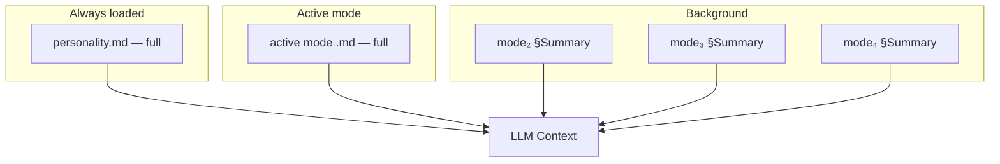

# ADR-0013: Context Composition Strategy — Active Mode + Summaries

## Context

Sensei's four behavioral modes (tutor, assessor, challenger, reviewer) exist as separate `.md` authoring files for tuning each behavioral pattern. However, modes are a **design abstraction, not a runtime abstraction** (PRODUCT-IDEATION.md §3.5). What loads into the LLM must be a composed set of principles, not four separate mode definitions.

LLM prompt attention is finite. Research on prompt attention dilution shows that loading all behavioral content simultaneously degrades adherence to any single principle. The engine needs a composition strategy that preserves authoring modularity while delivering focused runtime context.

The four mode files (`tutor.md`, `assessor.md`, `challenger.md`, `reviewer.md`) still exist as authoring tools. The question is: how does the engine compose them into the context window at runtime?

## Decision

The engine composes one unified principle set from per-mode authoring files using a **focused loading strategy**:

1. **Base personality** — always loaded in full (identity, relationship, universal principles).
2. **Active mode's full content** — the behavioral emphasis most relevant to the current interaction is loaded completely.
3. **Brief summaries of other modes** — one-paragraph distillations of the remaining three modes, sufficient for the LLM to recognize when a mode transition is warranted.

This produces a single coherent principle set in the context window rather than four competing instruction blocks. The LLM sees one mentor with emphasized behaviors, not four personas jostling for attention.

Mode transitions are signaled by conversational context (learner asks a question → tutor emphasis; learner submits code → reviewer emphasis). The engine recomposes the context when emphasis shifts.

<!-- Diagram: illustrates §Decision -->

*Figure 1. Context composition: full personality + full active mode + brief summaries of inactive modes.*

## Alternatives Considered

### A. Load all four mode files simultaneously

Load `tutor.md` + `assessor.md` + `challenger.md` + `reviewer.md` in full into every prompt.

**Rejected.** Prompt attention dilution causes the LLM to under-weight principles from any single mode. When everything is emphasized, nothing is emphasized. Empirically, models follow instructions better when the relevant instructions are foregrounded and irrelevant ones are minimized.

### B. Hard-switch between mode files

Load only the active mode file; other modes are completely absent from context.

**Rejected.** Produces jarring transitions — the LLM has no awareness of other behavioral patterns and cannot recognize when a shift is appropriate. Cross-mode state (e.g., a teaching moment arising during code review) is lost entirely. The learner experiences discontinuity rather than a unified mentor.

### C. Single monolithic personality file

Merge all mode content into one large file authored as a single document.

**Rejected.** Unmanageable authoring experience. Tuning assessor behavior requires wading through tutor and challenger content. No separation of concerns for contributors. Merge conflicts multiply. The authoring abstraction of separate mode files exists precisely to avoid this.

## Consequences

### Positive

- Focused context window: the LLM attends strongly to the active behavioral emphasis.
- Smooth transitions: summaries of other modes let the LLM recognize when emphasis should shift.
- Authoring modularity preserved: contributors edit mode files independently.
- Fits the product model: composition logic lives in deterministic code (Layer 1), not in LLM reasoning.

### Negative

- Requires a summarization step: each mode file needs a maintained one-paragraph summary for inclusion in non-active slots.
- Composition logic adds complexity to the engine's context-building pipeline.
- Mode detection heuristics must be tuned — incorrect emphasis selection degrades the experience.

## References

- [P-principles-not-modes](../foundations/principles/principles-not-modes.md) — "Principles, Not Mode-Switching": modes are authoring abstractions, not runtime abstractions.
- [P-mentor-relationship](../foundations/principles/mentor-relationship.md) — "One Mentor, Principle-Driven Behavior": Sensei is one personality, not four agents.
- [ADR-0012: Adopt `docs/foundations/` for Cross-Cutting Concerns](0012-foundations-layer.md) — foundations layer where base personality principles reside.
