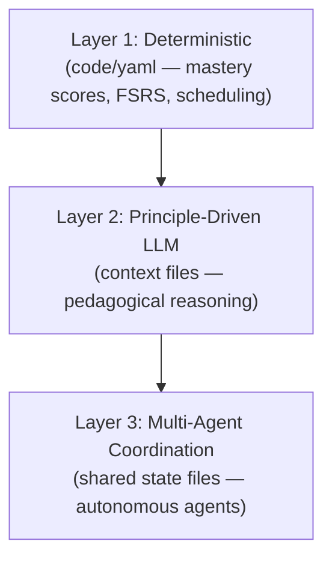

# ADR-0014: Principles Over State Machines for LLM Pedagogy

## Context

The initial design considered deterministic state machines for pedagogical decisions — explicit transition graphs governing when to teach, assess, challenge, or review. This is the conventional approach in intelligent tutoring systems (ITS).

However, research conducted during the ideation phase (PRODUCT-IDEATION.md §3.1) produced strong evidence that LLM-driven pedagogy with principle-based guardrails outperforms deterministic pedagogical state machines:

| Evidence | Finding |
|----------|---------|
| **StratL** | The narrow finding motivating state machines: naive GPT-4o prompting, 17 students, 2 math problems. The same lab moved past it. |
| **PedagogicalRL-Thinking (2025)** | +134% learning improvement with LLM chain-of-thought for pedagogical decisions. |
| **Google's LearnLM** | +31% expert preference. Their conclusion: *"Pedagogy is prohibitively difficult to define"* for all contexts. |
| **Harvard RCT** | AI tutoring (no state machines) produced **2× learning gains** vs active learning. |
| **GPT-5.2** | 0% answer leakage with just a pedagogical prompt — the failure that motivated state machines is disappearing. |
| **Khanmigo** | 700K+ users with LLM-driven Socratic tutoring, no transition graphs. |

The product constraint is decisive: Sensei ships as a pip package that works with *any* LLM agent. We cannot ship a state-machine runtime that intercepts and orchestrates arbitrary agents. We *can* ship well-crafted principle-based context files.

## Decision

Use **principle-driven LLM pedagogy** over deterministic state machines. The architecture separates concerns into three layers:

### Layer 1: Deterministic (code/yaml)

- Mastery scores, spaced repetition queue (FSRS), session scheduling.
- Hard guardrails: never reveal answers, enforce mastery gates.
- These are **data/scheduling problems**, not reasoning problems.

### Layer 2: Principle-Driven LLM (agent context files)

- *"Use Socratic questioning before direct explanation."*
- *"If the learner has failed twice, diagnose prerequisites before trying a third explanation."*
- *"When frustration is detected, reduce difficulty and acknowledge struggle."*
- *"Silence is a valid pedagogical action — don't intervene when the learner is productively struggling."*
- The LLM reasons about **how** to apply these principles given the specific learner context.

### Layer 3: Multi-Agent Coordination

- Agents reason autonomously, share state through files.
- No central rules engine orchestrating them.
- Each agent has its own principles and role.

Pedagogical judgment lives in Layer 2. The LLM decides *how* to teach; deterministic code decides *what* to teach next and *whether* mastery has been achieved.

<!-- Diagram: illustrates §Decision -->

*Figure 1. Three-layer architecture: deterministic computation at the base, principle-driven LLM reasoning in the middle, multi-agent coordination at the top.*

## Alternatives Considered

### A. Full deterministic state machine

Explicit state graphs for all pedagogical transitions (teach → assess → remediate → advance).

**Rejected.** Google's LearnLM team concluded pedagogy is "prohibitively difficult to define" for all contexts. A state machine either under-specifies (leaving gaps the LLM fills unpredictably) or over-specifies (producing rigid, unnatural interactions). The StratL finding that motivated this approach was narrow (17 students, 2 problems) and the same lab moved past it.

### B. Hybrid state machine + LLM override

State machine as default with LLM allowed to override transitions when confidence is high.

**Rejected.** Adds complexity without clear benefit. The override logic itself requires pedagogical judgment — the same judgment we'd be trying to encode in the state machine. Creates two competing decision-makers with unclear precedence.

### C. Pure LLM with no deterministic layer

Let the LLM handle everything including scheduling, scoring, and mastery gates.

**Rejected.** LLMs have compulsive intervention bias (MetaCLASS: models intervene 8–10× more than appropriate). Mastery scoring and spaced repetition are mathematical — they should be computed, not reasoned about. Hard guardrails (never reveal answers during assessment) must be enforced absolutely, not probabilistically.

## Consequences

### Positive

- **Enables the product model.** Principle-based context files ship in a pip package and make any frontier LLM a good tutor without requiring a state-machine runtime.
- **Scales with LLM capability.** As models improve at following instructions (GPT-5.2: 0% leakage), the principle-based approach gets stronger without code changes.
- **Authoring is accessible.** Principles are written in natural language prose, not transition graph DSLs. Contributors tune pedagogy by editing markdown.
- **Validated at scale.** Khanmigo demonstrates 700K+ users with this approach; Harvard RCT demonstrates 2× learning gains.

### Negative

- **Depends on frontier model quality.** Weaker models may not follow principles reliably. Mitigated by Layer 1 hard guardrails for critical invariants.
- **Harder to debug.** Principle violations are probabilistic, not deterministic failures. Mitigated by transcript fixtures (ADR-0011) and the review protocol.
- **No formal guarantees.** Cannot prove pedagogical correctness the way a state machine's reachability can be verified. Accepted trade-off given the evidence.

## References

- [P-principles-not-modes](../foundations/principles/principles-not-modes.md) — "Principles Over Rules — The Core Decision": full evidence table and three-layer architecture.
- [ADR-0006: Hybrid Runtime — Scripts Compute, Protocols Judge](0006-hybrid-runtime-architecture.md) — establishes the deterministic/LLM boundary that this ADR's Layer 1/Layer 2 split instantiates.
- [ADR-0011: Transcript Fixtures as a Verification Artifact](0011-transcript-fixtures.md) — verification mechanism for principle adherence.
- [`docs/research/reports/llm-driven-pedagogy.md`](../research/reports/llm-driven-pedagogy.md) — full research report on LLM-driven pedagogy.
- [`docs/research/reports/agentic-pedagogy.md`](../research/reports/agentic-pedagogy.md) — full research report on agentic pedagogy.
