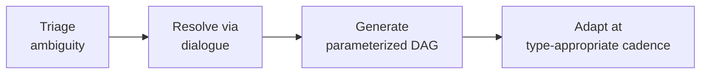

# ADR-0015: Unified Goal-Processing Pipeline with Type-Sensitive Parameters

## Context

Sensei must handle diverse learning goals: well-defined domain mastery ("master data structures"), skill-in-context ("learn Rust for systems programming"), performance goals ("prepare for interviews"), vague aspirations ("understand distributed systems deeply"), time-bounded sprints ("get productive in Python in 2 weeks"), and career transitions ("switch from Java backend to React frontend").

An early design instinct was to build per-goal-type strategies — a different processing path for each category. This would mean separate triage logic, separate curriculum shapes, and separate adaptation cadences for each type. PRODUCT-IDEATION.md §5.3 observed that despite surface differences, every goal decomposes into the same three unknowns: prior state (what does the learner already know?), target state (what does "done" look like?), and constraints (what shapes the path — time, context, depth, application domain). Goal types differ not in structure but in which unknown is hardest to resolve.

The question is whether to build one pipeline that handles all goal types or multiple specialized strategies.

## Decision

Sensei uses **one goal-processing pipeline with type-sensitive parameters** rather than per-goal-type strategies.

The pipeline follows four stages:

1. **Triage ambiguity** — determine which of the three unknowns (prior state, target state, constraints) needs resolving first for this particular goal.
2. **Resolve via minimal dialogue** — one or two sharp questions, not a questionnaire. The first lesson itself is the primary resolution mechanism.
3. **Generate a parameterized DAG** — always a dependency graph, but shape varies by goal type: deep vs. wide, pruned vs. expansive, interleaved vs. linear.
4. **Adapt at type-appropriate cadence** — well-defined domains evolve slowly as the structure is stable. Vague aspirations evolve rapidly as the target itself shifts.

The three-unknowns framework is universal. What changes per goal type is:

| Goal Type | Hard Unknown | Pipeline Consequence |
|-----------|-------------|---------------------|
| Well-defined domain | Prior state | Calibration-heavy early interactions |
| Skill + context | Domain weaving | Interleaved DAG structure |
| Performance goal | Multi-track coordination | Parallel tracks with convergence points |
| Vague aspiration | Target state | Rapid DAG evolution as target clarifies |
| Time-bounded | Depth calibration | Aggressive pruning parameters |
| Career transition | Transfer mapping | Explicit carry-over/gap analysis |

Type sensitivity lives in the parameters, not in the pipeline structure.

<!-- Diagram: illustrates §Decision -->

*Figure 1. Unified goal pipeline: one pipeline for all goal types, with type-sensitive parameters at each stage.*

## Alternatives Considered

### A. Per-goal-type strategy classes

Build a separate processing strategy for each goal category (e.g., `WellDefinedDomainStrategy`, `VagueAspirationStrategy`), each with its own triage, generation, and adaptation logic.

**Rejected.** The structural similarity across goal types means most logic would be duplicated. Worse, new goal types (inevitable as the product evolves) would each require a new strategy class. The combinatorial explosion when goals blend types (e.g., a time-bounded vague aspiration) makes strategy selection itself a hard problem. One pipeline with parameters is simpler, more extensible, and matches the insight that the three-unknowns framework is universal.

### B. Goal-type detection as a first-class classification step

Run a classifier to determine goal type before entering the pipeline, then branch on the classification.

**Rejected.** Goals frequently blend types, and classification errors propagate through the entire pipeline. The unified pipeline sidesteps classification entirely — it triages which unknown is hardest, which is a continuous assessment rather than a discrete label. This is more robust to ambiguous or evolving goals.

### C. Defer goal processing — let the learner define the curriculum

Let the learner specify topics, ordering, and depth rather than generating a curriculum from the goal.

**Rejected.** Contradicts the product's core insight (§5.1): learners cannot reliably specify what they don't know. The curriculum-as-hypothesis model requires Sensei to generate and then correct, not to ask and then execute.

## Consequences

### Positive

- One pipeline to build, test, and maintain instead of six (or more).
- New goal types require only new parameter profiles, not new pipeline code.
- Blended goals (time-bounded + vague) are handled naturally by combining parameter influences.
- Aligns with the three-unknowns framework from §5.3, keeping the conceptual model and the implementation model in sync.

### Negative

- Type-sensitive parameters must be carefully tuned — a single pipeline with bad parameters for a goal type performs worse than a dedicated strategy would.
- The pipeline must be flexible enough to accommodate future goal types that may stress the three-unknowns model in unforeseen ways.
- Debugging goal-processing issues requires understanding which parameters were active, adding observability requirements.

## References

- [P-curriculum-is-hypothesis](../foundations/principles/curriculum-is-hypothesis.md) — every goal decomposes into three unknowns: prior state, target state, constraints (originally §5.3).
- [`docs/specs/goal-lifecycle.md`](../specs/goal-lifecycle.md) — the unified approach: one pipeline with type-sensitive parameters (originally §5.4).
- [`docs/foundations/principles/curriculum-is-hypothesis.md`](../foundations/principles/curriculum-is-hypothesis.md) — curriculum generated immediately as hypothesis, not planned after assessment.
- [`docs/foundations/principles/know-the-learner.md`](../foundations/principles/know-the-learner.md) — the meta-pillar that collapses all goal types into a single representational framework.
