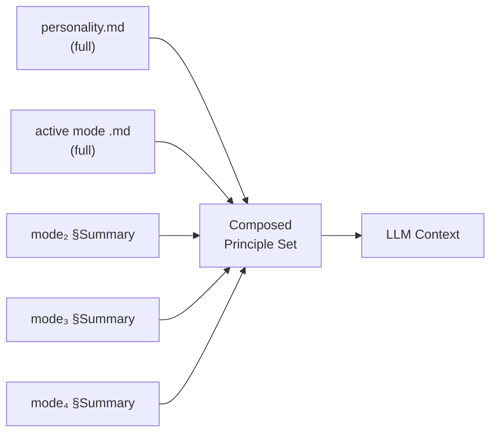
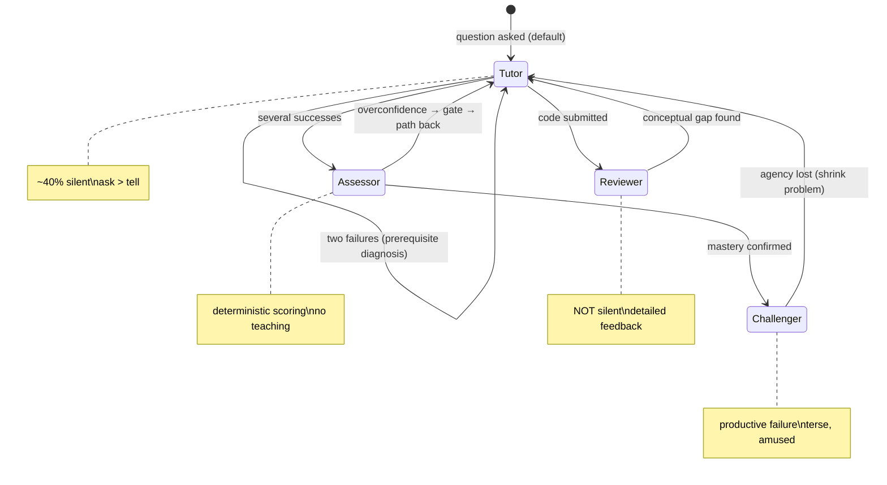

# Behavioral Modes — Composition & Orchestration

## Context

The [`docs/specs/behavioral-modes.md`](../specs/behavioral-modes.md) spec defines four behavioral modes (Tutor, Assessor, Challenger, Reviewer) and their transitions, silence profiles, and adaptive behaviors. The [`P-principles-not-modes`](../foundations/principles/principles-not-modes.md) principle establishes that modes are a design-time authoring abstraction — the runtime sees a single composed principle set, not four separate mode definitions. This design doc specifies how the engine composes per-mode files into that principle set, how transitions are triggered, how adaptive behaviors map to mode-specific responses, and how the assessor exception is enforced.

## Specs

- [P-principles-not-modes](../foundations/principles/principles-not-modes.md) — the composition principle
- [learner-profile](../specs/learner-profile.md) — the state that drives transitions and adaptation

## Architecture

### Composition model

Per-mode authoring files live at `protocols/modes/{tutor,assessor,challenger,reviewer}.md`. These are inputs to composition, not standalone runtime artifacts. At session time the engine composes one principle set from three layers:

| Layer | Source | Size in context |
|---|---|---|
| **Base personality** | `protocols/personality.md` | Full content — always loaded |
| **Active emphasis** | `protocols/modes/<active>.md` | Full content — the mode currently driving behavior |
| **Brief summaries** | `protocols/modes/<other>.md` § Summary | One paragraph each — enough for the LLM to recognize when a transition is warranted, not enough to dilute attention |

The composed output is a single principle set injected into the LLM context. Transitions between modes swap which file supplies the active emphasis and which supply brief summaries. The learner experiences a shift in tone, not a context reload.

**Why not load all four at full length?** Transformer attention dilution — longer contexts reduce per-token attention weight, making behavioral instructions less reliable. The CSS-cascade analogy from P-principles-not-modes applies: authors write rules per-component, the engine composes them into one computed style.

<!-- Diagram: illustrates §Composition model -->

*Figure 2. Context composition: base personality + active mode at full length + brief summaries of the other three modes.*

### Transition trigger table

Transitions are system-driven and mostly invisible (§3.4). The engine evaluates triggers after each learner turn and activates the highest-priority matching mode.

| Trigger signal | Activated mode | Example surface text | Priority |
|---|---|---|---|
| Learner asks a question or requests explanation | Tutor | "What do you think happens if..." | 1 (default) |
| Learner submits code or solution | Reviewer | Learner's version next to idiomatic version | 2 |
| Reviewer finds a conceptual gap | Tutor | "Let me explain why this matters..." | 3 |
| Same concept failed twice (two-failure principle §3.8) | Tutor (prerequisite diagnosis) | Diagnose missing prerequisite, not third explanation | 4 |
| Several successive successes | Assessor | "Let me see where you are with this..." | 5 |
| Overconfidence detected (confident × incorrect quadrant) | Assessor | Evidence-based gate, clear path back | 6 |
| Assessor confirms mastery (mastery_check.py gate=pass) | Challenger | "You've got the basics. Time to stress-test." | 7 |
| Learner mastered ≥80% of curriculum | Challenger (primary) | Pattern disruption, constraint mutation | 8 |

**Priority resolution:** When multiple triggers match, the highest-numbered priority wins. This ensures mastery-confirmed transitions override default question-handling. If no trigger matches, the previous active mode persists.

<!-- Diagram: illustrates §Transition trigger table -->

*Figure 1. Behavioral mode transitions. Tutor is the default; transitions are system-driven and invisible to the learner.*

### Signal → response adaptation table

Adaptive behaviors from §3.11 mapped to mode-specific responses, including the push-vs-comfort diagnostic from §7.1.

| Signal | Responding mode | Behavior | Push-vs-comfort check |
|---|---|---|---|
| Breezes through 3 topics fast | Challenger | Accelerate pace, skip basics, go to exercises directly | N/A — learner is thriving |
| Asks "can you explain differently?" | Tutor | Detect style mismatch, try visual/code-first/analogy, update `learning_style` | N/A — learner is seeking help |
| Same concept wrong twice | Tutor | Add to weaknesses, schedule spaced repetition, diagnose prerequisite (§3.8) | **Push.** The emotion is blocking learning, not protecting identity — address the gap |
| Hasn't logged in for 5 days | Tutor | On return, quick review of last 2 topics before new material | N/A — re-engagement |
| Repeated anti-pattern in exercises | Reviewer → Tutor | Reviewer flags it, Tutor weaves correction into next lesson | N/A — skill gap |
| "This is boring" or skips sections | Tutor | Note in engagement patterns, restructure to be more hands-on | **Comfort.** Protect identity — don't push harder, change the approach |
| Mastered ≥80% of curriculum | Challenger | Challenger takes over as primary mode | N/A — earned transition |
| 40+ minutes in session | Any (current) | Suggest break, note attention span in profile | **Comfort.** Fatigue impairs working memory — pause protects learning |
| Avoids a topic (identity threat, per §7.1) | Assessor → Challenger | **Push.** The avoidance is protecting identity, not blocking learning — push through it with dignity | **Push.** "Is the emotion blocking learning or protecting identity?" — if protecting identity, push |
| Catastrophizing / panic (per §7.1) | Tutor | **Comfort.** Pause and ground. Early wins aren't coddling, they're recalibration | **Comfort.** Anxiety impairs working memory — emotional regulation is prerequisite |

**The push-vs-comfort diagnostic (§7.1):** "Is the emotion blocking *learning*, or protecting *identity*?" If the learner avoids a topic because it threatens their self-image, push through it. If the learner is catastrophizing or panicking, pause and ground them. This diagnostic governs which adaptive response fires when emotional signals are present.

### Silence profiles per mode

Each mode has a distinct silence profile (§3.10) encoded in its authoring file:

| Mode | Silence level | Behavior |
|---|---|---|
| Tutor | ~40% silent | Short responses, returning the ball, strategic non-answering |
| Assessor | High | Silent while learner works; observe without helping |
| Challenger | High | Silent to let productive failure happen |
| Reviewer | Low | Detailed, specific feedback — NOT silent |

### Assessor exception enforcement

The assessor exception (§3.6) is the ONE area where a hard rule overrides principles: "Never teach during assessment." LLMs have compulsive intervention bias; this must be enforced deterministically.

**Mechanism:** When the assessor emphasis is active, mastery scoring runs as a subprocess to `mastery_check.py` per ADR-0006:

```
python .sensei/scripts/mastery_check.py --profile learner/profile.yaml \
                                        --topic <topic> --required <level>
```

The LLM asks assessment questions and records responses. The script computes the mastery gate (pass/fail) deterministically. The LLM does not reason about whether mastery is achieved — it reads the script's JSON output.

During assessment:
- The active emphasis is assessor at near-full weight.
- Brief summaries of other modes shrink to almost nothing — the tutor summary is minimal to suppress teaching impulse.
- The protocol prose includes explicit don'ts: no hints, no reteaching, no "let me help you with that."
- Exit codes: `0` = pass (transition to challenger), `3` = fail (learner stays, clear path back shown), `1` = profile error (surface error, end assessment).

### Ambiguous mode detection

When the engine cannot determine a clear mode from the learner's turn:

| Ambiguity | Resolution |
|---|---|
| No trigger matches | Persist the current active mode. The previous emphasis continues. |
| Multiple triggers at same priority | Prefer the mode that is already active (hysteresis). Avoid thrashing between modes on ambiguous input. |
| Learner intent is genuinely unclear | Default to Tutor. Tutor is the safest fallback — asking a clarifying question is always appropriate. |
| Conflicting signals (e.g., correct answer + expressed frustration) | Apply the push-vs-comfort diagnostic. If the emotion is blocking learning, address it (Tutor comfort). If the learner is performing well despite frustration, continue current mode. |

The engine never announces mode transitions to the learner. Transitions are invisible shifts in tone, not "ENTERING ASSESSMENT MODE." The learner develops intuition for what's happening without being forced to think about it (§3.4).

## Decisions

- [ADR-0006: Hybrid Runtime](../decisions/0006-hybrid-runtime-architecture.md) — assessor exception enforcement via `mastery_check.py` subprocess
- [P-principles-not-modes](../foundations/principles/principles-not-modes.md) — composition model: base personality + active emphasis + brief summaries

## Notes

**Why not a fifth mode for performance training?** The Performance Preparation Stack (§3.9) is a cross-cutting concern that modifies how all modes behave under pressure, not a separate mode. When in performance phase, Tutor adds time awareness, Challenger adds interview-style pressure, Assessor simulates evaluation conditions. This is a phase of the learning journey layered on top of the four modes.

**Why hysteresis on ambiguous transitions?** Without hysteresis, borderline inputs cause rapid mode-switching that produces jarring tonal shifts. Preferring the current mode on ties produces smoother conversations. The learner can always force a transition via explicit intent or power-user shortcuts (`/review`, `/quiz`).

**Why Tutor as the default fallback?** Tutor is the only mode where asking a clarifying question is always appropriate. Assessor would suppress teaching when it might be needed; Challenger would increase difficulty when the learner might be confused; Reviewer requires submitted code. Tutor's "ask before telling" principle handles ambiguity gracefully.
