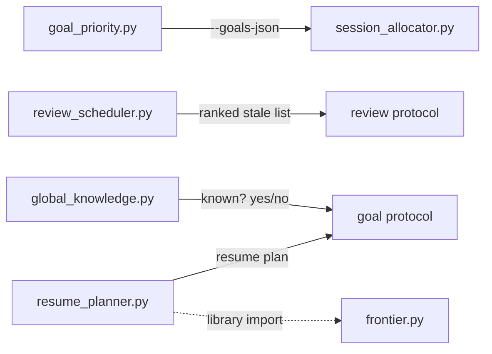

# Cross-Goal Intelligence

## Context

When a learner pursues multiple goals, each goal's protocol operates independently — its own curriculum frontier, its own decay tracking, its own review loop. Without coordination, the same topic reviewed in two goals produces duplicate review items, paused goals resume without accounting for decay, and session time is split by gut feel rather than computed priority. The cross-goal intelligence spec defines four invariants that require a coordination layer above individual goal protocols.

This design doc describes the pipeline topology and data flows that realize those invariants. It does not repeat the individual script contracts (those live in the plan and source); it focuses on how the five scripts connect and the one architectural deviation from ADR-0006.

## Specs

- [cross-goal-intelligence](../specs/cross-goal-intelligence.md) — the four invariants this pipeline realizes

## Architecture

### Pipeline topology

Five scripts form the cross-goal coordination layer. They are not a monolithic pipeline — they serve different protocols at different times, connected by JSON contracts.

**Session start orchestration.** When a session begins with multiple active goals, the engine runs `goal_priority.py` (which scores each goal by progress, decay risk, and deadline urgency), then pipes its output to `session_allocator.py --goals-json <path>` which allocates a time budget per goal proportional to score (minimum 5 minutes). The goal protocol uses these allocations to structure the session.

**Review scheduling.** `review_scheduler.py` independently reads all active goal files plus the learner profile, computes freshness for every completed topic across all goals, and outputs a flat ranked list. The review protocol receives this list and processes it top-down — it has no awareness of deduplication.

**Resume planning.** `resume_planner.py` handles a single paused goal. It computes decay for completed nodes and recomputes the curriculum frontier, outputting a resume plan with `recommended_action: "review_first" | "continue"`.

**Global knowledge checks.** `global_knowledge.py` is queried per-topic by the goal protocol to determine whether a topic can be skipped. It operates independently of the other scripts.

### Deduplication strategy

`review_scheduler.py` is the only script that sees across goal boundaries during review. When the same topic appears as completed in multiple goals, the scheduler keeps a single entry with the **lowest freshness score** (most decayed). The review protocol receives a flat ranked list and reviews each topic once — it doesn't know deduplication happened.

### `require_redemonstration` data flow

The goal schema allows `require_redemonstration: true` on individual curriculum nodes. When the goal protocol encounters such a node, it invokes `global_knowledge.py --goal <path>`. The script checks global mastery first, then checks the node's flag. If the flag is set, it overrides `known` to `false` regardless of global state, forcing in-context proof. Without `--goal`, behavior is unchanged — backward compatible.

### Invocation patterns

All five scripts follow ADR-0006: argparse CLI, JSON stdout, subprocess invocation from protocols.

**Exception:** `resume_planner.py` imports `compute_frontier` from `frontier.py` as a direct library call rather than spawning a subprocess. This is because `resume_planner` already has the full goal data loaded in memory — serializing it to JSON, spawning a subprocess, and deserializing would be pure overhead for an in-process computation. The script itself is still invoked as a subprocess by the goal protocol; only its internal dependency on `frontier.py` is a library import.

## Interfaces

| Script | Role | Inputs | Outputs | Consumed by |
|--------|------|--------|---------|-------------|
| `goal_priority.py` | Score and rank active goals | `--goals-dir`, `--profile`, `--now`, `--deadline-weight` | JSON: ranked goals with scores and reasons | `session_allocator.py` |
| `session_allocator.py` | Allocate session time per goal | `--goals-json` (from priority output), `--session-minutes` | JSON: `{allocations: [{slug, minutes, reason}]}` | Engine / status protocol |
| `review_scheduler.py` | Deduplicated stale-topic list across all goals | `--goals-dir`, `--profile`, `--half-life-days`, `--stale-threshold`, `--now` | JSON: ranked review candidates (freshness ↑) | Review protocol |
| `resume_planner.py` | Decay-aware resume plan for a paused goal | `--goal`, `--profile`, `--half-life-days`, `--stale-threshold`, `--now` | JSON: `{stale_topics, frontier, recommended_action}` | Goal protocol |
| `global_knowledge.py` | Per-topic mastery check with redemonstration override | `--topic`, `--profile`, optional `--goal` | JSON: `{known, redemonstration_required}` | Goal protocol |

## Decisions

- [ADR-0006: Hybrid Runtime](../decisions/0006-hybrid-runtime-architecture.md) — all scripts follow the argparse/JSON/subprocess pattern, with the `resume_planner.py` library-import exception documented above
