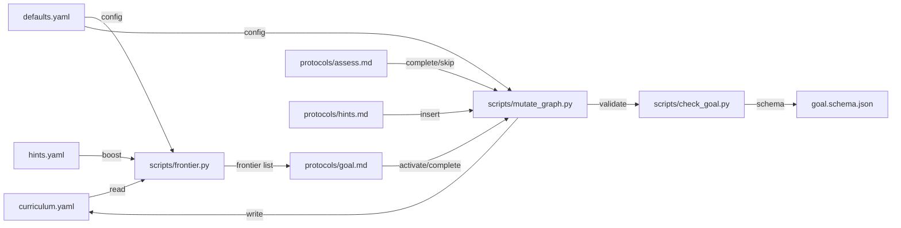

# Curriculum Graph

## Context

The [curriculum-graph spec](../specs/curriculum-graph.md) defines a DAG of topics that Sensei traverses to teach the learner. The schema (`goal.schema.json`) and validator (`check_goal.py`) already exist. What's missing are deterministic Python helpers for graph operations — frontier computation, validated mutations, and priority ordering. Currently the LLM does all graph operations by reading prose and editing YAML manually. Per ADR-0006 (hybrid runtime), deterministic logic belongs in scripts.

## Specs

- [Curriculum-graph spec](../specs/curriculum-graph.md) — DAG structure, node states, traversal invariants

## Architecture

### Graph State Model

The curriculum lives in `learner/goals/<goal-slug>/curriculum.yaml`:

```yaml
schema_version: 1
nodes:
  load-balancing:
    state: completed
    prerequisites: []
  caching:
    state: active
    prerequisites: [load-balancing]
  cap-theorem:
    state: pending
    prerequisites: [caching]
    inserted_from: caching
```

5 node states: `skipped`, `decomposed`, `pending`, `inserted`, `active`, `completed`.
At most one active node per goal (enforced by `check_goal.py` and mutation helpers).

### Frontier Computation (`scripts/frontier.py`)

Computes which nodes are eligible for activation:

- **Input:** curriculum.yaml path
- **Algorithm:** A node is on the frontier if ALL prerequisites have state `completed` or `skipped`, AND the node itself is NOT `skipped`, `active`, or `completed`
- **Output:** JSON array of frontier node slugs, ordered by priority
- **Priority:** base position (insertion order) + hint boost (from hints.yaml if available)
- **CLI:** `python frontier.py --curriculum <path> [--hints <hints.yaml-path>] [--boost-weight 1.5] [--max-boost 2.0]`
- Exit 0, JSON array to stdout

### Graph Mutations (`scripts/mutate_graph.py`)

Performs validated state transitions:

- **CLI:** `python mutate_graph.py --curriculum <path> --operation <op> --node <slug> [--prerequisites <slugs>] [--subgraph <json>]`
- **Operations:**
  - `activate <slug>` — set to active. Fails if another node is active or node not on frontier.
  - `complete <slug>` — set to completed. Fails if node is not active.
  - `skip <slug>` — set to skipped. Dependents become unblocked.
  - `insert <slug> --prerequisites <slugs>` — insert node with state `inserted`. Fails if cycle introduced.
  - `decompose <slug> --subgraph <json>` — replace node with subgraph. Original becomes grouping label (state: decomposed). Subgraph nodes inherit original's dependents.
- **Validation:** After every mutation, run cycle detection (Kahn's algorithm from `check_goal.py`). Reject and exit non-zero if invalid.
- **Output:** Updated YAML written to file. JSON summary to stdout: `{operation, node, new_state, frontier_after}`.

### Configuration

Additions to `defaults.yaml`:

```yaml
curriculum:
  max_nodes: 30
  initial_size: 5-12
  frontier_max: 5
  mastery_threshold: 0.9
```

### Integration with Existing Components

**Goal protocol (`protocols/goal.md`):**
- Step 4 (generate DAG) → writes `curriculum.yaml`
- Step 5 (validate) → `check_goal.py` (existing)
- Step 6 (traverse) → `frontier.py` picks next topic, `mutate_graph.py activate`

**Hints protocol (`protocols/hints.md`):**
- Curriculum boosting → `frontier.py --hints <path>` incorporates boost into priority
- Gap insert → `mutate_graph.py insert <slug> --prerequisites <slugs>`

**Assessment protocol (`protocols/assess.md`):**
- Mastery confirmed → `mutate_graph.py complete <slug>`
- Already known → `mutate_graph.py skip <slug>`

**Review protocol (`protocols/review.md`):**
- Operates on completed nodes via `decay.py` (no change needed)



### Session Lifecycle

1. **Start:** LLM reads `curriculum.yaml`, runs `frontier.py` to know available topics
2. **Teach:** LLM teaches active node, probes understanding
3. **Assess:** LLM triggers `mastery_check.py` → if pass, runs `mutate_graph.py complete`
4. **Next:** LLM runs `frontier.py` again, selects next, runs `mutate_graph.py activate`
5. **Boost:** If hints exist, `frontier.py --hints` reorders frontier by boosted priority

## Interfaces

| Component | Role | Consumed By |
|-----------|------|-------------|
| `learner/goals/<slug>/curriculum.yaml` | Graph state | All scripts, goal protocol |
| `scripts/frontier.py` | Frontier computation + priority ordering | Goal protocol, hints protocol |
| `scripts/mutate_graph.py` | Validated graph mutations | Goal protocol, assessment protocol, hints protocol |
| `scripts/check_goal.py` | Invariant validation (existing) | mutate_graph.py (internal), goal protocol |
| `schemas/goal.schema.json` | Schema validation (existing) | check_goal.py |
| `defaults.yaml` → `curriculum:` | Configuration tunables | frontier.py, mutate_graph.py, goal protocol |

## Decisions

Spec reference: [curriculum-graph spec](../specs/curriculum-graph.md).

No new ADRs anticipated — this follows the hybrid runtime pattern established in ADR-0006. Deterministic graph operations in Python, pedagogical judgment in LLM prose.
