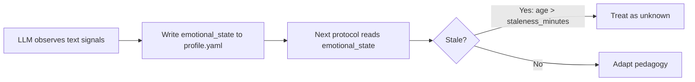

# Emotional State Tracking

## Context

The [`emotional-state-tracking`](../specs/emotional-state-tracking.md) spec promotes emotional state from free-text session-note observations to a structured, persistent signal in the learner profile. Currently: `personality.md` handles tone via a push-vs-comfort diagnostic, `tutor.md` has a 2-response overwhelm heuristic, session notes capture `emotional_shift` as prose, the profile carries zero emotional fields, and assessment/review are affect-blind.

This design adds one object to the profile schema, ~15 lines across four protocols, and two tunables. No new scripts — the LLM is the sensor and the judge. Scripts cannot classify emotion better than the LLM reading the conversation. The value is in *persisting* the LLM's judgment so it survives across sessions and model swaps.

## Specs

- [emotional-state-tracking](../specs/emotional-state-tracking.md) — the 12 invariants this mechanism realizes

## Architecture

### Model

Three dimensions, each a coarse enum plus `unknown`:

| Dimension | Values | Maps to |
|-----------|--------|---------|
| `engagement` | `flow`, `active`, `passive`, `disengaged`, `unknown` | D'Mello & Graesser's engagement continuum |
| `frustration` | `none`, `confused`, `frustrated`, `overwhelmed`, `unknown` | Spec's degradation chain: confusion → frustration → boredom → disengagement |
| `agency` | `autonomous`, `guided`, `dependent`, `unknown` | SDT-adjacent: does the learner have moves to try? |

Boredom maps to `disengaged` on the engagement dimension — D'Mello & Graesser's four emotions (confusion, frustration, boredom, engagement) are captured by two dimensions: frustration directly, and the engagement spectrum covers both engagement and boredom as opposite poles.

`engagement` and `frustration` are the two primary dimensions. `agency` is secondary — it captures whether the learner feels they can act, which the spec identifies as the boundary between productive struggle and cruelty.

Agency is a behavioral observation (how the learner interacts with the mentor), not a motivational assessment (why they're learning). It is distinct from the SDT motivation tracking deferred in the spec's Out of Scope.

The `unknown` value on every dimension is the safety valve. Per the spec: ~1/3 of learners show no emotion-performance correlation. When signals are absent or ambiguous across multiple turns, the system records `unknown` rather than fabricating a classification.

### Data flow



Emotional state is written by the LLM directly to YAML (like session notes), not computed by a script. The LLM already observes these signals — the schema gives it a place to persist them.

### Staleness

Emotional state older than `staleness_minutes` (default 120) is treated as `unknown`. This realizes the spec invariant that the system never assumes a prior emotional state still holds after significant time. At session start, if `updated_at` exceeds the threshold, all dimensions read as `unknown` and the mentor re-assesses from the first few turns.

### Degradation chain

The spec's degradation chain (confusion → frustration → boredom → disengagement) maps to the `frustration` dimension's enum ordering: `none` → `confused` → `frustrated` → `overwhelmed`. When `frustration` reaches or exceeds `degradation_intervention_threshold` (default `frustrated`), the mentor intervenes: reduce scope, restore agency, offer a break. This subsumes the tutor protocol's existing 2-response overwhelm heuristic.

### Misclassification safety

Per the spec: emotional classifications are probabilistic, not ground truth. Interventions triggered by emotional state are low-cost and reversible — easing off when the learner is actually fine costs one gentler probe; pushing through when the learner is actually frustrated is caught within 1-2 turns and corrected. No single emotional signal triggers an irreversible decision.

## Schema

### profile.schema.json — add `emotional_state`

Add as a top-level optional property. Bump `schema_version` from `0` to `1`.

```json
"emotional_state": {
  "type": "object",
  "additionalProperties": false,
  "description": "LLM-assessed emotional signals. Updated mid-session when shifts are detected.",
  "properties": {
    "engagement": {
      "type": "string",
      "enum": ["flow", "active", "passive", "disengaged", "unknown"]
    },
    "frustration": {
      "type": "string",
      "enum": ["none", "confused", "frustrated", "overwhelmed", "unknown"]
    },
    "agency": {
      "type": "string",
      "enum": ["autonomous", "guided", "dependent", "unknown"]
    },
    "updated_at": {
      "type": "string",
      "format": "date-time",
      "description": "ISO-8601 UTC timestamp of last update."
    }
  },
  "required": ["engagement", "frustration", "agency", "updated_at"]
}
```

`schema_version` changes from `"const": 0` to `"const": 1`.

### Default state

All fields `unknown`. New and migrated profiles:

```yaml
emotional_state:
  engagement: unknown
  frustration: unknown
  agency: unknown
  updated_at: "1970-01-01T00:00:00Z"
```

### Migration

Existing profiles at `schema_version: 0` gain `emotional_state` with all-`unknown` values and `updated_at` set to epoch. The version bump to `1` signals the change. `check_profile.py` must accept both versions during the transition (version `0` without `emotional_state`, version `1` with it).

## Protocol Changes

All additions are minimal — tokens matter in the LLM context window.

### personality.md — ~5 lines after "Behavioral Rules"

> **Emotional state tracking.** After every few exchanges, assess whether the learner's emotional state has shifted. If it has, update `learner/profile.yaml` field `emotional_state`: set `engagement` (flow/active/passive/disengaged/unknown), `frustration` (none/confused/frustrated/overwhelmed/unknown), `agency` (autonomous/guided/dependent/unknown), and `updated_at` to current UTC. At session start, read `emotional_state`. If `updated_at` is older than `staleness_minutes` from `.sensei/defaults.yaml`, treat all dimensions as unknown and re-assess from the first few turns. The existing push-vs-comfort diagnostic maps directly: "blocking learning" → frustration is rising; "protecting identity" → agency is weakening.

### tutor.md — ~3 lines extending "Overwhelm detection"

> When overwhelm is detected (2+ confused/frustrated responses), update `emotional_state` immediately: set `frustration` to the observed level and `agency` to `weakening` or `dependent`. Do not wait for session close. If `frustration` reaches the `degradation_intervention_threshold` from `.sensei/defaults.yaml`, activate the crisis script.

### assess.md — ~3 lines, new section before "Silence profile"

> **Affect-aware session decisions.** At assessment start, read `emotional_state` from the profile. If `frustration` is `frustrated` or `overwhelmed`, or `agency` is `dependent`, consider deferring the assessment or reordering topics to start with the learner's strongest area. These are session-level decisions only — do NOT add scaffolding, hints, or encouragement to individual items (assessor exception holds).

### review.md — ~3 lines, new section before "Silence profile"

> **Affect-aware pacing.** At review start, read `emotional_state` from the profile. If `frustration` is `frustrated` or `overwhelmed`, reduce the review queue length and start with topics the learner is likely to recall successfully. If `engagement` is `passive` or `disengaged`, shorten the session. These are pacing decisions — the silence profile and no-reteach rules still hold.

## Configuration

### defaults.yaml — add under `mentor:`

```yaml
mentor:
  emotional_state:
    staleness_minutes: 120
    degradation_intervention_threshold: frustrated
```

- `staleness_minutes`: emotional state older than this is treated as `unknown` at session start. Default 120 (2 hours) — a learner returning after lunch gets a fresh read.
- `degradation_intervention_threshold`: the `frustration` level that triggers pedagogical intervention. Default `frustrated` — the system intervenes before `overwhelmed`, not after.

## Interfaces

| Component | Role | Consumed By |
|-----------|------|-------------|
| `learner/profile.yaml` → `emotional_state` | Persistent emotional signal | All four protocols |
| `profile.schema.json` → `emotional_state` | Schema validation | `check_profile.py` |
| `defaults.yaml` → `mentor.emotional_state` | Staleness + intervention config | personality.md, tutor.md |

## Decisions

- **LLM-as-sensor, not script.** Emotional state is written by the LLM directly to YAML. No `classify_emotion.py` script. The LLM reading the conversation has strictly more signal than any text-processing script could extract. This is consistent with the hybrid runtime architecture (ADR-0006): scripts handle deterministic computation (decay curves, mastery gates); the LLM handles judgment (emotional classification).
- **Mid-session writes, not session-close only.** The oracle proposed session-close updates. The spec requires mid-session updates ("emotional shifts observed during a session are recorded as they occur"). The design follows the spec: the LLM writes when it detects a shift, not on a fixed schedule.
- **Three dimensions, not four emotions.** D'Mello & Graesser identify four emotions (confusion, frustration, boredom, engagement). The design maps these to two primary dimensions (`engagement` for the positive range, `frustration` for the degradation chain) plus `agency` as a secondary signal. This is more actionable than four independent labels — the degradation chain is an ordered enum, not four booleans.
- **`unknown` over inference.** When signals are ambiguous, the system records `unknown`. This respects the spec's individual-variation invariant (~1/3 of learners show no emotion-performance correlation) and avoids false-precision interventions.
- **No `notes` field.** The oracle proposed a 200-char `notes` field. Session notes already capture narrative emotional observations via `emotional_shift`. Adding a second free-text field creates redundancy. The structured enums are the signal; session notes are the audit trail.
