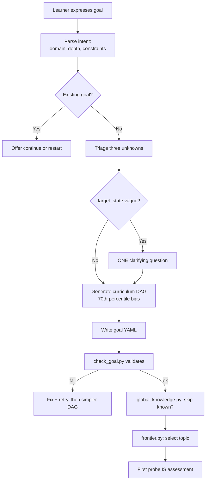

# Goal Lifecycle

## Context

The goal protocol is the largest in the system (391 lines) and the primary orchestrator: it owns the path from a learner's first utterance ("I want to learn X") through curriculum generation and into the ongoing teaching loop. Every downstream protocol — teaching, review, assessment, performance training — assumes a goal exists and has been processed through this pipeline. The protocol invokes four deterministic scripts, manages a multi-phase state machine, and enforces the spec's central constraint: the learner must be learning within two turns.

This design doc describes the architecture that makes that possible — the pipeline topology, the three-unknowns triage mechanism, the DAG generation strategy, and the script orchestration pattern. It does not repeat the protocol's step-by-step procedure.

## Specs

- [goal-lifecycle](../specs/goal-lifecycle.md) — the product intent and invariants this pipeline realizes

## Architecture

### Goal-creation pipeline

The protocol implements a five-stage pipeline that converts natural language into a validated curriculum DAG:

The pipeline's defining constraint is immediacy: no intake questionnaire, no multi-turn onboarding. The protocol generates a draft curriculum biased toward the 70th-percentile learner — intentionally imprecise but usefully wrong. Reacting to a concrete draft is faster than answering abstract questions, and the learner's performance on the first probe reveals more than self-report ever could.

### Three-unknowns triage

Every goal decomposes into three unknowns (per ADR-0015):

| Unknown | Values | Resolution mechanism |
|---------|--------|---------------------|
| **Prior state** — what the learner already knows | `unknown`, `none`, `partial`, `strong` | Inferred from the goal statement; confirmed by the first probe's result |
| **Target state** — what "done" looks like | `vague`, `emerging`, `clear` | If `vague`: one clarifying question. Otherwise: inferred directly |
| **Constraints** — time, context, application domain | Free text or `none` | Extracted from the goal statement |

The triage is not a classification step — it determines which unknown is hardest to resolve for this goal, which in turn parameterizes DAG shape (deep vs. wide, pruned vs. expansive) and adaptation cadence (how aggressively the curriculum reshapes over time). The protocol enforces a hard limit: at most one clarifying question, and only when `target_state` is `vague`.

### Curriculum DAG generation

The protocol generates a 5–12 node DAG where each node is a topic with prerequisite edges. Generation rules:

- **70th-percentile bias** — not a complete beginner, not an expert. The draft is a Bayesian prior updated by every interaction.
- **One active node** — exactly one node starts as `active`; all others are `spawned`. The schema enforces this as a cross-field constraint.
- **Five valid states** — `spawned` → `active` → `completed` (normal path), `collapsed` (already known, skipped), `expanded` (needs sub-topics). Transitions are performed exclusively by `mutate_graph.py`.

After writing the YAML file, `check_goal.py` validates against the goal schema: DAG acyclicity, slug format, node state legality, prerequisite referential integrity. On failure, the protocol retries with a simpler structure (fewer nodes, flatter graph) before surfacing the error.

### Script orchestration

The goal protocol delegates all deterministic operations to four scripts following ADR-0006's hybrid runtime pattern (argparse CLI, JSON stdout, subprocess invocation):

| Script | Operations | When invoked |
|--------|-----------|--------------|
| `check_goal.py` | Schema + DAG validation | After every goal file write or mutation |
| `mutate_graph.py` | `activate`, `complete`, `collapse`, `spawn`, `expand` | On node state transitions during teaching |
| `frontier.py` | Compute next-topic ordering | After any node completion/collapse to select the next topic |
| `global_knowledge.py` | Cross-goal mastery lookup | Before teaching each topic — skip if already mastered elsewhere |

The orchestration follows a consistent pattern: mutate → validate → recompute frontier → check global knowledge → teach. Every mutation triggers validation; every frontier recomputation checks for globally known topics that can be collapsed.

### State model

The goal YAML file (`instance/goals/<slug>.yaml`) is the single source of truth. The schema (`goal.schema.json`) enforces:

- **Structural invariants** — `schema_version`, required fields, slug format (`^[a-z][a-z0-9-]*$`), node state enum, prerequisite references.
- **Lifecycle fields** — `status` (active/paused/abandoned/completed), `paused_at`, `resumed_at`, `deadline`.
- **Three-unknowns record** — persisted at creation, used by cross-goal scripts for priority scoring.
- **Performance training overlay** — optional `performance_training` block with stage progression (1–6), event type, and event date.

Goal completion is automatic: after every `complete` or `collapse` mutation, the protocol checks whether all nodes are terminal. If so, `status` flips to `completed`.

## Interfaces

| Script | Role | Inputs | Outputs | Consumed by |
|--------|------|--------|---------|-------------|
| `check_goal.py` | Validate goal file against schema + DAG constraints | `--goal <path>` | JSON: `{status, errors}` | Goal protocol (after every write) |
| `mutate_graph.py` | Perform node state transitions | `--operation <op> --node <slug> --curriculum <path>` | Updated YAML file | Goal protocol (teaching loop) |
| `frontier.py` | Compute ordered next-topic list | `--curriculum <path>`, optional `--hints <path>` | JSON: ordered frontier list | Goal protocol (topic selection) |
| `global_knowledge.py` | Check if topic is mastered globally | `--profile <path> --topic <slug>`, optional `--goal <path>` | JSON: `{known, redemonstration_required}` | Goal protocol (skip-known check) |

## Decisions

- [ADR-0006: Hybrid Runtime](../decisions/0006-hybrid-runtime-architecture.md) — deterministic scripts invoked as subprocesses with JSON contracts
- [ADR-0015: Unified Goal-Processing Pipeline](../decisions/0015-unified-goal-pipeline.md) — one pipeline with type-sensitive parameters, not per-goal-type strategies
