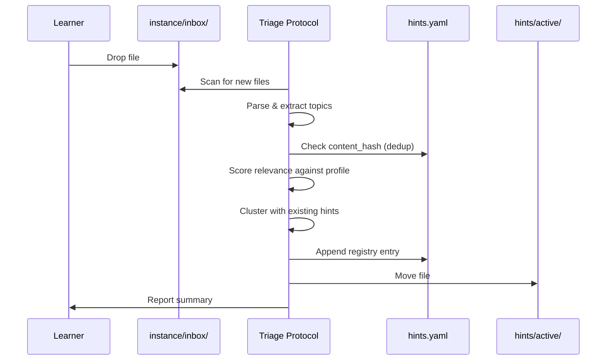
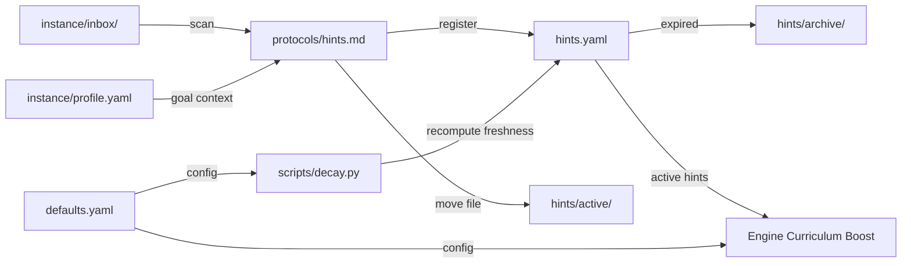

# Hints Ingestion

## Context

The [hints spec](../specs/hints.md) defines a system where learners drop external content into an inbox, Sensei triages it, and uses it to bias curriculum priority. This document specifies the folder structure, triage protocol mechanics, registry schema, decay integration, and curriculum boosting mechanism.

## Specs

- [Hints spec](../specs/hints.md) — 10 invariants covering universal inbox, triage, dedup, lifecycle, decay, bounded boosting, and archival

## Architecture

### Folder Structure

```
instance/
├── inbox/              ← universal drop zone (learner's only touchpoint)
├── hints/
│   ├── active/         ← triaged hints currently boosting curriculum
│   ├── archive/        ← terminal-state hints (absorbed/expired/irrelevant)
│   └── hints.yaml      ← registry of all processed hints
```

### Hint File Format

Optional YAML frontmatter in dropped files:

```yaml
---
date: 2026-04-09
source_url: https://...
author: "@handle"
channel: twitter    # twitter|youtube|reddit|telegram|article|repo
content_type: thread  # thread|video|article|repo|course|diagram|list
tags: []
---
```

If frontmatter is missing, the triage protocol infers metadata from content and filename (date from pattern `Month-DD_HH-MM_Title.md`).

### Registry Schema (hints.yaml)

| Field | Type | Required | Description |
|-------|------|----------|-------------|
| file | string | yes | Relative path from `instance/` to the hint file |
| ingested | date | yes | Date triage processed this hint |
| relevance | float | yes | 0.0–1.0 score against learner's active goal |
| topics | list[string] | yes | 1–5 extracted learning topics |
| cluster | string | no | Auto-assigned topic cluster name |
| status | enum | yes | triaged \| active \| absorbed \| expired \| irrelevant |
| freshness | float | yes | Current decay value (0.0–1.0), recomputed each session |
| acted_on | date | no | Date learner engaged with related material |
| content_hash | string | yes | SHA-256 of file content for change detection |

### Triage Protocol

`protocols/hints.md` is a prose-as-code file executed by the LLM agent. Steps:

1. **Scan** — List files in `instance/inbox/` not in registry (by path or content_hash)
2. **Parse** — Extract frontmatter, read content, infer missing metadata
3. **Extract topics** — Identify 1–5 concrete learning topics
4. **Score relevance** — Compare topics against `instance/profile.yaml` goal. Score 0.0–1.0
5. **Deduplicate** — File-level (content_hash), topic-level (>80% overlap), absorption-level (mastery check)
6. **Cluster** — Group by topic similarity, assign/create cluster name
7. **Register** — Append entry to `instance/hints/hints.yaml`
8. **Move** — Move file from `instance/inbox/` to `instance/hints/active/`
9. **Report** — Summarize: count processed, relevance breakdown, duplicates flagged



### Decay Integration

- Reuses `scripts/decay.py` (same forgetting-curve model as review protocol)
- Default half-life: 14 days (configurable via `hints.half_life_days`)
- Freshness recomputed at session start for all active hints
- When freshness < `expire_threshold` (default 0.2): status → `expired`, file moved to `instance/hints/archive/`

### Curriculum Boosting

Boost formula: `topic_priority += hint_relevance * freshness * boost_weight`

- Active hints with relevance > 0.5 contribute boost to their topics
- `boost_weight` default 1.5, capped at `max_boost` (2.0)
- Boost is additive — prevents runaway priority from hint floods
- If 3+ hints cluster on a topic NOT in current curriculum, surfaces: "You've saved N items about X. Add to your plan?"

### Data Flow



### Configuration

Additions to `defaults.yaml`:

```yaml
hints:
  half_life_days: 14.0
  boost_weight: 1.5
  max_boost: 2.0
  cluster_threshold: 3
  expire_threshold: 0.2
  expire_after_days: 28
  relevance_floor: 0.3
```

### Session Start Integration

1. Check `instance/inbox/` for unprocessed files → nudge learner
2. Recompute freshness for all active hints via `scripts/decay.py`
3. Transition expired hints to archive
4. Load active hint topics into curriculum boosting context

Non-blocking — learner can defer triage.

### Inbox Router

V1: all inbox items classify as hints. The triage protocol includes a classification step that currently always returns "hint". When new content types are added, the router dispatches to different protocols. This is a no-op extension point, not premature abstraction.

## Interfaces

| Component | Role | Consumed By |
|-----------|------|-------------|
| `instance/inbox/` | Universal drop zone | Triage protocol |
| `instance/hints/hints.yaml` | Hint registry + state | Triage protocol, curriculum engine, session start |
| `instance/hints/active/` | Active hint file storage | Triage protocol (writes), curriculum (references) |
| `instance/hints/archive/` | Terminal hint storage | Decay process (writes) |
| `protocols/hints.md` | Triage + boosting logic | Engine dispatch table |
| `scripts/decay.py` | Freshness computation | Session start, triage protocol |
| `defaults.yaml` → `hints:` | Configuration tunables | All hint components |

## Decisions

Spec reference: [hints spec](../specs/hints.md).

ADRs will be written as decisions crystallize during implementation. Candidates:

- **File-drop over CLI** — low friction for learner input
- **Boosting over rewriting** — preserves curriculum integrity
- **Universal inbox over typed drop zones** — reduces cognitive load
