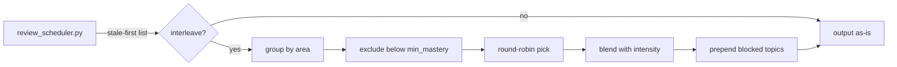

# Interleaving

## Context

The [`interleaving`](../specs/interleaving.md) spec requires review sessions to alternate topics between different areas rather than exhausting one area before the next. Currently: `review_scheduler.py` outputs a flat stale-first list sorted by freshness ascending, with slug-level and concept-aware deduplication. The review protocol processes this list top-down. There is no area-aware reordering.

This design adds interleaving as a **post-sort** of the existing `review_scheduler.py` output. The scheduler already produces the right candidates in the right priority order. Interleaving re-sequences them to alternate between areas, preserving stale-first order within each area. No new scripts — interleaving is a reorder step inside the existing scheduler.

## Specs

- [interleaving](../specs/interleaving.md) — the 7 invariants this mechanism realizes

## Architecture

### Core insight

Interleaving is a post-sort. The existing pipeline:

1. Collect stale topics across all active/paused goals
2. Deduplicate by slug (keep lowest freshness)
3. Deduplicate by concept (keep stalest per concept group)
4. Sort by freshness ascending

Interleaving adds step 5:

5. Group by area → round-robin pick across areas → output interleaved list

### Area derivation

An *area* is a structural grouping, not a semantic one:

- **Within-goal:** the top-level DAG branch a topic belongs to (its root ancestor in the curriculum graph). The protocol determines this by walking the `prerequisites` edges in the goal file.
- **Cross-goal:** the `goal_id` itself. Topics from different goals are in different areas by definition.

The protocol resolves areas and passes them to the script as `--topic-areas '{"slug": "area", ...}'`. This preserves the ADR-0006 boundary: the LLM judges structure (which branch a topic belongs to), the script computes order.

### Round-robin algorithm

Given topics grouped by area, each group internally sorted stale-first:

```
areas = group_by_area(topics)  # preserves stale-first within each group
result = []
while any areas have topics:
    for area in areas (round-robin):
        if area has topics:
            result.append(area.pop_first())
```

This produces: stalest from area A, stalest from area B, stalest from area C, second-stalest from area A, etc.

### Intensity

Intensity (float 0.0–1.0) controls the blend between pure stale-first and fully interleaved:

- At `1.0`: fully interleaved (round-robin output)
- At `0.0`: original stale-first order (no interleaving)
- Between: linear interpolation of positions. Each topic's final position is `intensity * interleaved_pos + (1 - intensity) * stale_pos`, then re-sorted by this blended position.

### Mastery threshold

Topics below `min_mastery` (default 0.3) are excluded from interleaving and placed at the front of the output in their original stale-first order. These topics need blocked practice, not discriminative contrast. The threshold is checked against the `mastery` field in the profile's `expertise_map`. Topics without a mastery entry are treated as below threshold.

### Data flow



### Schema changes

None. Areas are derived from the curriculum DAG structure (protocol-side) and passed as a CLI argument. `concept_tags` on `NodeState` already exist from cross-goal-intelligence.

### Script changes (review_scheduler.py)

Three new arguments:

| Argument | Type | Default | Description |
|----------|------|---------|-------------|
| `--interleave` | boolean flag | from config | Enable interleaving post-sort |
| `--interleave-intensity` | float 0–1 | from config | Blend ratio: 0=stale-first, 1=fully interleaved |
| `--topic-areas` | JSON string | `{}` | Mapping of topic slug → area label |

The `schedule_reviews` function gains matching keyword arguments. When `--interleave` is set and `--topic-areas` is non-empty, the interleaving post-sort runs after deduplication.

For mastery threshold checking, the function reads the profile's `expertise_map` to get each topic's mastery. The `min_mastery` threshold comes from config (passed by the protocol or defaulted).

### Protocol changes

**review.md** (~5 lines added to Step 2): Before invoking `review_scheduler.py`, the protocol determines each topic's area from the curriculum DAG structure (top-level branch for within-goal topics, goal_id for cross-goal topics). It passes `--interleave --topic-areas '{...}'` to the scheduler. The protocol does NOT label topics with their area when presenting to the learner — discriminative contrast requires the learner to identify the problem type.

**tutor.md**: No changes. Review weaving already exists (invariant 7 codifies existing behavior).

### Configuration (defaults.yaml)

```yaml
interleaving:
  enabled: true
  intensity: 0.7
  min_mastery: 0.3
```

- `enabled`: master switch for interleaving post-sort
- `intensity`: 0=blocked (stale-first only), 1=fully interleaved. Default 0.7 balances transfer benefit against cognitive load.
- `min_mastery`: topics with mastery below this get blocked practice, not interleaved. Default 0.3 — a topic needs at least initial exposure before discriminative contrast helps.

## Interfaces

| Component | Role | Consumed By |
|-----------|------|-------------|
| `review_scheduler.py` → `--interleave`, `--topic-areas`, `--interleave-intensity` | Interleaving post-sort | Review protocol |
| `defaults.yaml` → `interleaving` | Config tunables | Review protocol, `review_scheduler.py` |
| `review.md` → Step 2 area derivation | Area→slug mapping | `review_scheduler.py` via `--topic-areas` |

## Decisions

- **Post-sort, not separate script.** Interleaving reorders the scheduler's output. A separate `interleave.py` script would require serializing/deserializing the candidate list between two processes for a simple reorder. Adding it as a step inside `review_scheduler.py` is simpler and keeps the single-invocation contract with the review protocol.
- **Protocol derives areas, script computes order.** The LLM walks the DAG to determine which top-level branch each topic belongs to (judgment). The script applies the round-robin algorithm (computation). This preserves the ADR-0006 boundary.
- **Intensity as position blending.** Rather than probabilistic selection or partial interleaving, intensity linearly interpolates between stale-first and interleaved positions. This is deterministic, testable, and produces a smooth gradient between the two extremes.
- **Mastery threshold excludes, not demotes.** Topics below `min_mastery` are removed from the interleaving pool entirely and placed first (blocked practice). They are not interleaved at reduced frequency — the spec is clear that novice topics need blocked practice until sufficient mastery.
