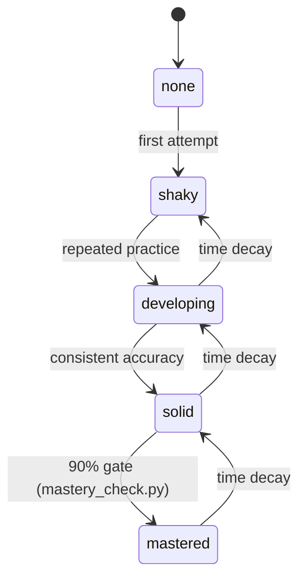

# Learner Profile State — YAML Shape

## Context

The [`learner-profile`](../specs/learner-profile.md) spec defines what Sensei tracks at v1 and which invariants must hold. This design doc specifies the concrete yaml shape that realizes those invariants, and the validator contract that enforces them.

## Specs

- [learner-profile](../specs/learner-profile.md) — the product invariants this realizes

## Architecture

### File Location

A single yaml file at `instance/profile.yaml` in each Sensei instance. Loaded by scripts and protocols via relative paths from the instance root. Never committed to the engine bundle; always an instance artifact.

### Shape

```yaml
schema_version: 0
learner_id: alice
expertise_map:
  recursion:
    mastery: developing
    confidence: 0.6
    last_seen: 2026-04-18T14:20:00Z
    attempts: 4
    correct: 3
  bfs:
    mastery: shaky
    confidence: 0.3
    last_seen: 2026-04-15T09:00:00Z
    attempts: 2
    correct: 0
```

### Fields

| Field | Type | Required | Description |
|---|---|---|---|
| `schema_version` | integer | yes | Profile schema version. Currently `0`. Bumped when any field changes semantics. |
| `learner_id` | string | yes | Human-readable identifier. Chosen once per learner; never regenerated. |
| `expertise_map` | object | yes | Map from topic slug → TopicState. Empty object is valid. |

### TopicState

| Field | Type | Required | Description |
|---|---|---|---|
| `mastery` | enum | yes | One of `none`, `shaky`, `developing`, `solid`, `mastered`. Strict order. |
| `confidence` | float | yes | Learner-declared confidence in `[0.0, 1.0]`. |
| `last_seen` | string | yes | ISO-8601 UTC timestamp. |
| `attempts` | integer | yes | Non-negative count of attempted retrievals. |
| `correct` | integer | yes | Non-negative count of correct attempts. Must be `≤ attempts`. |

<!-- Diagram: illustrates §Fields -->

*Figure 1. TopicState mastery progression with validator-enforced gates and time-based demotion.*

### Topic Slug Convention

Topic keys in `expertise_map` are lowercase ASCII strings with hyphens as the only permitted separator (regex `^[a-z][a-z0-9-]*$`). No nested namespaces at v1 (no dots, no slashes). The slug is chosen by whatever protocol first records the topic and is treated as immutable.

### Validator Contract

`src/sensei/engine/scripts/check_profile.py` loads a profile and validates:

1. File parses as yaml.
2. Conforms to `src/sensei/engine/schemas/profile.schema.json` (a JSON Schema document).
3. Every topic satisfies `correct ≤ attempts` (JSON Schema alone cannot express this cross-field constraint; the validator enforces it after schema validation).

Exit codes:
- `0` — profile is valid.
- `1` — profile is syntactically malformed or schema-invalid.
- `2` — profile passes schema but violates a cross-field invariant.

The validator prints a JSON line summarising what it checked and what failed, so protocols can surface the failure to the learner without parsing stderr.

### Mastery-Check Contract

`src/sensei/engine/scripts/mastery_check.py` loads a profile and answers a single question: does this learner meet a required mastery level for a topic?

Invocation:

```
python mastery_check.py --profile instance/profile.yaml --topic recursion --required solid
```

Semantics:

- Topic absent from `expertise_map` → treated as mastery `none`; the gate fails unless `--required none` was specified.
- Topic present → compare the learner's current level against `--required` using the strict ordering `none < shaky < developing < solid < mastered`.
- Pass (current ≥ required) → exit 0.
- Fail (current < required) → exit 3.
- Profile invalid → exit 1 (validator-style).

Always prints a single JSON line describing the decision, including `current_mastery`, `required`, and `gate` (`pass` or `fail`).

The numeric confidence threshold (§3.6 "90% threshold") is deliberately not part of the v1 gate — the enum comparison alone is enough to support the first protocols. A later ADR may introduce a confidence-aware gate as a separate helper or a `--min-confidence` flag.

## Interfaces

| Component | Role | Consumed By |
|---|---|---|
| `instance/profile.yaml` | The per-learner state file | Every protocol that reads learner state |
| `src/sensei/engine/schemas/profile.schema.json` | JSON Schema document | `check_profile.py` |
| `src/sensei/engine/scripts/check_profile.py` | Schema + cross-field validator | Invoked by protocols before any state-dependent decision |
| `src/sensei/engine/scripts/mastery_check.py` | Mastery-level gate | Invoked by the assessor-exception enforcement path |

## Decisions

- [ADR-0006: Hybrid Runtime](../decisions/0006-hybrid-runtime-architecture.md) — this design ships two of the five v1 helpers named in that ADR
