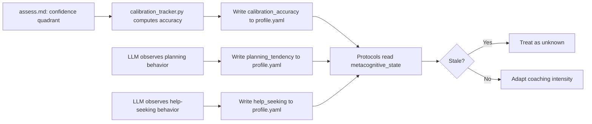

# Metacognitive State Tracking

## Context

The [`metacognitive-tracking`](../specs/metacognitive-tracking.md) spec promotes metacognitive signals from implicit behavioral observations to structured, persistent fields in the learner profile. Currently: `tutor.md` prompts forethought on non-trivial probes (Option A), `assess.md` runs the confidence quadrant classifier, `modes/reviewer.md` asks for self-assessment, and the profile carries zero metacognitive fields. Coaching intensity is static — the same prompting regardless of whether the learner already self-regulates.

This design adds one object to the profile schema, ~10 lines across four protocols, one small script, and two tunables. The pattern follows emotional-state-tracking exactly: structured enums in the profile, LLM-as-observer for behavioral classification, script for deterministic computation (calibration accuracy).

## Specs

- [metacognitive-tracking](../specs/metacognitive-tracking.md) — the 9 invariants this mechanism realizes

## Architecture

### Model

Three dimensions:

| Dimension | Values | Source |
|-----------|--------|--------|
| `calibration_accuracy` | float 0–1, null = unknown | Computed from confidence quadrant history (confident-correct / total-confident) |
| `planning_tendency` | `proactive`, `prompted`, `impulsive`, `unknown` | LLM observes: does the learner plan before acting? |
| `help_seeking` | `strategic`, `avoidant`, `dependent`, `unknown` | LLM observes: does the learner ask at the right moments? |

`calibration_accuracy` is deterministic — computed by a script from profile data. `planning_tendency` and `help_seeking` are behavioral — classified by the LLM from conversational signals. This split follows the hybrid runtime architecture (ADR-0006): scripts handle deterministic computation, the LLM handles judgment.

Monitoring (self-assessment of understanding during learning) is not tracked as a separate dimension. It is observed through calibration_accuracy — a learner who accurately predicts their own performance IS monitoring effectively. Separating monitoring from calibration would create redundant signals: both measure the same underlying skill (knowing what you know). If future evidence shows they diverge, monitoring can be added as a fourth dimension.

### Data flow



### Staleness

Metacognitive state older than `staleness_days` (default 14) is treated as unknown. Metacognitive skills change slowly — unlike emotional state (hours), metacognitive patterns are stable over days. At session start, if `updated_at` exceeds the threshold, all dimensions read as `unknown`.

### Fading

When `planning_tendency` reaches the `fading_threshold` (default `proactive`), forethought prompts are reduced. The learner has internalized the planning habit — continued prompting wastes tokens and undermines autonomy. This realizes the MetaCLASS finding that LLMs over-intervene 96% of the time.

## Schema

### profile.schema.json — add `metacognitive_state`

Add as a top-level optional property. Bump `schema_version` from `1` to `2`.

```json
"metacognitive_state": {
  "type": "object",
  "additionalProperties": false,
  "description": "Metacognitive signals: calibration, planning, help-seeking. Updated by scripts and LLM observation.",
  "properties": {
    "calibration_accuracy": {
      "type": ["number", "null"],
      "minimum": 0,
      "maximum": 1,
      "description": "Ratio of confident-correct to total-confident responses. Null = insufficient data."
    },
    "planning_tendency": {
      "type": "string",
      "enum": ["proactive", "prompted", "impulsive", "unknown"]
    },
    "help_seeking": {
      "type": "string",
      "enum": ["strategic", "avoidant", "dependent", "unknown"]
    },
    "updated_at": {
      "type": "string",
      "format": "date-time",
      "description": "ISO-8601 UTC timestamp of last update."
    }
  },
  "required": ["calibration_accuracy", "planning_tendency", "help_seeking", "updated_at"]
}
```

`schema_version` changes from `"const": 1` to `"const": 2`.

### Default state

All fields unknown/null. New and migrated profiles:

```yaml
metacognitive_state:
  calibration_accuracy: null
  planning_tendency: unknown
  help_seeking: unknown
  updated_at: "1970-01-01T00:00:00Z"
```

### Migration

Existing profiles at `schema_version: 1` gain `metacognitive_state` with all-unknown/null values and `updated_at` set to epoch. The version bump to `2` signals the change.

The profile migration chain is: v0 (baseline) → v1 (emotional_state) → v2 (metacognitive_state). Both migrations are implemented in `src/sensei/engine/scripts/migrate.py` and the current `CURRENT_PROFILE_VERSION` is `2`.

## Protocol Changes

All additions are minimal — tokens matter in the LLM context window.

### assess.md — ~3 lines after confidence classification (Step 4)

> After classifying the confidence quadrant, run `calibration_tracker.py` to update `metacognitive_state.calibration_accuracy` in the profile. This computes the running ratio of confident-correct to total-confident responses across the learner's expertise_map.

### tutor.md — ~2 lines extending forethought prompt (Step 3)

> Read `metacognitive_state.planning_tendency` from the profile. If `impulsive`, prompt forethought on ALL probes (not just non-trivial). If `proactive` and past the `fading_threshold` in `.sensei/defaults.yaml`, reduce forethought prompts to non-trivial probes only.

### modes/reviewer.md — ~2 lines after self-assessment

> After reviewing the learner's submission, note help-seeking pattern: did they attempt independently before asking for review (`strategic`), avoid asking until stuck too long (`avoidant`), or submit without attempting fixes (`dependent`)? Update `metacognitive_state.help_seeking` in `learner/profile.yaml` if the pattern is clear.

### personality.md — ~3 lines extending behavioral rules

> **Metacognitive state tracking.** At session start, read `metacognitive_state` from `learner/profile.yaml`. If `updated_at` is older than `staleness_days` from `.sensei/defaults.yaml`, treat all dimensions as unknown. Adapt coaching intensity: more forethought prompts for `impulsive` planners, calibration feedback for low `calibration_accuracy` (< 0.5), proactive check-ins for `avoidant` help-seekers. Fade prompts as the learner develops self-regulation.

## Script

### calibration_tracker.py

A small script that computes `calibration_accuracy` from the profile's `expertise_map`. For each topic with `attempts > 0`, the confidence quadrant data (confident-correct vs confident-incorrect) feeds the ratio. The script reads the profile, computes the ratio, and prints JSON to stdout.

```
python calibration_tracker.py --profile learner/profile.yaml
```

Output: `{"calibration_accuracy": 0.85}` or `{"calibration_accuracy": null}` if insufficient data.

Implementation: `calibration_tracker.py` is already implemented in `src/sensei/engine/scripts/calibration_tracker.py` and tested in `tests/scripts/test_calibration_tracker.py`.

## Configuration

### defaults.yaml — add under `mentor:`

```yaml
mentor:
  metacognitive_state:
    staleness_days: 14
    fading_threshold: proactive
```

- `staleness_days`: metacognitive state older than this is treated as unknown. Default 14 — metacognitive skills change slowly.
- `fading_threshold`: the `planning_tendency` level at which forethought prompts are reduced. Default `proactive`.

## Interfaces

| Component | Role | Consumed By |
|-----------|------|-------------|
| `learner/profile.yaml` → `metacognitive_state` | Persistent metacognitive signal | All four protocols |
| `profile.schema.json` → `metacognitive_state` | Schema validation | `check_profile.py` |
| `defaults.yaml` → `mentor.metacognitive_state` | Staleness + fading config | personality.md, tutor.md |
| `calibration_tracker.py` | Deterministic calibration computation | assess.md |

## Decisions

- **Script for calibration, LLM for behavioral dimensions.** Calibration accuracy is a deterministic ratio — a script computes it reliably. Planning tendency and help-seeking are behavioral judgments — the LLM observes and classifies. This follows the hybrid runtime split from ADR-0006.
- **Fading over static prompting.** MetaCLASS shows LLMs over-intervene 96%. The design fades forethought prompts as planning_tendency reaches proactive, rather than prompting at a fixed rate regardless of learner development.
- **14-day staleness, not 2-hour.** Metacognitive skills are stable over days, unlike emotions (hours). A learner who was impulsive last week is likely still impulsive this week. The longer window avoids unnecessary re-assessment.
