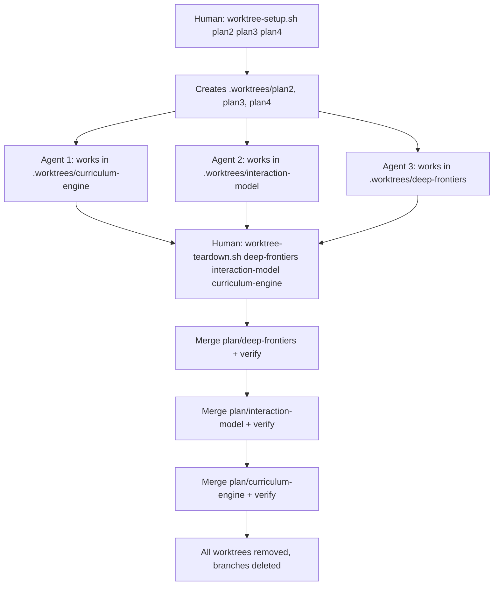

# Parallel Agent Execution — Worktree Isolation

## Context

The parallel-agents spec requires filesystem isolation for concurrent LLM agents. This design specifies the mechanism: git worktrees contained within the project directory, managed by shell scripts, with a human orchestrator coordinating setup and integration.

## Specs

- [`docs/specs/parallel-agents.md`](../specs/parallel-agents.md)

## Architecture

### Isolation mechanism: Git worktrees

Git worktrees provide independent working directories sharing a single `.git` object store. Each worktree has its own HEAD, index, and working tree. This is the consensus mechanism across the LLM agent ecosystem (Claude Code, Cursor 3, CAID/CMU, Claudio, multiclaude).

### Directory structure

```
sensei/
├── .gitignore              # includes: .worktrees/
├── .worktrees/             # gitignored, contains all agent workspaces
│   ├── curriculum-engine/  # Agent 1: full working copy on plan/curriculum-engine branch
│   ├── interaction-model/  # Agent 2: full working copy on plan/interaction-model branch
│   └── deep-frontiers/     # Agent 3: full working copy on plan/deep-frontiers branch
├── scripts/
│   ├── worktree-setup.sh   # Creates worktrees for parallel plans
│   └── worktree-teardown.sh # Merges and removes worktrees
├── src/
└── docs/
```

Worktrees live inside the project at `.worktrees/` (gitignored). This matches the emerging community standard (Claude Code uses `.claude/worktrees/`, Claudio uses `.claudio/worktrees/`). No parent directory pollution.

### Branch naming

Worktree branches use the pattern `plan/<plan-name>` (e.g., `plan/curriculum-engine`). This distinguishes parallel-execution branches from feature branches (`feat/`) and documentation branches (`docs/`).

### Setup workflow

`scripts/worktree-setup.sh` accepts one or more plan names and:
1. Validates the working directory is clean (aborts if uncommitted changes)
2. For each plan name, creates branch `plan/<name>` from the current HEAD
3. Creates worktree at `.worktrees/<name>/` on that branch
4. Installs dependencies if needed (`pip install -e .` for Python projects)
5. Prints instructions: which directory to open in which agent session

Idempotent: if a worktree already exists, skips it with a message.

### Integration workflow

`scripts/worktree-teardown.sh` accepts one or more plan names and:
1. For each plan (in the order specified), merges `plan/<name>` into the current branch
2. Merge strategy: fast-forward if possible, `--no-ff` merge commit otherwise
3. After each merge, runs verification: `pytest` + `python ci/check_foundations.py`
4. If verification fails, aborts with the failing branch identified (human resolves)
5. On success: removes the worktree and deletes the branch
6. CHANGELOG.md conflicts are expected (all plans append to [Unreleased]) — the script prints resolution instructions rather than attempting auto-resolution

### Shared accumulation files

Files that multiple plans legitimately modify (CHANGELOG.md, docs/decisions/README.md):
- Each agent defers these modifications to the END of their plan execution
- During integration, the human resolves the trivial append-conflicts (keep all entries)
- The teardown script detects these conflicts and prints the resolution pattern

### Dependency installation

Each worktree needs its own Python environment. The setup script runs `pip install -e .` in each worktree. For Sensei (small project, few deps), this takes ~5 seconds per worktree.

### Error handling

| Failure | Script behavior |
|---------|----------------|
| Dirty working directory | Setup aborts before creating any worktrees |
| Worktree already exists | Setup skips with message |
| Branch already exists | Setup uses existing branch (warns if it's ahead of current HEAD) |
| Merge conflict during teardown | Teardown aborts, prints conflict files, leaves worktree intact for manual resolution |
| Verification fails after merge | Teardown aborts, prints failure output, leaves merge in progress for human to fix or abort |

### Workflow diagram



## Interfaces

| Component | Role |
|-----------|------|
| `scripts/worktree-setup.sh` | Creates isolated workspaces for parallel agents |
| `scripts/worktree-teardown.sh` | Integrates and cleans up agent workspaces |
| `.worktrees/` | Gitignored directory containing all agent worktrees |
| `docs/operations/parallel-agents.md` | Human-facing runbook with step-by-step workflow |

## Decisions

ADR to follow documenting the choice of git worktrees over alternatives (separate clones, Docker containers, branch-only workflows).
