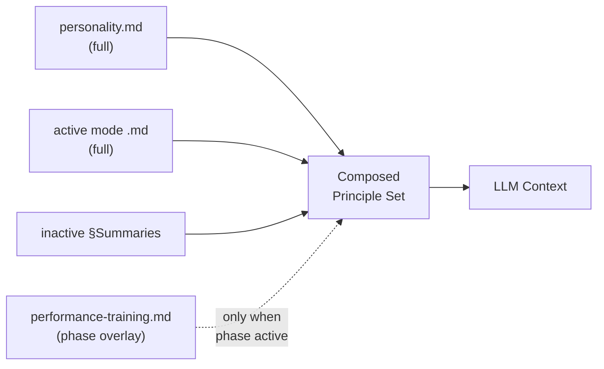

# Performance Training — Phase Overlay Composition

## Context

The [`docs/specs/performance-training.md`](../specs/performance-training.md) spec defines a six-stage Performance Preparation Stack that modifies how existing behavioral modes operate when a learner transitions from *knowing* to *performing under pressure*. The spec establishes that performance training is a phase, not a fifth mode — it overlays the existing four modes with phase-specific behaviors (Tutor adds time awareness, Challenger adds interview-style pressure, etc.).

The core design question: **how does the performance phase modify the LLM's context window when a mode is active?**

The existing composition model (ADR-0013, [`behavioral-modes.md`](behavioral-modes.md)) loads: base personality (full) + active mode (full) + inactive mode summaries. Performance training needs to inject per-mode behavioral deltas into this composition without breaking the focused-loading strategy that prevents attention dilution.

## Specs

- [performance-training](../specs/performance-training.md) — the six-stage stack and per-mode behavioral deltas
- [behavioral-modes](../specs/behavioral-modes.md) — the four-mode model that performance training modifies

## Architecture

### Option analysis

Three composition mechanisms were evaluated:

**Option 1: Conditional sections within mode files.** Each mode file gets a `## Performance Phase` section loaded only when the phase is active. Rejected — couples mode authoring to phase authoring. Every future phase would require editing all four mode files. Violates separation of concerns.

**Option 2: Separate overlay files.** One file per mode (`protocols/overlays/performance-tutor.md`, etc.) loaded alongside the active mode. Rejected — file proliferation (4 files for V1, 8+ as phases grow). Each overlay is small (a few paragraphs), making the per-file overhead disproportionate.

**Option 3: Single phase protocol.** One file (`protocols/performance-training.md`) loaded as an additional context layer when the phase is active. Contains per-mode sections that the LLM reads conditionally based on the active mode. **Selected** — see ADR-0021.

### Composition model with phase overlay

When performance training is **inactive**, composition is unchanged from ADR-0013:

```
personality.md (full) + active_mode.md (full) + inactive §Summaries
```

When performance training is **active**, one additional layer is composed:

```
personality.md (full) + active_mode.md (full) + inactive §Summaries + performance-training.md (full)
```

<!-- Diagram: illustrates §Composition model with phase overlay -->

*Figure 1. Phase overlay adds one conditional composition slot. Dashed line indicates the layer is absent when the phase is inactive.*

### Phase protocol structure

The phase protocol file (`protocols/performance-training.md`) contains:

1. **Phase preamble** — entry conditions, current stage, general phase principles.
2. **Per-mode overlay sections** — `## When Tutor is Active`, `## When Challenger is Active`, etc. The LLM reads the section matching the current active mode and applies those behavioral deltas on top of the mode's own instructions.
3. **Stage progression rules** — how the engine determines when to advance from one stage to the next.

The LLM conditionally attends to the per-mode section matching the active emphasis. This is the same pattern as mode summaries — the LLM reads selectively based on context, not via programmatic gating.

### Profile state tracking

Phase state is tracked at the goal level in `instance/goals/<slug>.yaml`:

```yaml
performance_training:
  active: true
  stage: 3          # 1-6, current stage in the stack
  entered_at: 2026-04-21T14:00:00Z
  event_type: interview   # interview | exam | certification
  event_date: 2026-05-12
```

Goal-level (not profile-level) because different goals may be in different phases — a learner could be in performance training for one goal while still in normal learning for another.

### Schema additions

`defaults.yaml` gains:

```yaml
performance_training:
  mastery_gate: solid        # minimum mastery level to enter phase
  stage_thresholds:
    automate: 3              # correct fluent recalls to advance
    verbalize: 2             # clear verbal explanations to advance
    time_pressure: 3         # timed problems solved within budget
```

### Context budget analysis

The phase protocol adds approximately **400–600 tokens** to the context window when active:

| Component | Estimated tokens |
|-----------|-----------------|
| Phase preamble + stage rules | ~150 |
| Active mode's overlay section | ~150–200 |
| Non-active overlay sections (skimmed) | ~100–200 |

This is comparable to the three inactive mode summaries (~100 tokens each). The total context budget with phase active remains well within frontier model limits.

### V1 boundary

V1 implements stages 1–4 (learn → automate → verbalize → time pressure). The phase protocol includes sections for all six stages but marks stages 5–6 as `[V2 — not yet active]`. The per-mode overlays for Assessor's simulated-evaluation behavior and Reviewer's full-mock debrief are stubbed.

## Interfaces

| Component | Role | Consumed By |
|-----------|------|------------|
| `protocols/performance-training.md` | Phase overlay — per-mode behavioral deltas | engine.md (context composition) |
| `instance/goals/<slug>.yaml` § `performance_training` | Phase state per goal | engine.md (phase detection), phase protocol |
| `defaults.yaml` § `performance_training` | Mastery gate + stage thresholds | engine.md, phase protocol |

## Decisions

- [ADR-0021: Phase Overlay Composition](../decisions/0021-phase-overlay-composition.md) — single phase protocol over conditional sections or separate overlay files
- [ADR-0013: Context Composition Strategy](../decisions/0013-context-composition.md) — the base composition model this extends
