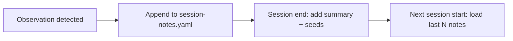

# Session Notes

## Context

The session-notes spec defines product guarantees — incremental observation writes, four observation types, prose summary + seeds at session end, bounded retention. This design doc defines the storage mechanism, schema shape, and data flow that realize those guarantees.

## Specs

- [session-notes](../specs/session-notes.md) — the invariants this mechanism realizes

## Architecture

### Storage: single file

`learner/session-notes.yaml` with `schema_version: 0` and a `sessions:` array. Single file because: the LLM reads one file (no globbing needed), the 50-entry cap keeps it manageable, and atomic writes use the existing `_atomic.py` pattern.

### Schema shape

```yaml
schema_version: 0
sessions:
  - date: "2026-04-22T18:30:00Z"
    goal: system-design-interviews
    topics_covered: [notification-systems, requirements-gathering]
    observations:
      - type: misconception
        topic: requirements-gathering
        detail: "Jumps to infrastructure before clarifying requirements"
      - type: breakthrough
        topic: notification-systems
        detail: "Connected partitioning to ordering guarantees unprompted"
      - type: effective_strategy
        detail: "Product-spec analogy clicked for requirements framing"
      - type: emotional_shift
        detail: "Frustrated early, engaged after breakthrough"
    summary: "Persistent pattern of skipping requirements phase. Strong on infrastructure reasoning."
    next_session_seeds:
      - "Start with a requirements-only exercise"
      - "Review: what are non-functional requirements?"
```

### Incremental write pattern

Observations are appended to the current session entry as they occur. The mentor reads the file, appends to the last session's `observations` array, and writes atomically. Summary and seeds are added at session close. If the session ends abruptly, all observations written so far survive — only the summary and seeds are lost.

### Session start loading

The engine reads `learner/session-notes.yaml` and takes the last N entries (configurable via `config.session_notes.load_count`, default 3). These are included in context alongside the profile and goal to inform the adaptive session opener.

### Bounding

When the `sessions` array exceeds `config.session_notes.max_entries` (default 50), the oldest entries are removed on the next write.

### Profile authority

Notes inform teaching approach only. All scheduling, gating, and mastery decisions read from the profile, never from notes.



## Interfaces

| Artifact | Writer | Reader |
|----------|--------|--------|
| `learner/session-notes.yaml` | Engine protocols (mid-session + session close) | Engine session-start, tutor mode, reviewer mode |

## Decisions

No ADR needed — single-file storage follows the existing `hints.yaml` pattern.
