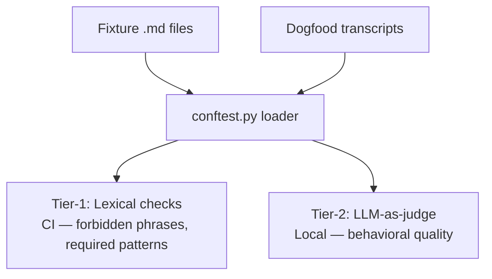

# Transcript Fixtures — Behavioural Verification for Prose-as-Code Protocols

## Context

Sensei's protocols (`src/sensei/engine/protocols/*.md`) are prose-as-code: an LLM at runtime reads them and executes the numbered steps. CPython-level verification (`tests/scripts/*`) asserts that the *helpers* protocols invoke compose correctly when driven in the specified sequence. It cannot assert that the LLM interpreting a protocol actually follows the steps — whether it skips validation, merges turns that should be separate, emits praise the silence profile forbids, or answers the learner's question when the spec says "refuse and offer a switch."

Those behaviours are product failures that pass every existing pytest. Until now, dogfood-style verification has lived as informal manual-test notes with no committed artifact.

This design introduces **transcript fixtures** as a new artifact type within the existing Verification layer — not a new layer, not a new spec. The Verification layer is already defined functionally ("artifacts that confirm Implementation met its spec; verifiers may run on a CPU, in an LLM, or both" — `docs/development-process.md`). Transcript fixtures fit that definition; they extend Verification from CPython-only to prose-plus-CPython.

## Specs

Transcript fixtures verify invariants declared in the protocol specs themselves. They serve:

- [`docs/specs/review-protocol.md`](../specs/review-protocol.md) — retrieval-only, stale-first, silence profile, single-writer, etc.
- Any future protocol spec that declares invariants executable prose must honour.

## Architecture

<!-- Diagram: illustrates §Architecture -->

*Figure 1. Two-tier verification: Tier-1 runs in CI (fast, deterministic); Tier-2 runs locally (LLM judgment).*

### Directory and file layout

```
tests/
  transcripts/
    __init__.py
    conftest.py              # pytest loader — parses fixtures + dogfood transcripts
    review.md                # fixtures file for protocols/review.md (committed)
    review.dogfood.md        # captured real LLM session, gitignored patterns excluded
    <protocol>.md            # one fixtures file per engine protocol
    <protocol>.dogfood.md    # one dogfood transcript per engine protocol
```

A fixtures file lives next to the rest of the test tree, not under `docs/`, because it is executable verification (pytest reads it), not documentation. Dogfood transcripts are committed; their value is the git-diff signal when the LLM's interpretation drifts between releases.

### Fixtures file format

Markdown with YAML frontmatter plus one or more `## Fixture: <name>` sections. Example shape:

```markdown
---
protocol: review
spec: docs/specs/review-protocol.md
invariants:
  - retrieval-only
  - silence-profile
  - single-writer
status: golden
date: 2026-04-20
---

## Fixture: silence-profile

**What it pins.** Step 8 permits only three acknowledgements and forbids praise.

**Forbidden phrases (must not appear in dogfood transcript turns marked
`[MENTOR]`):**

- `Great`
- `Nice work`
- `Well done`
- `You're doing well`
- `Actually,`           # opens a reteach
- `The correct answer`
- `Let me explain`

**Required one-of (at least one transition turn in every happy-path
session must match a regex in this set):**

- `^Got it\.$`
- `^Okay\.$`
- `^Recorded\.$`
- `^Next\.$`

## Fixture: retrieval-only

...
```

Each fixture is named for the invariant cluster it pins. The loader turns each fixture into a pytest case keyed to the dogfood transcript file.

### Dogfood transcript format

A verbatim paste of a real LLM session, lightly tagged with turn markers so the loader can isolate mentor turns from learner turns:

```markdown
---
protocol: review
agent: Claude Code (claude-opus-4-7)
captured: 2026-04-20T14:20:00Z
fixture_ref: tests/transcripts/review.md
---

[LEARNER] review

[MENTOR] What does `map` do in Python?

[LEARNER] I think it applies a function to each element of an iterable.

[MENTOR] Got it.

[LEARNER] stop

[MENTOR] That's it for now.
```

Turn prefixes are the only structure the loader cares about: lines starting with `[MENTOR]` are mentor output (checked against fixtures); lines starting with `[LEARNER]` are learner input (skipped). Anything else is framing and ignored.

### Loader (tier-1, free-in-CI)

`tests/transcripts/conftest.py` discovers fixture files and their companion dogfood transcripts at pytest collection time. For each fixture it emits a parametrised pytest case:

- **If the `.dogfood.md` companion is missing**, the case `pytest.fail`s with a loud message that names the missing file and the fixture protocol. Missing dogfood is now a hard failure: a fixture must not land before its dogfood capture exists. The original soft-skip behaviour was a transitional accommodation during the v0.1.0a17–a19 dogfood backfill; once every protocol had a real-LLM capture (CHANGELOG v0.1.0a19), keeping skip-on-missing was just a footgun for any future protocol added without dogfood.
- **If the companion exists**, the case parses mentor turns from the dogfood transcript and asserts:
  1. No forbidden phrase appears in any mentor turn.
  2. At least one required-one-of pattern matches at least one mentor turn (if the fixture declares `required` — happy-path fixtures do; negative fixtures may not).
  3. Per-fixture custom invariants (expressed as additional regex lists in frontmatter) pass.
  4. Optional quantitative metric bands hold (the Tier-1 metric family — three metrics, all helpers under `src/sensei/engine/scripts/`, all sharing `[MENTOR]`/`[LEARNER]` turn extraction):
     - `silence_ratio: {min, max}` — mentor word-share against the learner. Per [`docs/plans/silence-ratio-and-missing-dogfood.md`](../plans/silence-ratio-and-missing-dogfood.md). Measures *how much* the mentor talks.
     - `question_density: {min, max}` — mentor questions per mentor turn. Per [`docs/plans/question-density-metric.md`](../plans/question-density-metric.md). Measures *what shape* the talk takes; a Socratic regression cuts density without necessarily moving silence_ratio.
     - `teaching_density: {max}` — canonical-teaching-token appearances per mentor turn (taxonomy mined from existing `forbidden_phrases`). Per [`docs/plans/teaching-density-metric.md`](../plans/teaching-density-metric.md). Closes the assessor-exception / no-reteach gap; bands set `max: 0.0` for the seven protocols where teaching is forbidden.
     Each per-protocol band carries a calibration comment naming the observed value and the regression mode the band catches.

All assertions are lexical, regex, or computed at the helper level — zero LLM calls, zero API cost, runs on every push in CI.

### Tier-2: LLM-as-judge (operator-local, manual)

Some invariants cannot be checked lexically:

- "Did step 5 actually wait for the learner before classifying?" — turn-boundary semantics.
- "Did the question contain a hint?" — judgment.
- "Was the protocol's step order actually followed?" — sequence analysis.

For these, a second LLM reads the dogfood transcript plus the invariant list and produces a structured verdict. Because CI has no model keys configured, Tier-2 is an **operator-local** command invoked by the maintainer per release or per protocol change, not a CI gate. A verdict below a rubric threshold three times consecutively escalates from "yellow bucket" to release-blocking.

Tier-2 infrastructure is out of scope for the MVP plan; it lands in a follow-up once Tier-1 is in place.

### Flakiness policy

Tier-1 asserts invariants, not outputs. The LLM may emit "Got it." or "Okay." — both pass. The protocol forbids "Great answer" — that fails. Exact question wording is never asserted; only the absence of hint tokens and the presence of the required acknowledgement family.

When Tier-2 semantic checks fail, the fixture is logged to `tests/transcripts/.flaky-log.md` and is release-blocking only after three consecutive failures across distinct dogfood runs. Retries are not used — a non-deterministic pass hides real drift.

### Cadence

| Tier | Trigger | Cost | Runs in CI |
|---|---|---|---|
| Tier-1 | Every push / PR | Free | Yes |
| Tier-2 | Per protocol change (author-local), per release (operator-local) | ~$0.05 per run | No, not at v1 |

### Interaction with other Verification artifacts

Transcript fixtures are peers of the existing CPython-side verifiers:

- `tests/scripts/test_*.py` — CPython helpers (library + CLI + subprocess)
- `tests/ci/test_*.py` — maintainer-side CI tooling
- **`tests/transcripts/<protocol>.md`** — behavioural fixtures (NEW)
- `memory/rules.yaml` (future) — runtime executable assertions on wiki/profile content

Each answers "did this part meet its spec?" in its own medium.

## Interfaces

| Component | Role |
|---|---|
| `tests/transcripts/<protocol>.md` | Fixtures file (one per engine protocol). Committed. |
| `tests/transcripts/<protocol>.dogfood.md` | Captured LLM session. Committed, periodically refreshed. |
| `tests/transcripts/conftest.py` | Pytest loader that parses fixtures + dogfood and emits parametrised cases. |

## Decisions

- [ADR-0011: Transcript Fixtures as Verification Artifact](../decisions/0011-transcript-fixtures.md) — formalises the addition of this artifact type to the Verification layer.
- `docs/sensei-implementation.md` — Verification table extended with the new row; a new load-bearing principle #6 "Prose verified by prose" is added.

## Notes

**Why not a new SDD layer?** Verification's functional definition already covers LLM-run verifiers. Adding "Behavioural Verification" as a separate layer would duplicate Verification's purpose and force re-documenting flow rules that already apply. The cleaner move is to widen the artifact inventory inside Verification. This matches ADR-0043's precedent in sprue (the sibling project) of keeping layer names method-neutral.

**Why markdown-with-frontmatter rather than YAML/JSON?** Fixtures contain prose (rationale of what the fixture pins) alongside regex lists. Markdown reads naturally for the prose; YAML frontmatter gives the loader structured metadata. A pure-YAML file would make the rationale hostile to read; a pure-markdown file would make the regex lists hostile to parse. The hybrid is standard for test-adjacent docs (Jekyll, MkDocs, etc.).

**Why "transcript fixture" and not "behavioural test" or "eval"?** "Behavioural test" is fine but collides with `tests/test_*.py` naming; "eval" carries LLM-ops baggage (eval harnesses, eval platforms) that implies infrastructure we don't have. "Transcript fixture" is project-agnostic, describes what the file actually is (a fixture describing expected transcript properties), and stays reusable in any prose-as-code project.
