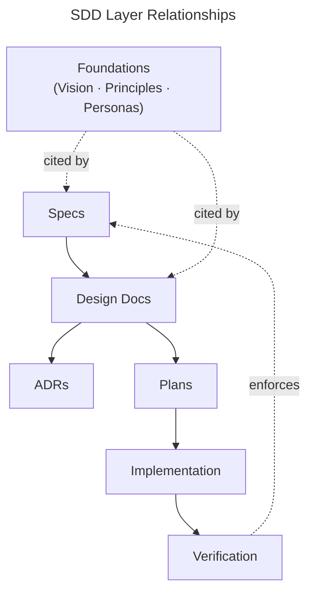

# SDD Development Process

How this project is developed. This document describes Spec-Driven Development (SDD) as a method — the artifact layers, how work flows through them, and when each layer is required. It is method-neutral: layers are defined functionally (what runs vs. what checks), not materially (Python vs. markdown).

For this project's specific instantiation of the bottom two layers (what Implementation and Verification mean here), see [sensei-implementation.md](sensei-implementation.md).

## Foundations

Before the six layers sit the **Foundations** — cross-cutting source material that feature artifacts cite rather than pass through. Foundations are not a processing stage; nothing flows into or out of them in a normal feature's life cycle. They are the corpus the stack assumes.

Three sub-namespaces under `docs/foundations/`:

- **Vision** (`docs/foundations/vision.md`) — a single narrative document describing the product's identity, mission, and non-goals. Read first by every contributor and every LLM-agent session.
- **Principles** (`docs/foundations/principles/<slug>.md`) — cross-cutting stances the project commits to, one per file. Distinguished by a `kind:` frontmatter field: `pedagogical` (project-specific design stances that shape product behaviour), `technical` (how artifacts are built), or `product` (broader-than-any-one-spec user promises). TOGAF-flavoured shape: Statement / Rationale / Implications / Exceptions and Tensions / Source. When a stance could sit in two categories, prefer `pedagogical` over `product`, and `technical` over `pedagogical` — the more specific tag wins.
- **Personas** (`docs/foundations/personas/<slug>.md`) — design-stressing user scenarios. Distinct from specs: specs describe product guarantees; personas describe users whose presence stress-tests those guarantees. Each persona carries an `owner:` and a `stresses:` list pointing at the specs and principles it exercises.

### Linkage to the six layers

Feature specs link upward to foundations via optional frontmatter:

- `serves: [<slug>, ...]` — vision or product principles this spec realises.
- `realizes: [<P-slug>, ...]` — technical or pedagogical principles this spec embodies.
- `stressed_by: [<persona-slug>, ...]` — personas that exercise this spec.

Personas link downward via `stresses: [<spec-slug>, <P-slug>, ...]` pointing at the artifacts they stress-test.

These links are machine-verifiable. Projects should ship a validator that asserts every slug resolves to an existing foundation file of the correct type; broken references are a release-blocking error, not a warning. The validator's concrete form is a project-instantiation choice.

The validator hard-fails on broken slugs and invalid `kind:` values. It warns (non-blocking) when an accepted principle is not referenced by any spec — scheduled to promote to hard-fail once backreference wiring has settled.

### Lifecycle and migration

Foundations are mutable but superseded-with-trail — never deleted. When a principle is superseded, the old file carries a `superseded-by:` frontmatter field and remains in place for archaeology. Moving an invariant from a feature spec up to a principle (or down from a principle to a feature spec) requires an ADR-lite with explicit Before-state / After-state / Why sections.

### Optional-but-prescribed

Foundations is a recognised artifact class in this method but is not required. A project with no cross-cutting product philosophy (a single-feature CLI, a data-transformation utility) may leave `docs/foundations/` empty or use only `principles/` for technical stances (e.g., "UTF-8 everywhere"). The extension is available when a project has cross-cutting concerns to name; projects without them pay no cost.

## The Layer Stack

The project is built from six artifact layers. Each has a different purpose, audience, abstraction level, and rate of change.

| Layer | Directory | Purpose | Audience | Changes When |
|-------|-----------|---------|----------|--------------|
| Specs | `docs/specs/` | Product intent — WHAT the project does | Contributors | Product vision changes |
| Design Docs | `docs/design/` | Technical architecture — high-level HOW | Contributors | Architecture evolves |
| ADRs | `docs/decisions/` | Decisions — WHICH choices and WHY | Future selves | New decision made |
| Plans | `docs/plans/` | Task breakdowns — WHAT to do in what order | Implementing agents | New feature started |
| Implementation | project-specific | Artifacts that perform operations | Executor (CPU or LLM) | Implementation improves |
| Verification | project-specific | Artifacts that confirm operations met their specs | CI, executor | Specs or implementation change |

Layers are ordered by abstraction. Specs are the most abstract (no implementation details). Verification is the most concrete (executable assertions or semi-mechanical checks). Each layer builds on the one above it.

### Specs

A spec describes WHAT the project does from a product perspective. It is implementation-agnostic — a spec makes sense even if the entire technical architecture changed. Specs capture product intent before any design work begins.

A spec answers: What problem does this solve? What properties must the output have? What invariants must always hold? What is explicitly out of scope?

A spec-level statement describes a user-facing property or invariant without naming any mechanism, data format, or executor. If a sentence mentions which component stores something, which language implements it, or which process runs it, it has crossed into design or implementation territory. See the project's instantiation doc for concrete examples of spec-level invariants in this project.

Specs come BEFORE ADRs. They define the intent that ADRs record decisions about. A feature might reference an existing spec (most new work serves an existing product guarantee) or require a new one (when the project takes on a genuinely new capability).

Specs live in `docs/specs/`. They are named descriptively, not numbered chronologically, because they represent product capabilities with no meaningful ordering — unlike ADRs, where chronological sequence is load-bearing (later decisions build on earlier ones).

### Design Docs

A design doc describes HOW a feature is built at a high level. It takes a spec's intent and proposes an architecture: which components interact, how data flows, what state model applies, what trade-offs were accepted. Design docs are where technical philosophy lives — the decisions about mechanisms, patterns, and system shape.

Design docs are technical but not procedural. They describe the architecture of a solution without specifying step-by-step execution. If numbered steps appear, the content belongs in an implementation artifact, not a design doc.

Design docs may be ephemeral in the sense that the implementation can diverge from the original plan. The ADRs capture the decisions that survive; the design doc captures the thinking that led to them.

Design docs live in `docs/design/`.

### ADRs

An Architecture Decision Record captures a single decision with its context, the choice made, alternatives considered, and consequences. ADRs are the "why" layer — they explain reasoning that might otherwise seem arbitrary to a future reader.

ADRs are NOT the starting point for new work. They are produced DURING design and implementation, as decisions crystallize. A feature might produce zero ADRs (if it follows existing patterns) or several (if it requires novel choices).

ADRs follow a consistent format: YAML frontmatter (`status`, `date`), then Context, Decision, Alternatives Considered, Consequences, and optionally Config Impact. ADRs are **immutable** once accepted. To reverse a decision, write a new ADR that supersedes it and set the old one's status to `superseded`.

ADRs live in `docs/decisions/`. See `docs/decisions/README.md` for the full index.

### Status values

- `accepted` — decision is committed; behavior must match.
- `accepted (lite)` — ADR-lite format per ADR-0005; same weight as `accepted`.
- `provisional` — accepted on current evidence, flagged for review when verification evidence lands (e.g., the protocol it governs gains a passing transcript fixture, or a superseding ADR proves the original wrong). A commitment to revisit, not a deferral.
- `superseded` — replaced by a later ADR. The superseding ADR's number must appear in the original's header.

Authors of new ADRs should prefer `provisional` when the decision governs a feature still in draft or when no fixture has yet validated the design property the decision turns on.

### Plans

A plan is an ordered task breakdown written AFTER design and BEFORE implementation. It tells the implementing agent exactly what to build, in what order, touching which files. Plans are the bridge between "we know HOW to build it" (design) and "we're building it" (implement).

Plans are feature-scoped, not mechanism-scoped. A plan answers: What are the ordered steps? Which files are created or modified? What are the acceptance criteria for each step? What depends on what?

Plans are committed to the feature branch as the first commit and kept as permanent records after the feature ships. They serve as historical records of how features were built — useful for understanding implementation decisions that don't rise to ADR level.

Plans live in `docs/plans/`. See `docs/plans/README.md` for the template.

### Checkbox convention

Plans use GFM `- [ ]` / `- [x]` checkboxes. A task's checkbox reflects whether the task has shipped:

- **`status: done`** — every task must be `- [x]` or explicitly deferred with `- [~]` and a `NOTE:` explaining why. A `done` plan with unticked items is an internal contradiction.
- **Partial deferrals** — mark as `- [~] T7: ... (deferred — see NOTE)` with rationale in a post-execution notes section.

The rule exists because plans are permanent records. A future reader must determine "shipped vs. skipped vs. forgotten" from checkbox state alone.

### Implementation

Implementation is the layer that performs operations. The artifacts at this layer can be:

- Traditional code run by a CPU (Python, TypeScript, etc.).
- Prose instructions interpreted by an LLM runtime.
- Configuration consumed by either.
- Any combination.

What matters is that the artifact produces the behavior the spec requires. The split between Implementation and Verification is functional (what runs vs. what checks), not material (Python vs. markdown).

A project using prose-as-LLM-instructions as its primary implementation medium must still treat that prose as code — reviewed, versioned, and tested like any other code. Ambiguity in an instruction is a bug in the same sense that an undefined variable is a bug.

For this project's instantiation of Implementation, see [sensei-implementation.md](sensei-implementation.md).

### Verification

Verification is the layer that confirms Implementation met its spec. The artifacts at this layer can be:

- Unit tests and integration tests run by a test framework.
- Type checks, linters, and static analysis.
- Executable assertions (e.g., `check-*` scripts).
- Prose instructions directing an LLM to verify that expectations were met.
- Human review procedures expressed as executable checklists.

What matters is that every spec invariant has a mechanical or semi-mechanical check. Verification is not "tooling" — tooling helps do work (a formatter, a scaffolder, a migration script); verification confirms that the work is correct. Verifiers may run on a CPU, in an LLM, or both, but they must be invokable deterministically enough that the same input produces the same pass/fail result.

For this project's instantiation of Verification, see [sensei-implementation.md](sensei-implementation.md).

---

## Branching and Integration

All changes land on `main` through a branch and pull request. Direct pushes to `main` are not allowed.

### Branch naming

Use descriptive slash-prefixed names that match the change type:

| Change type | Branch name pattern | Example |
|---|---|---|
| New feature | `feat/<slug>` | `feat/hints-ingestion` |
| Bug fix | `fix/<slug>` | `fix/profile-schema-crash` |
| Documentation | `docs/<slug>` | `docs/hints-spec` |
| Refactor | `refactor/<slug>` | `refactor/config-loader` |
| Chore / tooling | `chore/<slug>` | `chore/ci-mypy-strict` |

### Pull request workflow

1. Create a branch from `main`.
2. Commit work to the branch. Plans are the first commit on a feature branch.
3. Push the branch and open a pull request. PR title follows the same conventional-commit prefix as the branch (`feat:`, `fix:`, `docs:`, etc.).
4. Review, iterate, merge. Squash-merge is the default for single-concern branches. Merge commits are acceptable when the branch contains multiple atomic commits worth preserving individually.
5. Delete the branch after merge.

### What belongs in one branch

A branch covers one concern — a feature, a bug fix, a spec, a refactor. If work spans multiple unrelated concerns, split into separate branches. A branch that touches both a new spec and an unrelated bug fix is too broad.

Batching related commits on one branch is fine: a spec commit + its design doc commit + its plan commit all serve the same feature and belong together.

## How Work Flows Through the Layers

Not every change touches every layer. The path through the stack depends on the scope and nature of the change.

### New Feature: Full Stack

When introducing a new user-visible capability:

1. **Spec** — Write or update a spec capturing product intent. What problem does this solve? What properties must the output have? What invariants must hold?
2. **Design Doc** — Write a design doc proposing architecture. Which components, how data flows, what trade-offs. (May be skipped when the conditions in § "When to Skip a Design Doc" are met.)
3. **ADRs** — As design decisions crystallize, capture each in an ADR. Not every design decision needs an ADR — only those where the choice was non-obvious or where viable alternatives existed.
4. **Branch** — Create a feature branch (`feat/<slug>`).
5. **Plan** — Write a task breakdown in `docs/plans/<feature>.md`. Ordered steps, file paths, acceptance criteria. Commit this as the first commit on the feature branch. All subsequent implementation and verification commits land here.
6. **Implementation** — Build or modify the artifacts that produce the behavior. These may be code, prose instructions, configuration, or any combination the project's instantiation allows.
7. **Verification** — Write or extend checks to assert the new invariants hold.
8. **Pull Request** — Open a PR, review, merge to `main`.

### Behavioral Change: Implementation + (maybe) ADR

When the change modifies HOW an existing feature works without changing WHAT it does:

1. Skip specs (product intent unchanged).
2. Skip design docs (architecture unchanged).
3. An ADR may be warranted if the change involves a non-obvious choice.
4. Write a plan if the change involves multiple steps across files.
5. Update the Implementation artifacts.
6. Update Verification if invariants changed.

### Bug Fix or Tuning: Implementation or Verification Only

The simplest path. A threshold is wrong, a check has a bug, a configuration value needs adjustment. Touch only the affected layer. No spec, no design doc, no ADR unless the fix reveals a design flaw that requires a decision.

A plan is still required if the fix touches multiple files or its correct scope isn't obvious from a one-line description. Single-file single-function fixes are the exception, not the default.

### Worked examples

Classifying a change into the right path is the most consequential routing decision in this method. These examples illustrate the reasoning:

| Change | Path | Why |
|---|---|---|
| Add a new CLI command with new output | Full Stack | New user-visible capability → needs spec, design, plan |
| Add a new output section to an existing command | Full Stack (light) | New guarantee to users → spec update, maybe plan, skip design if pattern instantiation |
| Change the default threshold for a scoring algorithm | Behavioral Change | Same mechanism, different parameter → no spec, maybe ADR-lite if the default encodes a design choice |
| Reorder output sections for readability | Behavioral Change | Same content, different presentation → no spec, no ADR |
| Fix a regex that rejects valid input | Bug Fix | Broken behavior → touch implementation + test only |
| Adjust a config value that was set too aggressively | Bug Fix | Tuning → touch config only |
| Add a new mode to an existing command | Full Stack | New capability → spec (what the mode guarantees), design (how it composes with existing modes) |

---

## Relationships Between Layers

<!-- Diagram: illustrates the directional relationships between SDD layers -->

*Figure 1. Foundations sit above the stack as source material. Specs drive design; design produces ADRs and plans; plans drive implementation; verification enforces specs.*

**Specs drive Design Docs.** A spec's intent constrains the solution space for the design.

**Design Docs produce ADRs.** Decisions made during design are captured as ADRs. Not every design decision needs an ADR — only those where the choice was non-obvious or where alternatives were genuinely viable.

**Design Docs inform Implementation.** The design's architecture becomes the implementation's structure.

**Implementation consumes configuration.** Where configuration is a distinct artifact, it should be externalized from the implementation artifacts that reference it, so that tuning can happen without changing logic. What is a "tunable" versus a "baked-in invariant" is an instantiation choice and belongs in the project's instantiation doc.

**Verification enforces Specs via Implementation.** Verification artifacts assert that implementation outputs conform to spec invariants. These invariants originate in specs (product-level guarantees) and are realized through implementation. Verification closes the loop by checking that the realization actually respects the spec.

**ADRs are retrospective, not prescriptive.** ADRs explain why the implementation and design are the way they are. They are the archaeological record, not the blueprint. Reading ADRs tells a future contributor "why was it done this way?" — the answer to the question that specs (what) and design docs (how) don't address.

## Document Authority

When two documents disagree, authority flows from abstract to concrete:

1. **Specs** — product invariants. If a spec says X must hold, X must hold.
2. **ADRs** — committed decisions. If an ADR says Y was decided, Y stands until superseded.
3. **Design Docs** — architectural intent. May drift as implementation evolves.
4. **Plans / Operations** — procedures. Must conform to specs and ADRs, not the reverse.
5. **AGENTS.md / README files** — entry points and indexes. Summaries here defer to the canonical source they reference.

If an operational runbook contradicts a spec invariant, the spec wins and the runbook must be updated (or the spec must be formally relaxed via a new ADR).

---

## When to Write a Spec

A spec is warranted when:

- The change introduces a new user-visible capability (a new command, a new mode, a new output dimension).
- The product intent needs to be captured before design begins.
- Multiple design approaches are possible and the spec constrains which are viable.
- A guarantee is being made to users that must survive implementation changes.

A spec is NOT needed for: implementation refactors, config tuning, single-artifact fixes, adding checks, adding a new output type that follows existing patterns.

Specs use a lightweight format: YAML frontmatter (`status`, `date`, plus optional foundation backreferences `serves`, `realizes`, `stressed_by`, and fixture fields `fixtures`, `fixtures_deferred`), then sections for Intent, Invariants, Rationale, Out of Scope, and Decisions. See `docs/specs/README.md` for the template.

### Fixture-naming convention

Any spec claiming to `realize:` a principle or `serve:` a foundation should name at least one concrete fixture that proves it — a test file, a transcript fixture, or an E2E test. If no fixture yet exists, use `fixtures_deferred:` with a reason. The project's CI validator warns when neither is present; the warning is scheduled to promote to hard-fail after two releases.

## When to Write a Plan

**Default: plan before build.** Any change that is not demonstrably trivial gets a plan file before the first source edit.

A change is **trivial** (act directly, no plan needed) only if:

- typo in a comment or string literal
- fixing a single failing assertion with an unambiguous fix
- renaming a local variable
- deleting code the caller can prove is unreachable

A change is **non-trivial** (plan first) if any of these apply:

- touches more than one function, file, or public symbol
- adds, removes, or pins a dependency
- changes a CLI flag, public schema, JSON/YAML shape, or protocol prose
- warrants a CHANGELOG entry
- multiple agents will collaborate on it
- you are unsure which side of this line it falls on

The default bias is toward planning. The cost of a short plan that gets approved in one round is low; the cost of redirecting a half-implemented feature is high. Retroactive plans (written after the code ships) are a corrective patch for rule violations, not a substitute for planning.

Plans use a lightweight format: YAML frontmatter (`feature`, `serves`, `design`, `status`, `date`), then sections for Tasks (ordered checklist with file paths and inline `(depends: T1)` annotations) and Acceptance Criteria. See `docs/plans/README.md` for the template.

## How Plans Are Executed

Plans are executed by an implementing agent (LLM or human). Each task in a plan falls into one of three categories, and the execution mode differs for each:

| Task type | Examples | Execution mode |
|---|---|---|
| **Mechanical** | File edit, test run, lint fix, deterministic refactor, dependency install, read/search | Stream through. Report one line per task. |
| **Decision** | Choose between architectures, resolve scope surprise, pick a library, name a thing | Stop. Present options. Wait for input. |
| **Destructive** | `git push --force`, delete files/branches, drop DB tables, publish to PyPI, production deploy | Stop. Describe intent and blast radius. Wait for explicit approval. |

**Streaming** means: execute consecutive mechanical tasks without pausing between them. Report progress inline with a single status line per task (`✓ T3: Created lib.py`). Summarize at the end, not after each step. The user can interrupt at any time by typing any message — the agent stops and awaits direction.

**Default mode negotiation**: At the start of a plan's execution, the agent announces the plan and asks whether to execute autonomously (stream mechanical tasks, stop only at decisions and destructive ops) or step-by-step (pause after each task). If the user confirms the plan with "go", "run it", or equivalent, the default is autonomous. If the user says "walk me through it" or asks detailed questions up front, the default is step-by-step.

**Pause triggers during a streaming batch** — even in autonomous mode, the agent stops when:

- A command fails in a non-obvious way (not a typo, not a missing import — a real failure)
- An audit or investigation reveals scope materially larger than planned
- The next task would violate a spec invariant or skip a layer-stack prerequisite
- The agent is about to execute a task not in the original plan

**Anti-pattern — approval theater**: pausing between consecutive mechanical tasks to ask "continue?" when the user has no realistic reason to say no. If a user response of "next" or "continue" is repeated more than twice in a row without any course correction, the agent is over-gating. Stream.

**Progress reporting** during streaming should be terse. Group trivial steps (`✓ T3–T5: created 3 test files, all passing`). Do not re-explain the plan. Do not ask for permission to continue unless a real pause trigger fires. At batch end, summarize what changed, any deviations, and the next decision point.

## When to Write a Design Doc

A design doc is warranted when:

- A new technical mechanism is being introduced (a new state model, a new verification approach, a new algorithm).
- The architecture is not obvious from reading the implementation alone — the reader needs to understand the system-level thinking.
- Trade-offs were evaluated and the design doc captures the reasoning before it fades.

A design doc is NOT needed for: threshold tuning, bug fixes, adding content to an existing output type, extending a vocabulary.

Design docs use a lightweight format: YAML frontmatter (`status`, `date`, `implements`), then sections for Context, Specs, Architecture, Interfaces, and Decisions. See `docs/design/README.md` for the template.

### When to Skip a Design Doc

A design doc may be skipped when **all four** conditions hold:

1. **Pattern instantiation** — the feature follows an architecture already documented in an accepted ADR or design doc. No new mechanism is introduced.
2. **Single-concern scope** — the feature touches one component boundary (e.g., one script + one schema, or one configuration surface). No novel cross-component interactions.
3. **Spec carries the reasoning** — the spec's Rationale section explains the *why* sufficiently that a design doc would only restate it with file paths.
4. **Plan exists** — a plan captures the file-level breakdown that a design doc's Architecture section would have provided.

When skipping, the plan's frontmatter should declare `design: "Follows ADR-NNNN"` (referencing the ADR or design doc whose pattern is being instantiated) so the skip is auditable, not silent.

**Watch for false skips.** If a "pattern instantiation" feature produces a new ADR during implementation, that signals the feature was more novel than assumed. Add a retrospective design doc in that case.

## When to Write an ADR

ADRs come in two weights.

### Full ADR (~40 lines)

Use when the decision changes the **model** — new architecture, new enforcement philosophy, genuine debate with multiple viable alternatives. Format: YAML frontmatter (`status`, `date`), then Context, Decision, Alternatives Considered, Consequences, optional Config Impact.

Warranted when:
- The decision has genuine alternatives that were debated.
- A future reader might ask "why was it done this way?" and need a full narrative.
- The decision constrains future work (establishing an invariant, choosing a data format, picking an architecture pattern).
- The decision was debated or reversed a previous approach.

When in doubt whether a decision warrants a full ADR or an ADR-lite, default to full ADR. The cost of over-documenting a decision is low; the cost of under-documenting one that a future contributor needs to understand is high.

### ADR-lite (~12 lines)

Use when the decision changes **behavior within an existing model** — gate changes, default changes, boundary changes. Format: YAML frontmatter (`status`, `date`, `weight: lite`, `protocols: [names]`), then three fields: Decision, Why, Alternative.

Concrete triggers (any one):
1. Changes a human approval gate (adds, removes, or bypasses).
2. Changes a default that alters out-of-box behavior.
3. Moves something from blocked to allowed (or vice versa).
4. Introduces a config knob whose existence encodes a design choice.

### No ADR needed

Bug fixes, threshold tuning, documentation improvements, presentation/formatting changes, adding a new output type that follows existing patterns, routine implementation updates with no meaningful alternative.

## Diagrams

Mermaid diagrams are inline in `.md` files (GitHub renders them natively). They enhance prose; they never replace it. Use them anywhere a visual clarifies a concept that prose alone struggles to convey — relationships, flows, states, hierarchies, or mental models.

### When to use a diagram

- **State machines or ordered enums** — a `stateDiagram-v2` makes transitions visible at a glance.
- **Multi-step orchestration** (3+ steps, multiple actors) — a `sequenceDiagram` shows handoffs.
- **Concept explanation** — a flowchart or graph can clarify a principle's implications, a spec's decision tree, or a design's architecture faster than prose paragraphs.
- **Dependency or hierarchy** — `graph TD/LR` for layer stacks, provenance chains, or plan dependencies.

Diagrams are welcome in any artifact type — specs, design docs, principles, READMEs — whenever they earn their keep by making something clearer. The test: would a contributor understand the concept faster with the diagram than without it?

### When diagrams are not expected

Don't force them. A flat list of invariants doesn't need a diagram. A narrative persona doesn't need a flowchart. If the prose is already clear and the diagram would just restate it in boxes, skip it.

### Conventions

- **Inline only.** No separate `.mmd` files. The diagram lives next to the prose it illustrates.
- **Anchor comment.** Each diagram has a comment above it: `<!-- Diagram: illustrates §Section Name -->`. This tells future editors which prose section the diagram serves.
- **Numbered caption.** Each diagram has a caption below it: `*Figure N. Description.*`
- **Accessibility.** Include `accTitle` and `accDescr` in the mermaid block when the diagram conveys information not available in surrounding prose.
- **No theme specification.** Never use `%%{init: {'theme': ...}}%%` — let GitHub handle dark/light mode.
- **Complexity ceiling.** ≤15 nodes per diagram. If bigger, decompose the concept into multiple diagrams or simplify.
- **Maintenance.** When editing a section with an adjacent diagram, verify the diagram still matches. Diagram rot is a defect with the same weight as stale prose.

### Diagram type guide

| Content pattern | Diagram type | Example |
|---|---|---|
| Ordered states with transition rules | `stateDiagram-v2` | Mastery levels, behavioral mode transitions |
| Multi-step protocol with actor handoffs | `sequenceDiagram` | Review protocol, assessment flow |
| Hierarchy or dependency graph | `graph TD` | SDD layer stack, plan dependencies |
| Pipeline or composition flow | `graph LR` | Context composition, goal lifecycle, provenance chain |
| Data model with typed fields | `classDiagram` | Profile schema (if complex enough to warrant it) |

---

## Glossary

Terms used throughout this document with specific meanings:

- **Behavioral change** — a modification that changes HOW an existing feature works without changing WHAT it guarantees. The spec invariants remain the same; the implementation or configuration changes. Example: changing a default threshold, reordering output sections, switching an algorithm.
- **Component boundary** — a distinct functional unit in the project's architecture. What constitutes a component is a project-instantiation choice. Typical boundaries: a script, a protocol, a schema, a configuration surface, a CLI command.
- **Spec invariant** — a property declared in a spec's Invariants section that verification must check. Spec invariants are product-level guarantees that survive implementation changes.
- **Non-trivial change** — a change that touches multiple files, introduces new behavior, or requires ordering of steps. The heuristic: if the change needs a plan to execute correctly, it is non-trivial.
- **Pattern instantiation** — implementing a feature by following an architecture already documented in an accepted ADR or design doc, without introducing new mechanisms or cross-component interactions.

## References

- [sensei-implementation.md](sensei-implementation.md) — this project's instantiation of Implementation and Verification
- [docs/decisions/README.md](decisions/README.md) — ADR index
- [docs/specs/README.md](specs/README.md) — spec index and template
- [docs/design/README.md](design/README.md) — design doc index
- [docs/plans/README.md](plans/README.md) — plan template
- [docs/operations/README.md](operations/README.md) — operational runbooks (release, parallel agents, context budget)
