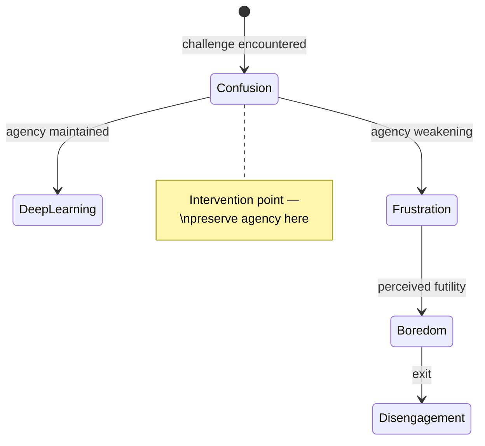

# Emotion and Cognition Are One System

## Statement

Confusion correlates with deep learning more than any other emotion, but has a shelf life. Motivation requires autonomy, competence, and relatedness (SDT), not rewards. Emotional state is learning infrastructure, not a side effect to manage.

## Rationale

Neuroscience has settled this: emotion and cognition are not separate processes. Immordino-Yang & Damasio establish that learning, memory, and decision-making are "subsumed within the processes of emotion." A system that models only knowledge states is modeling a ghost — the emotional dimension is not optional context but foundational infrastructure.

D'Mello & Graesser found that confusion correlates more strongly with deep learning than any other emotion — more than curiosity, more than engagement. Confusion signals cognitive disequilibrium, the state where existing mental models are being challenged and restructured. But confusion has a shelf life: unresolved, it degrades along a predictable chain.

Self-Determination Theory (Ryan & Deci) identifies three psychological needs that sustain motivation:
- **Autonomy** — "I'm choosing to do this." The learner perceives volition and ownership over their learning path.
- **Competence** — "I'm getting better at this." The learner perceives growth and increasing mastery.
- **Relatedness** — "Someone cares about my progress." The learner perceives connection and support from the learning relationship.

These are operational definitions the system can target, not abstract aspirations.

## Implications

- **Degradation chain.** Confusion → frustration → boredom → disengagement. The tipping point is not difficulty — it is loss of perceived agency. The system monitors for this chain and intervenes at the confusion→frustration boundary, not after disengagement has already occurred. Restoring agency (offering a choice, acknowledging the struggle, reframing the challenge) is the primary intervention.
<!-- Diagram: illustrates §Implications — degradation chain -->

*Figure 1. Emotional degradation chain: confusion is productive while agency holds. The tipping point is loss of perceived agency, not difficulty level.*

- **Loewenstein's information gap theory.** Curiosity requires three conditions: (1) some prior knowledge, (2) awareness of a gap, and (3) belief the gap is closeable. The mentor's job isn't to fill gaps — it's to create them strategically. Make the learner want to know before telling them. This means the system must assess prior knowledge before introducing new material, frame gaps as intriguing rather than threatening, and maintain the learner's belief that resolution is within reach.
- **Overjustification effect.** Gamification (points, badges, streaks, leaderboards) can destroy intrinsic motivation by shifting the learner's perceived locus of causality from internal to external. This is a named anti-pattern for Sensei. The system does not use extrinsic reward mechanisms that could undermine the autonomy and competence needs that sustain genuine engagement.
- **Perceived emotional support correlates with persistence whether the supporter is human or AI.** The system doesn't need to be human — it needs to create the conditions of a supportive relationship: safety (mistakes are expected and valued), being known (the system remembers and adapts), and being believed in (the system communicates genuine confidence in the learner's capacity to grow).

## Exceptions / Tensions

- Tensions with [P-productive-failure](productive-failure.md): productive failure deliberately induces confusion, which is the most learning-correlated emotion — but only if the degradation chain is interrupted before frustration sets in. The system must hold both truths simultaneously.
- Tensions with [P-know-the-learner](know-the-learner.md): emotional responses to the same pedagogical move vary dramatically across learners. What produces productive confusion in one learner produces immediate frustration in another. The learner profile must track emotional patterns, not just knowledge states.
- The relatedness need creates a design tension: the system must feel like a relationship without pretending to be human. Authenticity matters — perceived manipulation destroys the safety that relatedness requires.

## Source

Pedagogical Pillar (original, §2.4.2). Immordino-Yang & Damasio on emotion-cognition integration. D'Mello & Graesser on confusion as learning-correlated emotion. Self-Determination Theory (Ryan & Deci). Loewenstein's information gap theory of curiosity. [Bibliography #24] (affective dynamics), [Bibliography #25] (anticipatory affect).
