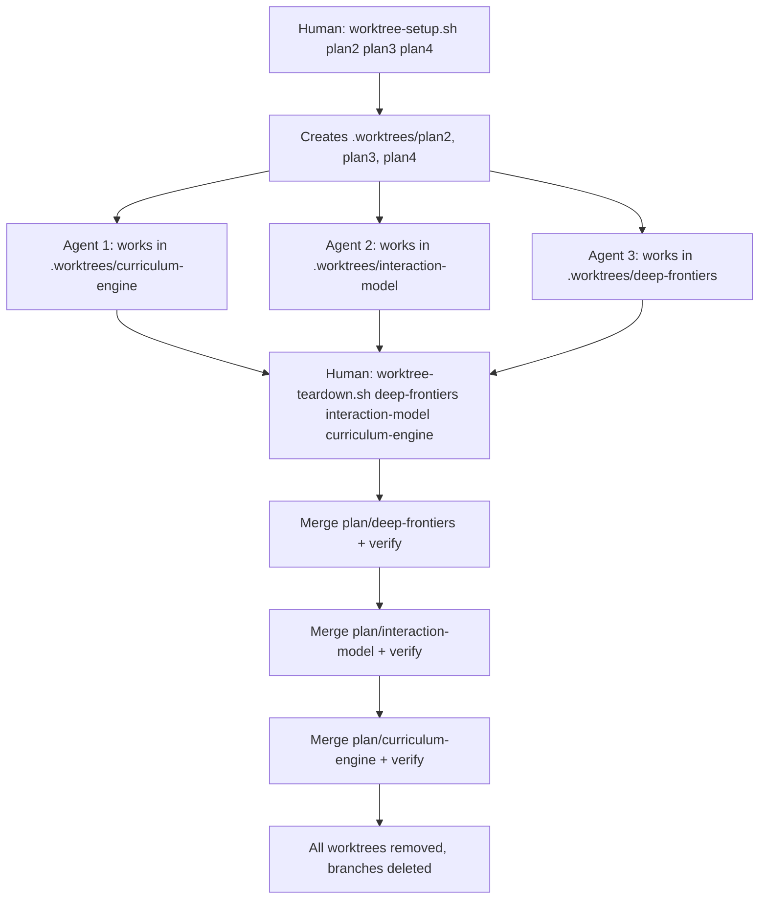

# Parallel Agent Execution — Runbook

How to run multiple LLM agents implementing different plans simultaneously.

## Why Worktrees

Two agents cannot implement different plans simultaneously in a shared working directory. One agent's branch creation changes the other's HEAD, uncommitted changes bleed across agents, and neither can reliably determine which changes are theirs to commit. Git worktrees give each agent a physically isolated checkout. Research (CAID, CMU 2026) confirms that filesystem isolation produces 63.3% task completion vs 55.5% with instruction-only isolation.

See [ADR-0016](../decisions/0016-git-worktrees-for-multi-agent-filesystem-isolation.md) for the decision record.

## Principles

- **Filesystem isolation** — each agent works in its own worktree; no shared state.
- **Commit attribution** — each agent commits only its own files.
- **Conflict-free by design** — parallel plans must have disjoint write sets.
- **Graceful degradation** — sequential execution (no worktrees) always works as a fallback.

### Out of scope

This system does not provide intra-plan parallelism, automated orchestration, inter-agent communication, or conflict resolution automation.

## Workflow



## When to Use

When the plan index (`docs/plans/README.md`) declares plans as parallelizable:
```
Plans 2, 3, 4 can run in parallel
```

## Setup

```bash
scripts/worktree-setup.sh curriculum-engine interaction-model deep-frontiers
```

This creates:
- `.worktrees/curriculum-engine/` on branch `plan/curriculum-engine`
- `.worktrees/interaction-model/` on branch `plan/interaction-model`
- `.worktrees/deep-frontiers/` on branch `plan/deep-frontiers`

The setup script is idempotent — if a worktree already exists, it skips with a message. Each worktree needs its own `pip install -e .` (~5s per worktree); the script runs this automatically if `pyproject.toml` exists.

## Launch Agents

Open each worktree directory in a separate LLM agent session:

| Agent Session | Directory | Instruction |
|---------------|-----------|-------------|
| Terminal 1 | `.worktrees/curriculum-engine/` | "Execute docs/plans/curriculum-engine.md" |
| Terminal 2 | `.worktrees/interaction-model/` | "Execute docs/plans/interaction-model.md" |
| Terminal 3 | `.worktrees/deep-frontiers/` | "Execute docs/plans/deep-frontiers-principles.md" |

Each agent sees a normal git repo. No special instructions needed.

## Shared Accumulation Files

Files that multiple plans legitimately modify (CHANGELOG.md, `docs/decisions/README.md`):
- Each agent defers these modifications to the END of their plan execution.
- During integration, the human resolves the trivial append-conflicts (keep all entries).
- The teardown script detects these conflicts and prints the resolution pattern.

## Integration

When all agents finish, merge back (smallest changes first):

```bash
scripts/worktree-teardown.sh deep-frontiers interaction-model curriculum-engine
```

The script merges each branch sequentially, running tests after each merge.

## Error Handling

| Failure | Script behavior |
|---------|----------------|
| Dirty working directory | Setup aborts before creating any worktrees |
| Worktree already exists | Setup skips with message |
| Branch already exists | Setup uses existing branch (warns if it's ahead of current HEAD) |
| Merge conflict during teardown | Teardown aborts, prints conflict files, leaves worktree intact for manual resolution |
| Verification fails after merge | Teardown aborts, prints failure output, leaves merge in progress for human to fix or abort |

## Troubleshooting

| Issue | Fix |
|-------|-----|
| "Working directory has uncommitted changes" | Commit or stash before setup |
| Worktree already exists | Script skips it; remove manually with `git worktree remove .worktrees/<name>` |
| Merge conflict during teardown | Resolve manually, `git merge --continue`, re-run teardown for remaining plans |
| Tests fail after merge | Fix the issue in the main checkout, commit, re-run teardown |
| Agent can't find dependencies | Run `pip install -e .` inside the worktree directory |
