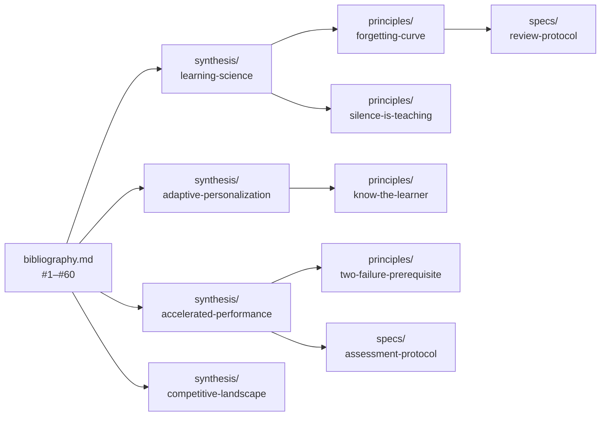

# Research

Three-tier research structure supporting the provenance chain: raw sources → deep reports → curated findings → principles/specs.

## Structure

```
docs/research/
├── README.md              ← this file
├── bibliography.md        ← Tier 1: 60 annotated citations (source index)
├── reports/               ← Tier 2: deep investigative reports
│   ├── agentic-pedagogy.md
│   └── llm-driven-pedagogy.md
└── synthesis/             ← Tier 3: curated findings bridging to specs/principles
    ├── README.md
    ├── learning-science.md
    ├── competitive-landscape.md
    ├── adaptive-personalization.md
    └── accelerated-performance.md
```

## Tiers

| Tier | Purpose | Format | Example |
|------|---------|--------|---------|
| **Bibliography** | Annotated source index — what we read and why | Per-entry: title, authors, year, URL, "Why it matters" | `bibliography.md` entry #8: Harvard RCT |
| **Reports** | Deep investigative analysis of a research question | Long-form (300-400 lines), with quotes and synthesis | `reports/agentic-pedagogy.md` |
| **Synthesis** | Curated findings with effect sizes and design implications, citing bibliography entry numbers | Themed, medium-length, `[Bibliography #N]` citations | `synthesis/learning-science.md` |

## Provenance Chain

<!-- Diagram: illustrates the research provenance chain -->

*Figure 1. Provenance chain: bibliography entries flow through synthesis docs into principles and specs.*

```
bibliography.md #N  →  synthesis/<theme>.md [Bibliography #N]  →  principle Rationale / spec Rationale
```

Foundation principles and feature specs cite synthesis docs in their Source/Rationale sections. Synthesis docs cite bibliography entries by number. The bibliography carries the full academic citation and URL.

## When to Add Content

- **New paper discovered** → add entry to `bibliography.md`
- **Deep investigation needed** → write a report in `reports/`
- **Finding informs a spec or principle** → add to the relevant synthesis doc with `[Bibliography #N]`
