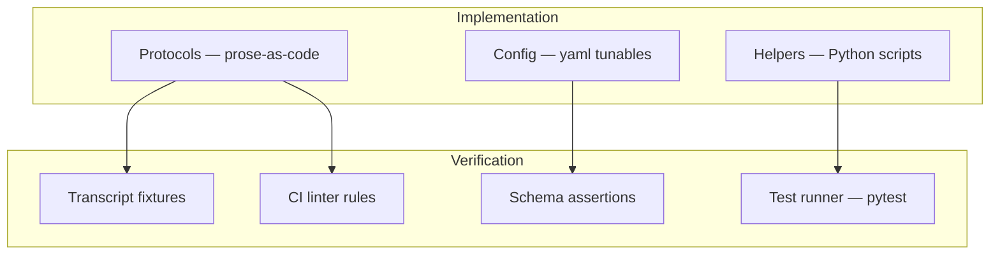

# Sensei's Instantiation of the SDD Stack

The development process in [`development-process.md`](development-process.md) describes Spec-Driven Development as a method: six generic layers (Specs → Design → ADRs → Plans → Implementation → Verification). This document describes how Sensei specifically instantiates the bottom two layers — **Implementation** and **Verification** — and will carry the load-bearing principles that make Sensei's instantiation distinctive.

For the generic method, read `development-process.md`. For Sensei's artifact choices, read this doc.

<!-- Diagram: illustrates §Implementation + Verification -->

*Figure 1. Implementation artifacts feed into verification: protocols verified by transcript fixtures, helpers by pytest, config by schema assertions, all by CI linter rules.*

> **Status: scaffolding.** Sensei is in the ideation-plus-scaffolding phase. The tables below describe the *intended* shape of Implementation and Verification, but most artifacts are placeholders. Load-bearing principles will be committed as they crystallize from the first real protocol. The runtime architecture question is resolved — see [ADR-0006](decisions/0006-hybrid-runtime-architecture.md).

## Implementation Layer (planned)

Implementation in Sensei is realized across three artifact types, all under `src/sensei/engine/`:

| Artifact type | Location | Executor | Role |
|---|---|---|---|
| Prose-as-code protocols | `src/sensei/engine/protocols/*.md` | LLM runtime | Judgment-requiring operations (mode selection, observation, decision) |
| Tunable configuration | `src/sensei/engine/defaults.yaml` | Both | Thresholds, vocabularies, limits, heuristics |
| Deterministic helpers | `src/sensei/engine/scripts/*.py` (non-`check-*`) | CPython | Mechanical work (config loading; scoring/scheduling math once runtime-code question is resolved) |

### Runtime Architecture (resolved by ADR-0006)

**Scripts compute what can be computed; protocols judge what requires understanding.** Sensei ships a hybrid runtime: prose-as-code protocols executed by the LLM, plus deterministic Python helpers executed by CPython. Protocols invoke helpers via shell subprocess.

**V1 helper inventory** (ships with the first protocol):

1. `scripts/config.py` — deep-merge loader (already shipped).
2. `scripts/mastery-check.py` — mastery-threshold gate for the assessor exception (§3.6).
3. `scripts/classify-confidence.py` — confidence × correctness → 4-quadrant label (§8.5).
4. `scripts/decay.py` — forgetting-curve freshness arithmetic.
5. `scripts/check-*.py` — schema validators, one per instance state file (added as schemas land).

**V2 deferrals** (separate ADR when needed): FSRS full scheduler, FIRe fractional credit propagation, per-student-per-topic speed calibration, affect detection.

See [`decisions/0006-hybrid-runtime-architecture.md`](decisions/0006-hybrid-runtime-architecture.md) for the full rationale, invocation-style decision, and deferred MCP path.

## Verification Layer (planned)

Verification in Sensei is the set of artifacts that confirm Implementation met its specs. Once specs exist, every spec invariant that can be checked mechanically will have a check.

| Artifact type | Location | Executor | Role |
|---|---|---|---|
| Executable assertions | `src/sensei/engine/scripts/check-*.py` | CPython | Structural checks (frontmatter, schemas, yaml shape) |
| Rule catalog | `memory/rules.yaml` (in instance) | CPython via `verify.py` | Registry of invariants with their check commands |
| Top-level runner | `sensei verify` (CLI) | CPython | Entry point for CI and inline invocation |
| Transcript fixtures | `tests/transcripts/<protocol>.md` + `<protocol>.dogfood.md` | pytest (tier-1, lexical) / LLM-as-judge (tier-2, operator-local) | Assert the LLM interpreting a protocol respects the invariants its spec declares. See [ADR-0011](decisions/0011-transcript-fixtures.md) and [design/transcript-fixtures.md](design/transcript-fixtures.md). |

## Load-Bearing Principles

Sensei's load-bearing principles have migrated to [`docs/foundations/principles/`](foundations/principles/) per [ADR-0012](decisions/0012-foundations-layer.md). The six technical principles that lived here (`prose-is-code`, `scripts-compute-protocols-judge`, `config-over-hardcoding`, `validators-close-the-loop`, `cross-link-dont-duplicate`, `prose-verified-by-prose`) are now first-class foundation files with the TOGAF shape (Statement / Rationale / Implications / Exceptions and Tensions / Source). Specs reference them via `realizes: [P-<slug>]` frontmatter; broken references are caught by [`ci/check_foundations.py`](../ci/check_foundations.py).

Sensei-specific pedagogical principles (the seven pillars from `docs/foundations/principles/`) land alongside them with `kind: pedagogical` in subsequent commits. See [`docs/foundations/principles/`](foundations/principles/) for the catalog.

## Where to Look for What

| Question | Read |
|---|---|
| "How is SDD supposed to flow?" | [`development-process.md`](development-process.md) |
| "What is Sensei as a product?" | [`docs/foundations/vision.md`](foundations/vision.md) |
| "Where are the tunables?" | `src/sensei/engine/defaults.yaml` |
| "Which ADRs have been accepted?" | [`decisions/README.md`](decisions/README.md) |
