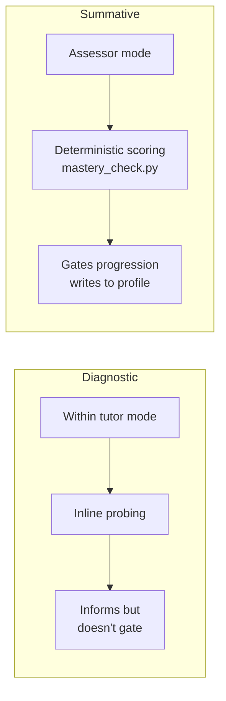
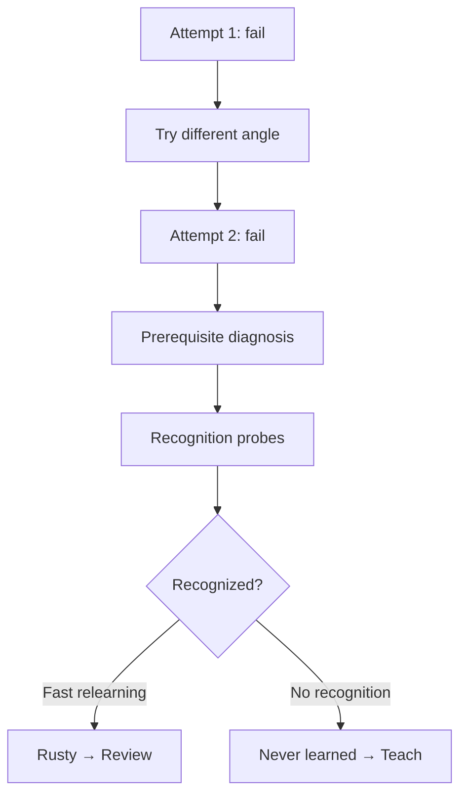

# Assessment Protocol

## Intent

Sensei uses two distinct assessment types that must not be conflated because they serve different purposes, run in different behavioral modes, and produce different kinds of evidence.

**Diagnostic assessment** answers "What does the learner know right now?" It happens *within* the teaching flow — the tutor probes understanding as part of the conversation, using inline questions, recognition probes, and observation of relearning speed. Diagnostic results inform the tutor's next move (reteach, advance, shift angle) but never gate progress. They are ephemeral signals, not verdicts.

**Summative assessment** answers "Has the learner mastered this?" It is the mastery gate. It happens at topic boundaries, invokes the assessor behavioral mode, and uses deterministic scoring via `mastery_check.py` — never LLM reasoning. Summative results write to the learner profile and determine whether the learner advances. The assessor exception applies absolutely: no teaching, no hints, no encouragement during summative assessment.

The separation exists because conflating the two corrupts both. If diagnostic probes gate progress, the tutor becomes an examiner and the learner stops treating conversation as safe exploration. If summative gates rely on LLM judgment, mastery thresholds flicker across sessions and models — the assessor exception becomes unenforceable. The hybrid runtime (ADR-0006) exists precisely to make this separation load-bearing: scripts compute the gate, protocols judge the understanding.

<!-- Diagram: illustrates §Intent — two assessment tracks -->

*Figure 1. Two assessment tracks: diagnostic (within teaching, non-gating) vs summative (assessor mode, deterministic, gates progress).*

## Invariants

- **Diagnostic assessment happens within tutor mode; summative invokes assessor mode.** The two assessment types never share a behavioral mode. Diagnostic probes are part of the teaching conversation. Summative assessment is a mode transition — the mentor stops teaching and starts measuring.
- **Summative uses deterministic scoring, never LLM reasoning.** The mastery gate runs through `mastery_check.py` (ADR-0006 v1 helper). The LLM classifies the learner's response; the script computes whether the threshold is met. This is the core of P-scripts-compute-protocols-judge applied to assessment.
- **The 90% mastery threshold is the summative gate.** A topic is not mastered until the learner meets the configured threshold (default 90%). The threshold is a number in config, checked by a script, not a feeling in the LLM's head.
- **Rusty-vs-never-learned detection uses recognition probes and relearning speed.** Diagnostic assessment distinguishes "rusty" (partial recognition, fast relearning, responds to brief cues) from "never learned" (no recognition, no partial recall). The distinction determines the remediation path: review for rusty, teach-from-scratch for never-learned.
- **Summative results write to the learner profile; diagnostic results inform but don't gate.** Summative assessment is a profile-writing event — it updates mastery state and determines progression. Diagnostic assessment is a signal the tutor consumes in-conversation; it does not write mastery state or block advancement.
- **The assessor exception is absolute.** During summative assessment, the mentor does not teach, hint, encourage, elaborate, or explain. No exceptions. The learner receives the question, gives the answer, and the script scores it. This is the hardest behavioral constraint in the system.
- **After two failures at the same concept, shift to prerequisite diagnosis.** Per P-two-failure-prerequisite, two failed summative attempts at the same concept mean the problem is deeper than explanation style. The protocol stops re-assessing and shifts to prerequisite diagnosis — using recognition probes to find the missing foundation. A third attempt without prerequisite repair is unproductive failure.

<!-- Diagram: illustrates §Invariants — two-failure prerequisite diagnosis -->

*Figure 2. Two-failure prerequisite diagnosis: after two failures, diagnose rather than explain a third time.*

## Rationale

The diagnostic/summative split is not a pedagogical nicety — it is a structural requirement of the product. Sensei's mastery-before-progress guarantee (P-mastery-before-progress) depends on a gate that holds. If the gate is soft (LLM-judged, tutor-embedded, or conflated with teaching), the guarantee is empty. ADR-0006 made the architectural decision that scripts compute what can be computed; this spec applies that decision to the highest-stakes computation in the system: whether the learner has mastered a topic.

The two-failure rule resolves a real tension. Without it, a learner who lacks prerequisites can fail the same summative gate indefinitely while the tutor tries increasingly creative explanations. Math Academy's finding — that one good explanation plus prerequisites outperforms many explanations — is the evidence. Two failures is the threshold where explanation-style variation stops being productive and prerequisite diagnosis becomes the only useful move.

The assessor exception's absoluteness is deliberate. Any softening ("just a small hint," "a word of encouragement") creates an ambiguity the LLM will exploit across sessions. The rule is binary so it can be verified by prose review: either the assessor spoke only to pose questions and record answers, or it didn't.

## Out of Scope

- **Graduated hinting.** The 5-level metacognitive→targeted progression from the ideation is valuable but belongs to a future teaching protocol, not to assessment. Hints inside summative assessment violate the assessor exception; hints inside diagnostic assessment are teaching moves, not assessment moves.
- **Affect-aware pacing.** Detecting frustration during assessment and adapting timing or difficulty is deferred. Assessment at v1 is affect-blind by design, consistent with the review protocol's stance.
- **Cross-goal assessment coordination.** Reasoning about whether mastery demonstrated in one goal satisfies a gate in another goal requires the prerequisite graph (ADR-0006 v2 scope) and is not v1.

## Decisions

- [ADR-0006: Hybrid Runtime](../decisions/0006-hybrid-runtime-architecture.md) — defines `mastery_check.py` and the deterministic scoring architecture that summative assessment depends on
- [docs/specs/review-protocol.md](review-protocol.md) — the retrieval protocol that assessment complements; review measures retention, assessment measures mastery
- [docs/specs/learner-profile.md](learner-profile.md) — the state that summative assessment writes to

## References

- P-two-failure-prerequisite — "Diagnostic vs Summative Assessment" — the source distinction this spec formalizes
- P-two-failure-prerequisite — "The Two-Failure Principle" — the prerequisite-diagnosis trigger
- docs/specs/review-protocol.md § Invariants — "The Assessor Exception" — the hard rule that summative assessment enforces
- [P-mastery-before-progress](../foundations/principles/mastery-before-progress.md) — the principle that requires a reliable gate
- [P-scripts-compute-protocols-judge](../foundations/principles/scripts-compute-protocols-judge.md) — the principle that requires deterministic scoring
- [P-two-failure-prerequisite](../foundations/principles/two-failure-prerequisite.md) — the principle that caps re-assessment at two failures
