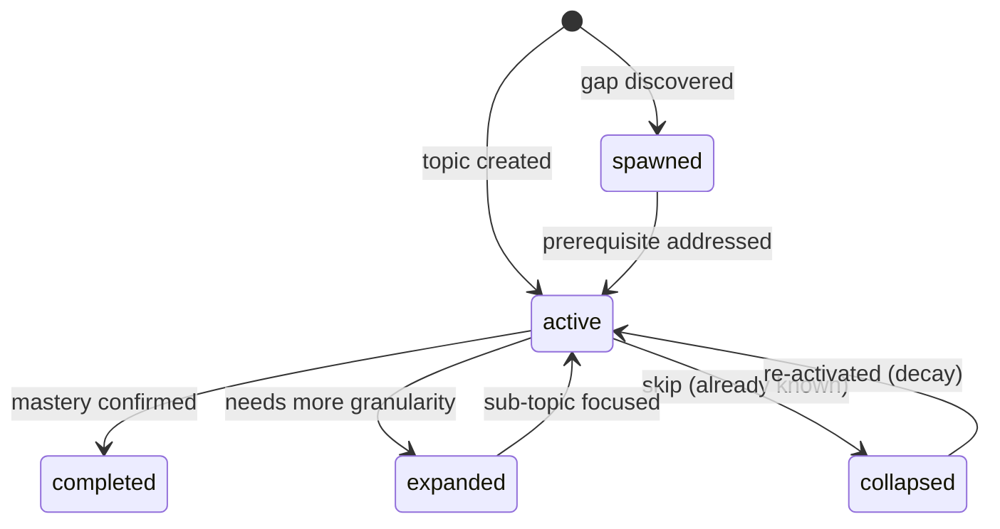
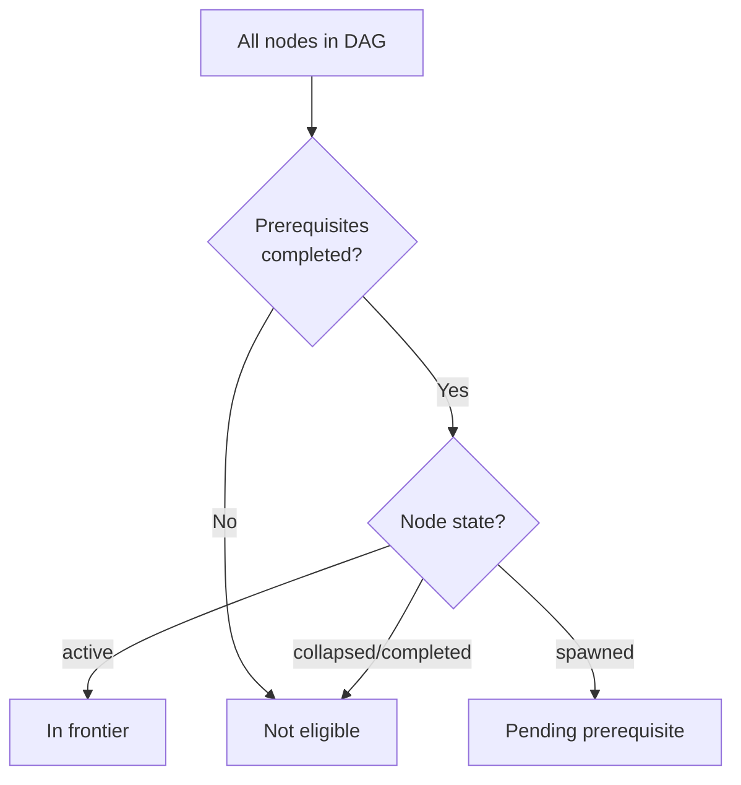

# Curriculum Graph

## Intent

The curriculum is a directed acyclic graph (DAG) of topics that represents Sensei's current hypothesis about what the learner needs to learn and in what order. Each node is a topic with typed state; edges encode prerequisite dependencies. The graph is generated immediately when a goal is created, biased toward the 70th-percentile learner, and then evolved incrementally through interaction — never regenerated wholesale.

The graph is the structural backbone that connects goal processing (what the learner wants) to protocol execution (what happens next). Protocols read the graph to determine the frontier — the set of topics eligible for teaching or review at any moment. The learner never sees the graph directly; they experience its effects as a coherent learning flow.

This spec exists because every protocol that selects "what to teach next" depends on a well-defined graph structure with clear state semantics. Without it, topic selection is ad hoc and the forgetting-curve pillar has no structure to schedule against.

## Invariants

- **The graph is a DAG.** No cycles. A topic cannot be its own transitive prerequisite. Any mutation that would introduce a cycle is rejected.
- **Five node states.** Every node is in exactly one state at any time:
  - **collapsed** — the learner already knows this topic; skip it. Entered when early calibration or explicit demonstration shows mastery. A collapsed node's dependents are unblocked.
  - **expanded** — the topic needs more granularity than initially generated. The node is replaced by a subgraph of finer-grained topics that collectively cover the original scope. The original node becomes a grouping label, not a teachable unit.
  - **spawned** — a gap discovered during interaction that was not in the original graph. Spawned nodes are inserted with appropriate dependency edges. They represent the hypothesis self-correcting.
  - **active** — the topic is currently being taught or assessed. At most one node is active per goal at any time.
  - **completed** — the learner has demonstrated sufficient mastery. Completed nodes contribute to unblocking dependents and feed the forgetting-curve decay model for future review.
<!-- Diagram: illustrates §Invariants — node states -->

*Figure 1. Curriculum graph node states and valid transitions.*

- **Frontier is computed, not stored.** The frontier — the set of topics eligible for activation — is derived dynamically from node states and dependency edges. A node is on the frontier when all its prerequisites are either collapsed or completed, and the node itself is neither collapsed, active, nor completed. The frontier is never persisted; it is recomputed on demand.
<!-- Diagram: illustrates §Invariants — frontier computation -->

*Figure 2. Frontier computation: a node enters the frontier when all its prerequisites are completed and it is in active state.*

- **Evolve, don't regenerate.** Graph mutations are incremental: collapse a node, expand a node into a subgraph, spawn a new node with edges, mark a node completed, activate a node. The graph is never thrown away and rebuilt from scratch. Wholesale regeneration is disorienting to the learner (even though they don't see the graph, they experience its effects as topic sequencing) and discards calibration evidence embedded in node states.
- **Validation effort scales with uncertainty.** For well-defined domains (e.g., "data structures"), the LLM-generated graph tolerates ~80% accuracy because the structure is correctable — errors surface as misplaced prerequisites and self-correct through interaction. For vague targets (e.g., "understand distributed systems deeply"), both the graph and the target are uncertain, so errors compound. Sensei invests more probing effort before stabilizing the graph when uncertainty is high.

## Rationale

**The curriculum DAG is hidden from the learner.** An earlier design question (§9) asked whether the learner should see and navigate the graph. The decision is no: Sensei manages the graph entirely, and the learner experiences the flow. Exposing the graph invites micromanagement of sequencing, which conflicts with the adaptive model. The learner's interface to the curriculum is conversation, not a visual map.

**LLM-generated graphs accept ~80% accuracy and self-correct.** The resolved §9 question on FIRe in a domain-agnostic system confirmed that LLM-generated prerequisite graphs are accurate enough for well-defined domains and self-correct over time through interaction. The graph is a hypothesis (per P-curriculum-is-hypothesis), not a ground-truth knowledge map. Errors are expected, tolerated, and corrected by the same interaction loop that calibrates the learner profile.

**DAG over tree.** A tree would force a single linear path through any topic's prerequisites. Real knowledge structures have shared prerequisites (e.g., "variables" is a prerequisite for both "loops" and "functions"). A DAG captures this naturally. The acyclicity constraint prevents pathological dependency loops while allowing the rich prerequisite sharing that real domains exhibit.

**Five states, not two.** A simpler model (done/not-done) cannot represent the curriculum-as-hypothesis lifecycle. Collapsed captures "the learner already knew this" — distinct from completed ("the learner learned this here"). Expanded captures "the hypothesis was too coarse." Spawned captures "the hypothesis missed something." These distinctions are load-bearing for the adaptation loop: they tell Sensei not just where the learner is, but how the hypothesis has changed.

## Out of Scope

- **Graph visualization or learner-facing UI.** The graph is an internal data structure. Any future visualization is a separate concern.
- **Cross-goal graph merging.** Each goal has its own graph. Shared concepts across goals are handled by cross-goal intelligence (see `cross-goal-intelligence.md`), not by merging graphs.
- **FSRS-based scheduling on graph nodes.** The forgetting curve uses the decay helper's exponential-freshness model. FSRS integration is deferred per ADR-0006.
- **Concurrent active nodes.** At v1, at most one node is active per goal. Parallel topic instruction is deferred.
- **Graph persistence format.** How the graph is serialized in the learner profile is specified in `learner-profile.md`, not here.

## Decisions

- [ADR-0015: Unified Goal-Processing Pipeline](../decisions/0015-unified-goal-pipeline.md) — the pipeline that generates and evolves the graph
- [ADR-0006: Hybrid Runtime](../decisions/0006-hybrid-runtime-architecture.md) — the runtime architecture that executes graph mutations via deterministic helpers

## References

- P-curriculum-is-hypothesis — Generate → Probe → Reshape model (originally §5.2)
- Original ideation §5.5 — the curriculum as living graph: collapsed, expanded, spawned nodes
- Original ideation §5.7 — accuracy risk: validation effort scales with uncertainty
- Original ideation §9 (resolved) — curriculum DAG is hidden; LLM-generated graphs accept ~80% accuracy
- `docs/foundations/principles/curriculum-is-hypothesis.md` — the principle this spec realizes
- `docs/foundations/principles/forgetting-curve-is-curriculum.md` — completed nodes feed the decay model
