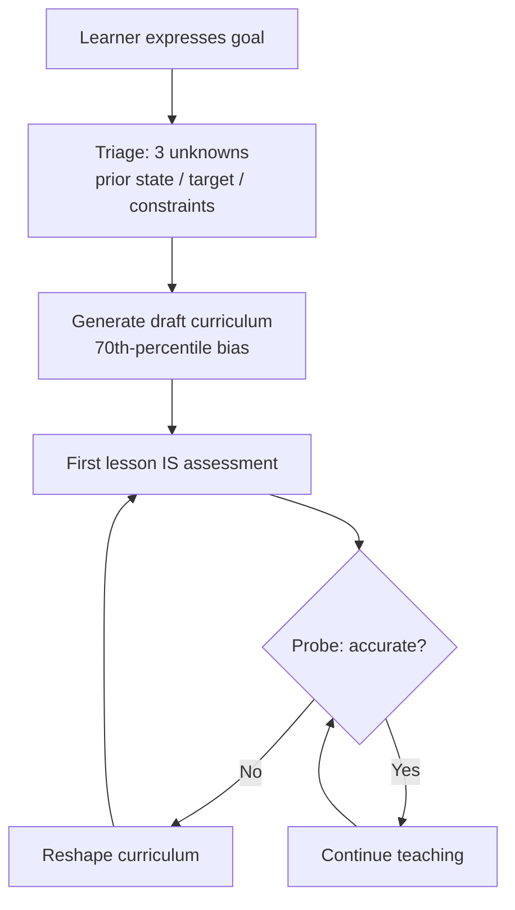

# Goal Lifecycle

## Intent

A learning goal is the unit of commitment between the learner and Sensei. This spec defines how goals are created, triaged, calibrated, and evolved — from the moment the learner expresses intent through the ongoing adaptation of the curriculum hypothesis.

The goal lifecycle exists because Sensei's adaptive model depends on a well-defined entry point. Without it, the system has no way to generate a curriculum hypothesis, no framework for triaging ambiguity, and no mechanism for the cold-start dissolution that the product promises. Every protocol downstream — teaching, review, assessment — assumes a goal exists and has been processed through this lifecycle.

## Invariants

- **Goals are created through conversation, never CLI.** The learner expresses a goal by talking to the mentor. There is no `sensei add-goal` command, no form, no structured input. The mentor parses intent from natural language. This preserves the mentor relationship and avoids reducing goal-setting to data entry.
- **The first interaction IS the assessment.** There is no separate onboarding phase, no intake questionnaire, no "tell me about yourself" preamble. When the learner states a goal, Sensei generates a draft curriculum immediately and begins teaching. The learner's performance on the first topic reveals prior knowledge, misconceptions, and pace far more reliably than self-report. One calibration prompt at most during init.
- **Draft curriculum generated immediately, biased toward the 70th-percentile learner.** Upon hearing a goal, Sensei generates a curriculum DAG biased toward what a moderately experienced learner in that domain would need. The draft is intentionally imprecise but usefully wrong — reacting to a concrete draft is 10× easier than answering abstract questions. The bias is a Bayesian prior that gets updated with every interaction.
- **All goals decompose into three unknowns.** Regardless of type, every goal reduces to: prior state (what does the learner already know?), target state (what does "done" look like?), and constraints (what shapes the path — time, context, depth, application domain). Goal types differ in which unknown is hardest to resolve, not in structure.
- **One pipeline, type-sensitive parameters.** Per ADR-0015, Sensei does not use different strategies per goal type. It uses one pipeline — triage ambiguity, resolve via minimal dialogue, generate a parameterized DAG, adapt at type-appropriate cadence — with parameters that vary by which unknown is dominant. Well-defined domains evolve slowly; vague aspirations evolve rapidly as the target itself shifts.

<!-- Diagram: illustrates §Invariants — goal lifecycle -->

*Figure 1. Goal lifecycle: generate → probe → reshape. The curriculum is a hypothesis continuously updated by evidence.*

## Rationale

**Init generates immediately without asking questions.** The resolved §9 question "How much should init ask?" was answered definitively: generate immediately, first lesson IS the assessment (§5.2). Questionnaires fail because learners are terrible at knowing what they don't know. A mentor discovers that through performance, not self-report. The draft curriculum gives the learner something concrete to react to, and the reaction is itself assessment data.

**Uncertain and vague goals are valid and evolve rapidly.** The resolved §9 question on uncertain target goals confirmed that vague aspirations like "understand distributed systems deeply" are first-class goals, not error states to be resolved before teaching begins. The target state unknown is simply harder to resolve for these goals, which means the curriculum hypothesis evolves at a faster cadence — the DAG reshapes more aggressively as interaction reveals what "deeply" means to this learner. The pipeline handles this through type-sensitive adaptation cadence, not through a separate "clarification phase."

**Conversation-only creation preserves the mentor relationship.** A CLI command for goal creation would be efficient but would frame goal-setting as a transactional operation. The product vision positions Sensei as a mentor, not a task manager. Goals emerge from dialogue — sometimes clearly stated, sometimes implied, sometimes discovered mid-lesson. The lifecycle must accommodate all of these entry points.

**Three-unknowns framework collapses goal diversity.** Without this framework, Sensei would need separate processing logic for each goal type — and the combinatorial explosion when goals blend types (a time-bounded vague aspiration) would make the system unmanageable. The three-unknowns model (§5.3) provides a universal decomposition that keeps one pipeline viable across all goal types.

## Out of Scope

- **Multi-goal prioritization and time allocation.** How Sensei balances effort across multiple active goals is specified in `cross-goal-intelligence.md`, not here.
- **Goal completion criteria.** What constitutes "done" for a goal depends on the target state unknown and is resolved through the curriculum graph's node completion semantics, not through a separate goal-level completion check.
- **Goal templates or presets.** Sensei does not ship pre-built goal definitions. Every goal is generated from conversation.
- **Goal sharing or export.** Goals are internal state. Portability is handled at the folder level (the instance is just a folder).
- **Proactive goal suggestions.** Sensei may suggest goals when patterns emerge (§9 resolved), but the suggestion mechanism is a separate concern from the lifecycle of an accepted goal.

## Decisions

- [ADR-0015: Unified Goal-Processing Pipeline](../decisions/0015-unified-goal-pipeline.md) — one pipeline with type-sensitive parameters
- [ADR-0006: Hybrid Runtime](../decisions/0006-hybrid-runtime-architecture.md) — deterministic helpers that support goal processing

## References

- P-curriculum-is-hypothesis — the core insight: constraint satisfaction disguised as generation (originally §5.1)
- P-curriculum-is-hypothesis — Generate → Probe → Reshape: the model this lifecycle implements (originally §5.2)
- ADR-0015 — every goal decomposes into three unknowns (originally §5.3)
- ADR-0015 — the unified approach: one pipeline, type-sensitive parameters (originally §5.4)
- Original ideation §5.6 — the cold start dissolves when the first lesson is the assessment
- Original ideation §9 (resolved) — init generates immediately; uncertain goals are valid
- `docs/specs/curriculum-graph.md` — the DAG structure that goals produce and evolve
- `docs/foundations/principles/curriculum-is-hypothesis.md` — curriculum as hypothesis, not plan
- `docs/foundations/principles/know-the-learner.md` — the meta-pillar that makes one pipeline viable
