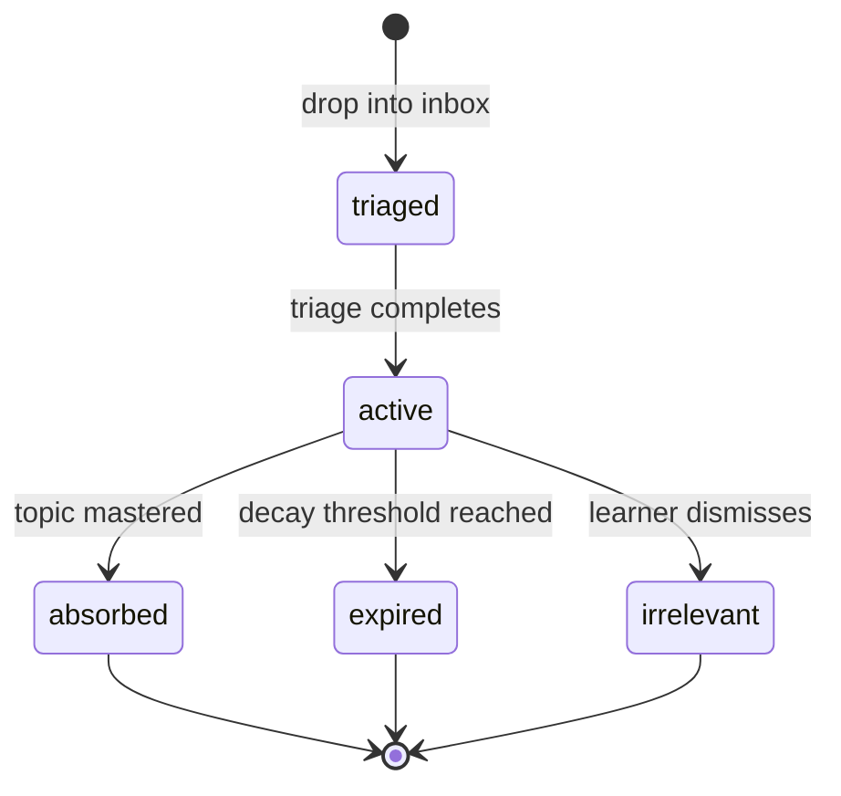

# Hints

## Intent

Sensei provides a hint system that lets learners capture external content they encounter during everyday browsing — tweets, videos, articles, repos, threads — and feed it back into their learning process. Hints are breadcrumbs that signal what the learner cares about *right now*. They are not learning material; they are interest signals.

Sensei triages these signals, extracts topic relevance, and uses them to bias curriculum priority. The learner drops content into a single inbox; Sensei handles classification, deduplication, and lifecycle management. Hints that align with the learner's goal boost related curriculum topics. Hints that go unacted decay and expire. The curriculum remains authoritative — hints influence priority, never structure.

<!-- figure:hint-lifecycle -->

*Figure 1. Hint lifecycle from inbox drop to terminal state.*

## Invariants

- **Universal inbox.** Sensei provides a single drop zone for external content. The learner never classifies content type — Sensei does.
- **Signal, not material.** A hint is a learner-saved external reference that signals interest in a topic relevant to their goal. Hints are breadcrumbs, not curriculum content.
- **Triage on demand.** Sensei processes unprocessed inbox items when the learner requests it or at session start via a non-blocking nudge. Triage extracts learning topics, scores relevance, detects duplicates, and clusters by topic area.
- **Boosting, not rewriting.** Hints bias curriculum priority — they do not replace or restructure the curriculum. Frequently-hinted topic areas receive priority boosts. Topics hinted but absent from the current plan are surfaced for the learner to accept or dismiss.
- **Three-layer deduplication.** Sensei deduplicates at the file level (same content processed twice), topic level (high overlap with an existing hint), and absorption level (topic already mastered per profile).
- **Defined lifecycle.** Each hint transitions through triaged → active → terminal (absorbed | expired | irrelevant). Active hints boost curriculum. Terminal hints are archived automatically.
- **Temporal decay.** Hint relevance decays over time. Unacted hints expire after a configurable period. Decay uses the same forgetting-curve model as review scheduling.
- **Archival, not deletion.** Terminal-state hints move to an archive, never deleted. The learner can recover dismissed hints. Deduplication checks against archived hints.
- **Implicit feedback.** When the learner studies a topic matching a hint's extracted topics, the hint transitions to absorbed automatically. Explicit feedback is also accepted.
- **Bounded influence.** Hint boosting has a configurable ceiling. A flood of hints on one topic cannot hijack the entire curriculum.

## Rationale

File-drop as the ingestion method matches Sensei's file-based, agent-agnostic philosophy — no browser extensions, no API integrations, no tool-specific affordances required. A universal inbox reduces cognitive load: the learner has one place for everything and zero classification decisions.

Boosting over rewriting respects the curriculum's pedagogical structure. The curriculum encodes sequencing, prerequisites, and mastery thresholds that ad-hoc interest signals lack the context to override. Decay prevents stale hints from polluting curriculum priority indefinitely — interest is perishable. Archival preserves learner history and enables deduplication across time without losing signal about past interests.

## Out of Scope

- **Automatic URL fetching/scraping.** V1 is file-drop only; Sensei does not fetch remote content.
- **Dedicated CLI command.** A `sensei hint add` command may earn its own feature spec later.
- **Browser extension or mobile integration.** Out of scope for the core engine.
- **Hint-to-hint dependency graphs.** Hints are independent signals, not a structured graph.
- **Collaborative hint sharing.** Sensei is single-learner; multi-learner sharing is deferred.

## Decisions

- [Design — Hints Ingestion](../design/hints-ingestion.md)
- [ADR-0017 — File-Drop Ingestion](../decisions/0017-file-drop-ingestion.md)
- [ADR-0019 — Universal Inbox over Typed Drop Zones](../decisions/0019-universal-inbox.md)

## References

- [Learner Profile spec](learner-profile.md) — profile mastery used for absorption detection
- [Curriculum Graph spec](curriculum-graph.md) — curriculum that hints boost
- [Review Protocol spec](review-protocol.md) — decay model reused for hint freshness
- [Persona: Jacundu](../foundations/personas/jacundu.md) — senior SDE browsing Twitter/YouTube during interview prep
