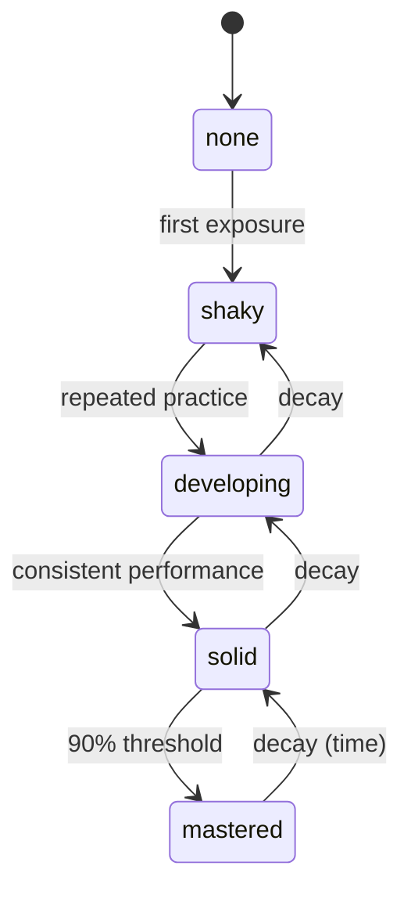

# Learner Profile

## Intent

Sensei maintains a persistent per-learner profile that records *what the learner knows* across sessions. The profile is the single source of truth for decisions that depend on prior state: whether a concept has been mastered, whether review is due, whether the mentor has standing to challenge versus introduce.

The v1 profile captures the smallest set of signals sufficient to enforce the assessor-exception hard rule (ADR-0006, §3.6) and the forgetting-curve spacing pillar (P-forgetting-curve-is-curriculum): per-topic mastery level, confidence, last-seen timestamp, and response counts. Everything else from the original ideation document (history preserved in git) §6.2 (learning_style, pace, weaknesses, engagement) is explicitly deferred to future specs — each added when a protocol requires it.

## Invariants

- **Single source of truth for mastery state.** Any mentor decision that depends on mastery, scheduling, or gating reads from the profile; no parallel caches, no per-session derived scoreboards that outlive the session. Complementary state stores (e.g., session notes for qualitative observations) may inform teaching approach and session continuity but never override profile-derived decisions.
- **Mastery is ordered.** The mastery axis has five levels in strict order: `none < shaky < developing < solid < mastered`. "Advanced" is never a level below "mastered" or above it; there is no sixth level at v1.
<!-- Diagram: illustrates §Invariants — mastery levels -->

*Figure 1. Mastery levels: progression through practice, demotion through decay. Monotonicity is not enforced.*

- **Confidence is a unit float.** Confidence for any topic is in `[0.0, 1.0]`. Values outside the range are an invalid profile.
- **Timestamps are absolute UTC, ISO-8601.** `last_seen` on each topic is a full ISO-8601 timestamp in UTC (Z-suffix or `+00:00`). No implicit local time.
- **Profile is schema-versioned.** Every profile carries `schema_version: <int>`. Loading a profile with a schema version the engine does not support is a validation failure, not a silent migration.
- **Absence is meaningful.** A topic that does not appear in `expertise_map` is equivalent to mastery `none` with no prior evidence — the learner has never been assessed on it. Adding it with level `none` and zero attempts is also valid and preserves the ability to record "we considered this topic but have no evidence yet."
- **Monotonicity is not enforced.** A topic's mastery level may drop between sessions (decay can trigger demotion per §8.1). The engine does not reject a downgrade; that is a legitimate pedagogical event, not data corruption.
- **Per-learner, global.** One profile per learner, spanning all goals. Goal-specific state lives in goal folders per §6.1, not duplicated here.
- **Automatic progress tracking.** Agents update the profile after every pedagogical interaction; progress tracking is automatic, not user-initiated.

## Rationale

The five-level mastery enum comes directly from the original ideation document §6.2. Retaining it verbatim preserves the ideation vocabulary and avoids a conversion layer between what the documents say and what the schema enforces.

Confidence as a unit float rather than a label (low / medium / high) is chosen because the confidence × correctness classifier (ADR-0006 v1 helper `classify_confidence.py`) accepts binary labels derived from a threshold, so the float is the more general representation from which labels can be produced. The threshold itself is a tunable that belongs in `defaults.yaml`, not in the profile.

`attempts` and `correct` counters are included at v1 (rather than deferred) because they are tiny, always-relevant, and the arithmetic needed to maintain them is trivial compared to anything richer (response histograms, per-attempt timestamps). They also directly support future mastery calibration helpers without requiring a schema bump.

Mastery scores are always visible to the learner — checkable anytime via conversation or `sensei status`. Transparency serves calibration and autonomy.

## Out of Scope

The following dimensions from §6.2 are explicitly **not** in v1:

- `learning_style` — requires pattern detection across many sessions; deferred until the mentor has a protocol that adapts modality.
- `pace` — computed from session timing, which requires session-end state that v1 does not track.
- `weaknesses` — pattern mining across errors; needs a taxonomy of error patterns first.
- `engagement` — emotional state (including engagement signals) is now tracked per the [emotional-state-tracking spec](emotional-state-tracking.md). Session-level emotional state informs topic ordering, deferral, and pacing.

These will each earn their own spec when a protocol needs them, with their own schema bump.

Also out of scope at v1: cross-profile intelligence (§4.4). Multi-goal coordination is now implemented per the [cross-goal-intelligence spec](cross-goal-intelligence.md) — concept tags enable shared-topic detection and coordinated review across goals.

## Decisions

- [ADR-0006: Hybrid Runtime](../decisions/0006-hybrid-runtime-architecture.md) — defines the helpers (`check_profile`, `mastery_check`) that consume this schema
- See also: the design doc [`learner-profile-state.md`](../design/learner-profile-state.md) for the concrete yaml shape realizing these invariants
