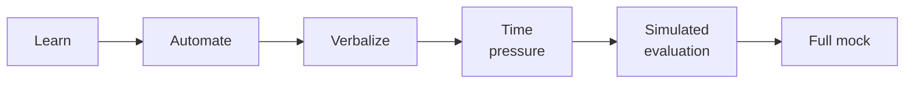

# Performance Training

## Intent

The Performance Preparation Stack is a cross-cutting journey phase that modifies how existing behavioral modes operate when a learner transitions from *knowing* to *performing under pressure*. The stack defines six ordered stages — learn → automate → verbalize → time pressure → simulated evaluation → full mock — that progressively shift the learner from conceptual understanding to exam-ready or interview-ready execution.

Performance training exists because learning and performing are different skills (see `docs/foundations/personas/jacundu.md`). A learner who can solve a problem in a quiet study session may fail the same problem under time pressure with an evaluator watching. The gap between "I understand this" and "I can execute this under stress" is the performance gap (see `docs/specs/behavioral-modes.md`), and closing it requires deliberate, staged preparation that no single behavioral mode addresses alone.

Rather than introducing a fifth mode or a separate agent, performance training overlays the existing four modes with phase-specific behaviors. The Tutor adds time awareness and pacing cues. The Challenger adds interview-style pressure and format constraints. The Assessor simulates realistic evaluation conditions — timed, observed, scored. The Reviewer continues its role in spaced retrieval of weak spots. The phase is entered when the learner has sufficient mastery across the relevant curriculum and an external performance event (interview, exam, certification) motivates the shift.

## Invariants

- **Performance training is a phase, not a fifth mode.** It is a journey phase that modifies the behavior of existing modes (Tutor, Challenger, Assessor, Reviewer). It does not introduce new modes, new agents, or a separate interaction pattern. The four-mode model remains the complete set of behavioral modes.
- **The six-stage stack is ordered.** The stages — learn → automate → verbalize → time pressure → simulated evaluation → full mock — form a progression. A learner does not skip to full mock without having passed through earlier stages for the relevant material. Each stage builds on the readiness established by the previous one.
- **Each stage modifies existing mode behaviors.** Tutor adds time awareness (pacing, clock management, when to move on). Challenger adds interview-style pressure (format constraints, curveball variations, thinking-aloud requirements). Assessor simulates evaluation conditions (timed problems, realistic scoring, no hints). No stage invents behavior outside the existing mode definitions. Observable behavioral deltas when the performance phase is active:
  - **Tutor:** adds time awareness cues ("you have ~3 minutes left on this type of problem"), pacing guidance (when to move on vs. when to dig in), and format-specific framing (e.g., "in an interview setting, you'd explain this as…").
  - **Challenger:** adds interview-style pressure (unexpected follow-ups, constraint mutations mid-problem), format constraints (whiteboard-only, no IDE, verbal-first), and thinking-aloud requirements ("walk me through your reasoning as you go").
  - **Assessor:** simulates evaluation conditions — timed, scored, no hints, no encouragement. The assessor exception applies with additional realism constraints: clock visible, scoring rubric disclosed upfront, no partial-credit negotiation. [V2]
  - **Reviewer:** targets weak spots identified during the performance phase for spaced retrieval. Review priority shifts toward topics where performance-phase attempts revealed execution gaps (knew the concept but failed under pressure).
- **Entry requires sufficient mastery across relevant curriculum.** Performance training is not a shortcut. The learner must have demonstrated adequate mastery of the underlying topics before the phase activates. Rushing a learner into timed mocks on material they haven't learned violates P-mastery-before-progress. The entry threshold is configurable via `performance_training.mastery_gate` in `defaults.yaml`, defaulting to `solid` — the same required level used by `mastery_check.py`. This means the learner must be at or above the `solid` mastery level on relevant topics before the performance phase activates.

<!-- Diagram: illustrates §Invariants — performance preparation stack -->

*Figure 1. Performance Preparation Stack: six ordered stages, each building on the previous.*

## Stage Definitions

| # | Stage | Dominant Mode(s) | Observable Behavioral Delta | Scope |
|---|-------|-------------------|----------------------------|-------|
| 1 | **Learn** | Tutor | Tutor frames material in the shape the performance format demands (e.g., "in an interview you'd phrase this as…"). No time pressure yet — focus is on format-aware understanding. | V1 |
| 2 | **Automate** | Tutor → Challenger | Repetition until recall is fluent. Tutor drills pattern recognition; Challenger introduces minor variations. The learner should produce correct answers without deliberation. | V1 |
| 3 | **Verbalize** | Challenger | Learner explains solutions aloud. Challenger enforces thinking-aloud requirements and probes for clarity. Builds the "narrate while solving" skill that interviews and oral exams demand. | V1 |
| 4 | **Time pressure** | Challenger + Tutor | Clock is introduced. Challenger sets time constraints; Tutor adds pacing guidance ("move on — you've spent too long here"). Problems are familiar; the new variable is speed. | V1 |
| 5 | **Simulated evaluation** | Assessor + Challenger | Assessor runs timed, scored problems under realistic conditions (no hints, no encouragement). Challenger adds curveball follow-ups. Scoring rubric disclosed upfront. | V2 |
| 6 | **Full mock** | Assessor + Reviewer | End-to-end simulation of the target event (full-length mock interview, timed exam). Reviewer debriefs afterward, targeting execution gaps for spaced retrieval. | V2 |

Stages 1–4 are V1 scope. Stages 5–6 (simulated evaluation and full mock) are deferred to V2 — they depend on the mock interview protocol and realistic scoring rubrics that are out of scope for this spec.

## Rationale

**Performance training is a cross-cutting journey phase, not a fifth mode or separate agent.** This was a resolved question in the product ideation (§9 / §3.9): the Performance Preparation Stack doesn't map cleanly to any single mode, but adding a fifth mode would fracture the behavioral model. Instead, performance training modifies how all modes behave when the learner's goal shifts from understanding to execution under pressure.

**The canonical example is Jacundu's three-week arc (§7.1).** The arc demonstrates how mode emphasis shifts across a performance-oriented journey:

- **Week 1 — Tutor-heavy.** Assessment and bridging. Honest diagnostic of what the learner knows, what they know in the wrong shape, and what's genuinely new. The Tutor maps professional experience to target-format patterns.
- **Week 2 — Challenger-heavy.** Deepening and gap-filling. Productive failure on identified weak spots. New concepts taught through the pedagogical pillars. The system knows exactly where blind spots are because Week 1 mapped the terrain.
- **Week 3 — Assessor + Reviewer.** Performance phase. Assessor runs timed mocks. Reviewer handles spaced retrieval of weak spots. Focus shifts from knowing to performing under pressure — solving while stressed, managing time, thinking out loud, pivoting when stuck.

This week-to-mode mapping is not a rigid schedule but an illustration of how the phase naturally shifts mode emphasis as the learner progresses through the stack. The same four modes are always available; what changes is which mode dominates and how each mode's behavior is modified by the performance context.

**The learning-vs-performing distinction is fundamental.** §7.1 identifies this as one of three new principles revealed by the Jacundu persona: "Knowing an algorithm and executing it under time pressure with someone watching are not the same thing. The pillars address learning but not performance under stress." Performance training closes this gap within the existing architectural model.

## Out of Scope

- **Implementation details.** How the phase is activated, how stage transitions are detected, and how mode overlays are configured are design concerns, not spec concerns.
- **Stress inoculation training specifics.** The psychological techniques for managing performance anxiety (breathing exercises, cognitive reframing, desensitization protocols) are not specified here.
- **Mock interview protocol.** The detailed orchestration of full mock interviews — timing, scoring rubrics, feedback format, interviewer simulation — will be specified in a dedicated protocol document.
- **Emotional-state detection.** Recognizing when anxiety is blocking learning vs. protecting identity (§7.1) is a broader concern that spans all modes and phases.

## Decisions

- [docs/specs/behavioral-modes.md](behavioral-modes.md) — the four-mode model that performance training modifies
- [ADR-0006: Hybrid Runtime](../decisions/0006-hybrid-runtime-architecture.md) — the runtime architecture within which performance training operates

## References

- docs/specs/behavioral-modes.md § Performance Preparation Stack — identifies the Performance Preparation Stack and establishes that performance training is a phase, not a fifth mode (originally §3.9)
- docs/foundations/personas/jacundu.md — the canonical three-week arc demonstrating mode-emphasis shifting under performance pressure (originally §7.1)
- docs/foundations/personas/jacundu.md — the principle that learning and performing under stress are different skills (originally §7.1)
