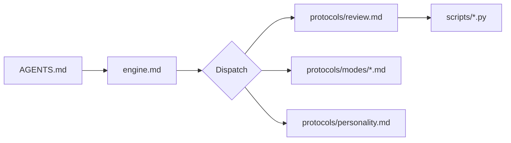

# Sensei Engine — Kernel

> **Status: active.** Review protocol authored (`protocols/review.md`). Behavioral modes authored (`protocols/personality.md` + `protocols/modes/`). The dispatch table below routes user intent to protocol files under `protocols/`.

This document is the kernel. Every LLM session starts at `AGENTS.md`, which routes here. From here, user intent is dispatched to a protocol file under `protocols/`.

## Boot Chain

```
AGENTS.md (root)
  └─► .sensei/engine.md   (this file, in a distributed instance)
        └─► .sensei/protocols/<name>.md   (operation-specific)
              ├─► .sensei/defaults.yaml   (config)
              ├─► .sensei/scripts/*.py    (deterministic helpers)
              └─► .sensei/prompts/*.md    (subroutine templates)
```

In the source repo (this one), the engine lives at `src/sensei/engine/` instead of `.sensei/`. The contents are identical; only the path differs.

<!-- Diagram: illustrates §Boot Chain -->

*Figure 1. Boot chain: AGENTS.md routes to engine.md, which dispatches to protocols. Protocols invoke helper scripts.*

## Dispatch Table

Every user-facing operation maps to exactly one protocol. All entries below are **TBD pending protocol authoring** — see [`docs/sensei-implementation.md`](../../../docs/sensei-implementation.md) for the open design questions that must be resolved first.

| User signal | Protocol file | Status |
|---|---|---|
| "I want to learn X" | `protocols/goal.md` | TBD |
| "Teach me" / "Let's work on X" | `protocols/tutor.md` | TBD |
| "Let's review" / "What should I review?" / "Quiz me on what I've learned" | `protocols/review.md` | accepted |
| "Review my solution" (code review) | `protocols/review-code.md` | TBD |
| "Quiz me" / "Am I ready?" | `protocols/assess.md` | TBD |
| "Challenge me" | `protocols/challenge.md` | TBD |
| "How am I doing?" | `protocols/status.md` | TBD |

## Invariants

These are the behavioral invariants the engine must preserve across every protocol. Each will be realized as a runtime assertion once protocols exist.

- **Assessor exception** — during assessment, the engine never teaches. (Source: `docs/specs/review-protocol.md` § Invariants)
- **Two-failure principle** — after two failed attempts at the same concept, diagnose prerequisites before a third explanation. (§3.8)
- **Silence profiles** — silence is a first-class pedagogical action; the engine's default is shorter responses, not longer. (§3.10)

## Configuration

All tunables live in `defaults.yaml` (engine) and are overridden by `instance/config.yaml` (learner instance). Protocols reference values via `config.dotpath` notation once they exist.

## References

- [`docs/sensei-implementation.md`](../../../docs/sensei-implementation.md) — what Implementation and Verification mean in this project
- [`docs/decisions/0002-agent-bootstrap.md`](../../../docs/decisions/0002-agent-bootstrap.md) — why `AGENTS.md` is the entry point
- [`docs/foundations/vision.md`](../../../docs/foundations/vision.md) — the product vision that invariants above derive from
