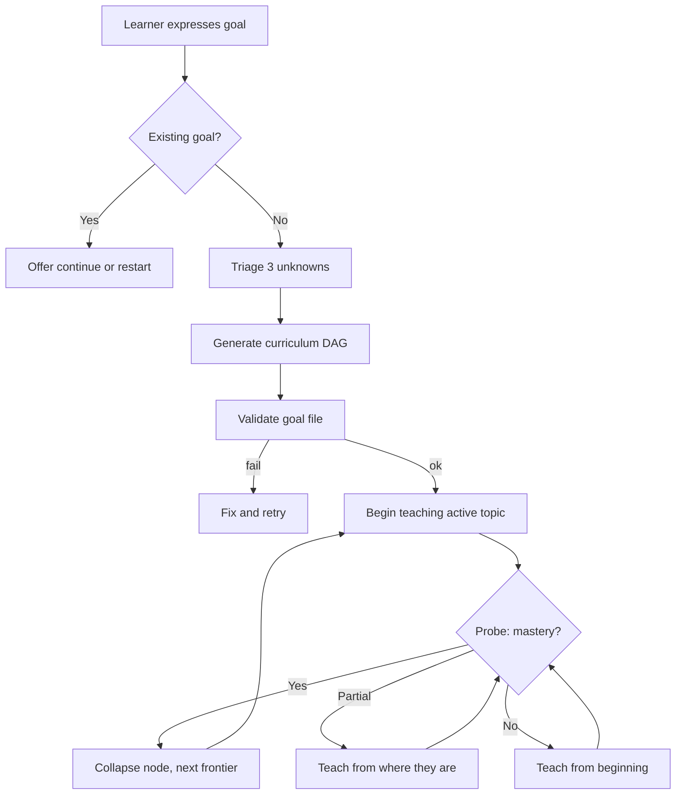

# Goal Protocol — Executable

> **This is prose-as-code.** An LLM runtime reads this file, interprets the steps literally, and executes them. Do not paraphrase, reorder, or skip. Deviations violate the spec at `docs/specs/goal-lifecycle.md`.

## Purpose

When the learner expresses a learning goal (e.g., "I want to learn X", "Help me with X", "Teach me X"), parse their intent, generate a curriculum hypothesis, and begin teaching immediately. The first lesson IS the assessment — there is no separate onboarding phase.

**This is not intake.** You do not interview the learner. You do not ask them to describe their background. You generate a draft curriculum biased toward the 70th-percentile learner and start teaching. The learner's performance reveals everything a questionnaire cannot.

<!-- Diagram: illustrates §Purpose -->

*Figure 1. Goal protocol flow: generate → probe → reshape. The learner is learning within 2 turns.*

## Invariants (from `docs/specs/goal-lifecycle.md`)

- Goals are created through conversation, never CLI.
- The first interaction IS the assessment. No intake, no questionnaire.
- Draft curriculum generated immediately, biased toward the 70th-percentile learner.
- All goals decompose into three unknowns: prior state, target state, constraints.
- One pipeline with type-sensitive parameters. No per-type branching.
- The learner must be LEARNING within 2 turns of stating their goal.

## Paths assumed

- Goals directory: `instance/goals/`
- Engine defaults: `.sensei/defaults.yaml`
- Instance overrides: `instance/config.yaml`
- Helpers: `.sensei/scripts/check_goal.py`
- Frontier computation: `.sensei/scripts/frontier.py`
- Graph mutations: `.sensei/scripts/mutate_graph.py`

Current UTC timestamp is generated with `date -u +%Y-%m-%dT%H:%M:%SZ` whenever the protocol needs "now".

---

## Step 1 — Parse the goal

Extract from the learner's message:

- **domain** — the subject area (e.g., "Rust", "distributed systems", "machine learning")
- **depth signal** — any indication of desired depth (e.g., "basics", "deeply", "advanced", "for production use")
- **constraints** — any time pressure ("in 2 weeks"), context ("for my job"), or application ("to build a web server")

Generate a slug from the domain: lowercase, hyphens for spaces, no special characters (e.g., `distributed-systems`, `rust-for-systems`).

## Step 2 — Check for existing goal

Look in `instance/goals/` for a file matching `<slug>.yaml`. If one exists and its `status` is `active`, say exactly:

> You already have an active goal for [topic]. Want to continue where we left off, or start fresh?

- If the learner says **continue**: load the goal file, find the node with state `active`, and go to Step 6.
- If the learner says **start fresh**: delete the existing file and proceed to Step 3.

If no matching file exists, proceed to Step 3.

## Step 3 — Triage the three unknowns

Assess from the learner's statement:

- **prior_state** — Do they seem to know something already?
  - `unknown` — cannot tell from the statement
  - `none` — explicitly a beginner ("I've never done X")
  - `partial` — some experience implied ("I know some X but…")
  - `strong` — significant experience implied ("I use X daily but want to go deeper")

- **target_state** — Is the goal clear or vague?
  - `vague` — no clear endpoint ("understand X", "get better at X")
  - `emerging` — directional but not precise ("learn X for Y")
  - `clear` — specific outcome stated ("build a REST API in Rust")

- **constraints** — Any time pressure, context, or application mentioned? Record as free text or `none`.

If `target_state` is `vague`, ask ONE clarifying question. Examples:

- "What would you want to be able to do with [topic] that you can't do now?"
- "Is there a project or context driving this?"

Do NOT ask more than one question. Do NOT ask if `target_state` is `emerging` or `clear`. After the learner responds (or if no question was needed), proceed to Step 4.

## Step 4 — Generate the curriculum DAG

Generate a draft curriculum as a list of 5–12 topics with prerequisite relationships. This is a hypothesis, not a plan.

Rules for generation:

- Bias toward the 70th-percentile learner in this domain. Not a complete beginner, not an expert.
- Each topic is a node with: `slug`, `title`, `state`, `prerequisites` (list of slugs).
- The graph MUST be a DAG — no cycles. A topic cannot be its own transitive prerequisite.
- Set the first frontier topic (a topic with no unmet prerequisites) to state `active`.
- All other topics start as `pending`.
- The draft is intentionally imprecise but usefully wrong. Err toward inclusion; nodes can be collapsed later.

Write the goal file to `instance/goals/<slug>.yaml` in this format:

```yaml
goal: <human-readable goal statement>
slug: <slug>
status: active
created: <current UTC ISO-8601>
prior_state: <unknown|none|partial|strong>
target_state: <vague|emerging|clear>
constraints: <free text or "none">
curriculum:
  - slug: <topic-slug>
    title: <Topic Title>
    state: <active|pending|collapsed|completed|expanded|spawned>
    prerequisites: []
  - slug: <topic-slug>
    title: <Topic Title>
    state: pending
    prerequisites: [<prerequisite-slug>]
  # ... 5-12 topics total
```

## Step 5 — Validate the goal file

Run:

```
python .sensei/scripts/check_goal.py --goal instance/goals/<slug>.yaml
```

Parse the output. If `status` is not `"ok"` (or exit code is non-zero):

- Read the error details.
- Fix the goal file to address the validation error.
- Re-run validation.
- If validation fails a second time, say:

> I generated a goal file but it won't validate. Details: `<one-line summary>`. Let me try a different approach.

Regenerate the curriculum with a simpler structure (fewer nodes, flatter graph) and validate again. If it still fails, surface the error and stop.

## Step 6 — Begin teaching the active topic

Find the node with state `active` in the curriculum. Transition to tutor mode.

Run `scripts/frontier.py --curriculum instance/goals/<slug>.yaml` to compute the frontier. Use the returned ordered list to select the next topic. If `instance/hints.yaml` exists, pass `--hints instance/hints.yaml` to incorporate learner-declared priority signals.

If no node is currently `active`, activate the first frontier topic:

```
python .sensei/scripts/mutate_graph.py --operation activate --node <slug> --curriculum instance/goals/<slug>.yaml
```

The first lesson IS the assessment. Start with a probe that reveals whether the learner already knows this topic. The probe should be:

- A question that requires producing knowledge, not recognizing it.
- Calibrated to the 70th-percentile — neither trivially easy nor impossibly hard.
- Natural and conversational, not quiz-like.

Example probe shapes (for calibration, not templates):

- "Before we dig in — how would you describe [concept] to a colleague?"
- "If you had to [apply concept], what would your first step be?"
- "What's your mental model of [concept]?"

Wait for the learner's response. Then classify:

- **Demonstrates mastery** (correct, confident, nuanced): Collapse this node. Find the next frontier topic (all prerequisites collapsed or completed, node is pending). Set it to `active`. Update the goal file. Say something brief like "You've got that. Let's move to [next topic]." Return to the top of Step 6 with the new active topic.

  Mark the node completed, then advance the frontier:

  ```
  python .sensei/scripts/mutate_graph.py --operation complete --node <topic-slug> --curriculum instance/goals/<slug>.yaml
  python .sensei/scripts/frontier.py --curriculum instance/goals/<slug>.yaml
  python .sensei/scripts/mutate_graph.py --operation activate --node <next-frontier-slug> --curriculum instance/goals/<slug>.yaml
  ```

  If the learner already knows a topic before teaching begins (revealed by the probe), collapse it instead:

  ```
  python .sensei/scripts/mutate_graph.py --operation collapse --node <topic-slug> --curriculum instance/goals/<slug>.yaml
  ```

- **Shows partial knowledge** (partially correct, or correct but uncertain): Continue teaching from where they are. Fill the gaps without re-explaining what they already know. Proceed in tutor mode.

- **Shows no knowledge** (incorrect, or "I don't know"): Teach from the beginning. Use the generate→probe→reshape loop: explain a concept, probe understanding, reshape based on response.

If teaching reveals a prerequisite gap (the learner lacks knowledge assumed by the current node), spawn a new node to cover it:

```
python .sensei/scripts/mutate_graph.py --operation spawn --node <new-slug> --prerequisites <comma-separated-prerequisite-slugs> --curriculum instance/goals/<slug>.yaml
```

Then activate the spawned node and teach it before returning to the original topic.

This is the ongoing teaching loop. Continue until the learner signals they want to stop, switch topics, or be assessed.

---

## Silence profile (binding)

- Tutor mode: ask more than tell. Target ~40% silence (questions, pauses, letting the learner think).
- Permitted: short acknowledgements (`Got it.`, `Right.`, `Okay.`), probing questions, concise explanations.
- Forbidden: questionnaires, intake forms, "tell me about yourself", multi-question onboarding, lengthy preambles before teaching begins.
- The learner MUST be learning within 2 turns of stating their goal.

## Forbidden patterns

- ❌ "Before we start, tell me about your experience with…"
- ❌ "Let me ask you a few questions to understand your level…"
- ❌ "On a scale of 1-10, how would you rate your…"
- ❌ "What's your learning style?"
- ❌ Any sequence of 2+ questions before teaching begins.

## Error handling

| Condition | Response |
|---|---|
| Goal file write fails (permissions, disk) | Surface error; do not proceed to teaching. |
| Validation fails after 2 retries | Surface error with details; stop. |
| Slug collision with inactive goal | Append timestamp suffix to slug. |
| Learner's goal is too broad to generate 5-12 topics | Generate at the highest useful abstraction level; nodes can be expanded later. |
| Learner's goal is too narrow for 5 topics | Generate 3-5 topics; the minimum is flexible for narrow goals. |

## References

- Spec: `docs/specs/goal-lifecycle.md`
- Spec: `docs/specs/curriculum-graph.md`
- ADR: `docs/decisions/0015-unified-goal-pipeline.md`
- ADR: `docs/decisions/0006-hybrid-runtime-architecture.md`
- Principle: `docs/foundations/principles/curriculum-is-hypothesis.md`
