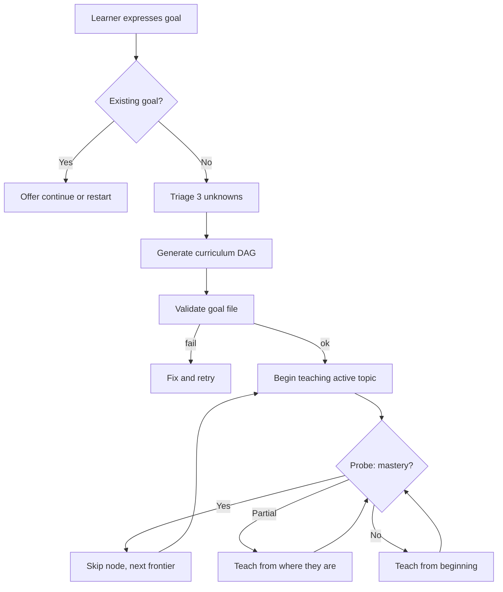

# Goal Protocol — Executable

> **This is prose-as-code.** An LLM runtime reads this file, interprets the steps literally, and executes them. Do not paraphrase, reorder, or skip. Deviations violate the spec at `docs/specs/goal-lifecycle.md`.

## Purpose

When the learner expresses a learning goal (e.g., "I want to learn X", "Help me with X", "Teach me X"), parse their intent, generate a curriculum hypothesis, and begin teaching immediately. The first lesson IS the assessment — there is no separate onboarding phase.

**This is not intake.** You do not interview the learner. You do not ask them to describe their background. You generate a draft curriculum biased toward the 70th-percentile learner and start teaching. The learner's performance reveals everything a questionnaire cannot.

<!-- Diagram: illustrates §Purpose -->

*Figure 1. Goal protocol flow: generate → probe → reshape. The learner is learning within 2 turns.*

## Invariants (from `docs/specs/goal-lifecycle.md`)

- Goals are created through conversation, never CLI.
- The first interaction IS the assessment. No intake, no questionnaire.
- Draft curriculum generated immediately, biased toward the 70th-percentile learner.
- All goals decompose into three unknowns: prior state, target state, constraints.
- One pipeline with type-sensitive parameters. No per-type branching.
- The learner must be LEARNING within 2 turns of stating their goal.

## Paths assumed

- Goals directory: `learner/goals/`
- Engine defaults: `.sensei/defaults.yaml`
- Learner overrides: `learner/config.yaml`
- Helpers: `.sensei/scripts/check_goal.py`
- Frontier computation: `.sensei/scripts/frontier.py`
- Graph mutations: `.sensei/scripts/mutate_graph.py`

**Script invocation:** All scripts are invoked via `.sensei/run <script>.py --args`. See `engine.md` §Running Helper Scripts.

Current UTC timestamp is generated with `date -u +%Y-%m-%dT%H:%M:%SZ` whenever the protocol needs "now".

---

## Step 1 — Parse the goal

Extract from the learner's message:

- **domain** — the subject area (e.g., "Rust", "distributed systems", "machine learning")
- **depth signal** — any indication of desired depth (e.g., "basics", "deeply", "advanced", "for production use")
- **constraints** — any time pressure ("in 2 weeks"), context ("for my job"), or application ("to build a web server")

Generate a slug from the domain: lowercase, hyphens for spaces, no special characters (e.g., `distributed-systems`, `rust-for-systems`).

## Step 2 — Check for existing goal

Look in `learner/goals/` for a file matching `<slug>.yaml`. If one exists and its `status` is `active`, say exactly:

> You already have an active goal for [topic]. Want to continue where we left off, or start fresh?

- If the learner says **continue**: load the goal file, find the node with state `active`, and go to Step 6.
- If the learner says **start fresh**: delete the existing file and proceed to Step 3.

If no matching file exists, proceed to Step 3.

## Step 3 — Triage the three unknowns

Assess from the learner's statement:

- **prior_state** — Do they seem to know something already?
  - `unknown` — cannot tell from the statement
  - `none` — explicitly a beginner ("I've never done X")
  - `partial` — some experience implied ("I know some X but…")
  - `strong` — significant experience implied ("I use X daily but want to go deeper")

- **target_state** — Is the goal clear or vague?
  - `vague` — no clear endpoint ("understand X", "get better at X")
  - `emerging` — directional but not precise ("learn X for Y")
  - `clear` — specific outcome stated ("build a REST API in Rust")

- **constraints** — Any time pressure, context, or application mentioned? Record as free text or `none`.

If `target_state` is `vague`, ask ONE clarifying question. Examples:

- "What would you want to be able to do with [topic] that you can't do now?"
- "Is there a project or context driving this?"

Do NOT ask more than one question. Do NOT ask if `target_state` is `emerging` or `clear`. After the learner responds (or if no question was needed), proceed to Step 4.

## Step 4 — Generate the curriculum DAG

Generate a draft curriculum as a list of 5–12 topics with prerequisite relationships. This is a hypothesis, not a plan.

Rules for generation:

- Bias toward the 70th-percentile learner in this domain. Not a complete beginner, not an expert.
- The graph MUST be a DAG — no cycles. A topic cannot be its own transitive prerequisite.
- Set the first frontier topic (a topic with no unmet prerequisites) to state `active`.
- All other topics start as `pending` (meaning: not yet started, waiting for prerequisites or activation).
- The draft is intentionally imprecise but usefully wrong. Err toward inclusion; nodes can be skipped later.

**Valid node states:** `active` (currently being taught — at most ONE), `pending` (not yet started), `inserted` (gap-fill prerequisite), `skipped` (skip — already known), `completed` (mastered), `decomposed` (needs sub-topics). For initial generation, use only `active` (one node) and `pending` (all others).

**Concept tags:** For each node, assign 1–3 `concept_tags` — lowercase slug-format abstract concepts (e.g., `"hash-maps"`, `"recursion"`, `"network-partitioning"`). Tags name the transferable knowledge, not the goal-specific application. Two goals teaching the same underlying concept under different names should share tags.

Write the goal file to `learner/goals/<slug>.yaml` in **exactly** this format:

```yaml
schema_version: 0
goal_id: <slug>
expressed_as: "<learner's original statement>"
created: "<current UTC ISO-8601>"
status: active
three_unknowns:
  prior_state: <unknown|none|partial|strong>
  target_state: <vague|emerging|clear>
  constraints: "<free text or none>"
nodes:
  <topic-slug>:
    state: active
    prerequisites: []
    concept_tags: [<abstract-concept>]
  <topic-slug>:
    state: pending
    prerequisites: [<prerequisite-slug>]
    concept_tags: [<concept-a>, <concept-b>]
  <topic-slug>:
    state: pending
    prerequisites: [<slug-a>, <slug-b>]
    concept_tags: [<concept>]
  # ... 5-12 topics total
```

**Critical:** The file must match this schema exactly. `nodes` is a map (not a list). Each node has only `state` and `prerequisites`. No `title` field. Topic slugs are lowercase with hyphens only (`^[a-z][a-z0-9-]*$`).

## Step 5 — Validate the goal file

Run:

```
.sensei/run check_goal.py --goal learner/goals/<slug>.yaml
```

Parse the output. If `status` is not `"ok"` (or exit code is non-zero):

- Read the error details.
- Fix the goal file to address the validation error.
- Re-run validation.
- If validation fails a second time, say:

> I generated a goal file but it won't validate. Details: `<one-line summary>`. Let me try a different approach.

Regenerate the curriculum with a simpler structure (fewer nodes, flatter graph) and validate again. If it still fails, surface the error and stop.

## Step 6 — Begin teaching the active topic

Find the node with state `active` in the curriculum. Transition to tutor mode.

**Global knowledge check:** Before teaching, check if this topic is already mastered globally:

```
.sensei/run global_knowledge.py --profile learner/profile.yaml --topic <active-topic>
```

If `known == true`: the learner already mastered this elsewhere. Skip the node:

```
.sensei/run mutate_graph.py --operation skip --node <topic> --curriculum learner/goals/<slug>.yaml
```

Say: "You already know [topic] from previous work. Skipping ahead."

Recompute the frontier and activate the next topic. Repeat the global knowledge check for the new topic. Continue until you find a topic that is NOT globally known, then teach it.

**If not globally known:** proceed with teaching.

Run `.sensei/run frontier.py --curriculum learner/goals/<slug>.yaml` to compute the frontier. Use the returned ordered list to select the next topic. If `learner/hints.yaml` exists, pass `--hints learner/hints.yaml` to incorporate learner-declared priority signals.

If no node is currently `active`, activate the first frontier topic:

```
.sensei/run mutate_graph.py --operation activate --node <slug> --curriculum learner/goals/<slug>.yaml
```

The first lesson IS the assessment. Start with a probe that reveals whether the learner already knows this topic. The probe should be:

- A question that requires producing knowledge, not recognizing it.
- Calibrated to the 70th-percentile — neither trivially easy nor impossibly hard.
- Natural and conversational, not quiz-like.

Example probe shapes (for calibration, not templates):

- "Before we dig in — how would you describe [concept] to a colleague?"
- "If you had to [apply concept], what would your first step be?"
- "What's your mental model of [concept]?"

Wait for the learner's response. Then classify:

- **Demonstrates mastery** (correct, confident, nuanced): Skip this node. Find the next frontier topic (all prerequisites skipped or completed, node is pending). Set it to `active`. Update the goal file. Say something brief like "You've got that. Let's move to [next topic]." Return to the top of Step 6 with the new active topic.

  Mark the node completed, then advance the frontier:

  ```
  .sensei/run mutate_graph.py --operation complete --node <topic-slug> --curriculum learner/goals/<slug>.yaml
  .sensei/run frontier.py --curriculum learner/goals/<slug>.yaml
  .sensei/run mutate_graph.py --operation activate --node <next-frontier-slug> --curriculum learner/goals/<slug>.yaml
  ```

  If the learner already knows a topic before teaching begins (revealed by the probe), skip it instead:

  ```
  .sensei/run mutate_graph.py --operation skip --node <topic-slug> --curriculum learner/goals/<slug>.yaml
  ```

- **Shows partial knowledge** (partially correct, or correct but uncertain): Continue teaching from where they are. Fill the gaps without re-explaining what they already know. Proceed in tutor mode.

- **Shows no knowledge** (incorrect, or "I don't know"): Teach from the beginning. Use the generate→probe→reshape loop: explain a concept, probe understanding, reshape based on response.

If teaching reveals a prerequisite gap (the learner lacks knowledge assumed by the current node), insert a new node to cover it:

```
.sensei/run mutate_graph.py --operation insert --node <new-slug> --prerequisites <comma-separated-prerequisite-slugs> --curriculum learner/goals/<slug>.yaml
```

Then activate the inserted node and teach it before returning to the original topic.

This is the ongoing teaching loop. Continue until the learner signals they want to stop, switch topics, or be assessed.

---

---

## Lifecycle Transitions

These transitions are triggered by learner intent expressed in natural language. They operate on the currently active goal unless the learner names a specific goal.

### Pause

**Triggers:** "pause this goal" / "take a break" / "switch goals" / "put this on hold"

1. Set `status: paused` in the goal file (`learner/goals/<slug>.yaml`).
2. Leave the current active node as-is (will resume from there).
3. Confirm: "Goal paused. Your progress is saved."

### Resume

**Triggers:** "resume [goal]" / "back to [goal]" / "continue [goal]"

1. If another goal is currently active, pause it first (run §Pause).
2. Set `status: active` in the target goal file. Set `resumed_at` to the current UTC timestamp. Clear `paused_at` (set to `null`).
3. Compute a decay-aware resume plan:
   ```
   .sensei/run resume_planner.py \
     --goal learner/goals/<slug>.yaml \
     --profile learner/profile.yaml \
     --half-life-days <config.memory.half_life_days> \
     --stale-threshold <config.memory.stale_threshold> \
     --now <utc>
   ```
   Parse the JSON output. The result contains `stale_topics` (sorted by freshness ascending), `frontier` (recomputed from current node states), and `recommended_action` (`"review_first"` or `"continue"`).

   If `resume_planner.py` fails (exit ≠ 0), fall back to continuing from the frontier without a decay check — run `.sensei/run frontier.py --curriculum learner/goals/<slug>.yaml` and proceed as if `recommended_action` were `"continue"`.
4. If `recommended_action` is `"review_first"`:
   - Report: "Resuming [goal]. You left off at [active topic]. [N] topics are getting stale: [list stale topic slugs]."
   - Offer: continue where you left off, or review stale topics first?
   - If the learner chooses review: route to the review protocol for the stale topics.
   - If the learner chooses continue: proceed to Step 6 (begin teaching).
5. If `recommended_action` is `"continue"`:
   - Report: "Resuming [goal]. You left off at [active topic]. Everything looks fresh."
   - Proceed to Step 6 (begin teaching).
6. Use the `frontier` from the resume plan to select the next topic if no node is currently `active`.

### Abandon

**Triggers:** "drop this goal" / "I don't want to learn X anymore" / "abandon [goal]"

1. Confirm: "Are you sure? Your progress will be preserved if you change your mind."
2. On confirmation: set `status: abandoned` in the goal file.
3. If this was the active goal, no goal is active. Offer to create or resume another.

### Complete (automatic)

After every `mutate_graph.py complete` or `skip` operation:

1. Check if ALL nodes in the curriculum have state `skipped` or `completed`.
2. If yes: set `status: completed` in the goal file.
3. Report: "Congratulations — you've completed [goal]! [Summary of what was learned]."
4. Offer: review topics periodically, set a new goal, or explore related areas?

---

## Performance Phase Activation

**Triggers:** "I have an interview coming up" / "Prepare me for the exam" / "Start performance training" / learner expresses a performance event (interview, exam, certification) for the current goal.

1. **Identify the event.** Extract from the learner's message:
   - `event_type` — one of `interview`, `exam`, `certification`. If unclear, ask: "Is this for an interview, an exam, or a certification?"
   - `event_date` — target date if mentioned, else `null`.

2. **Check the mastery gate.** The learner must have demonstrated mastery at or above `config.performance_training.mastery_gate` (default: `solid`) on the goal's completed nodes. Run:

   ```
   .sensei/run mastery_check.py \
     --profile learner/profile.yaml \
     --topic <active-topic> \
     --required <config.performance_training.mastery_gate>
   ```

   Run this for each completed node in the goal. Parse the output. If any relevant topic's mastery level is below the gate threshold:
   - Explain what gaps remain: "You're not ready for performance training yet. [Topic X] and [Topic Y] need more work. Let's strengthen those first."
   - Do NOT activate the phase. Continue normal learning.

3. **Activate the phase.** If the gate is met, update the goal file:

   ```yaml
   performance_training:
     active: true
     stage: 1
     entered_at: <current UTC ISO-8601>
     event_type: <interview|exam|certification>
     event_date: <date or null>
   ```

   Validate with `check_goal.py`. If validation fails, fix and retry (same error-handling as Step 5).

4. **Inform the learner.** Say: "Performance training is active. We're starting at stage 1 — learning [topic] in [event_type] format. No time pressure yet."

5. **Load the phase protocol.** Read `protocols/performance-training.md` in full. Apply the overlay matching the current active mode. Proceed with stage 1 behavior.

---

## Performance Phase Stage Advancement

When the performance phase is active, evaluate stage progression after each learner interaction. The phase protocol (`protocols/performance-training.md` §Stage Progression Rules) defines the criteria for each transition.

1. **Check progression criteria.** Based on the current stage:
   - **Stage 1 → 2:** Learner demonstrates correct format-aware understanding. Mentor judgment — no counter.
   - **Stage 2 → 3:** Learner produces `config.performance_training.stage_thresholds.automate` correct fluent recalls.
   - **Stage 3 → 4:** Learner delivers `config.performance_training.stage_thresholds.verbalize` clear verbal explanations.
   - **Stage 4 → [V2]:** Learner solves `config.performance_training.stage_thresholds.time_pressure` timed problems within budget. V1 stops at stage 4.

2. **Advance the stage.** Update the goal file:

   ```yaml
   performance_training:
     stage: <new_stage_number>
   ```

   Validate with `check_goal.py`.

3. **Inform the learner briefly.** Example: "You're fluent on these patterns. Adding the clock now — stage 4." Do not over-explain the stage model.

---

## Silence profile (binding)

- Tutor mode: ask more than tell. Target ~40% silence (questions, pauses, letting the learner think).
- Permitted: short acknowledgements (`Got it.`, `Right.`, `Okay.`), probing questions, concise explanations.
- Forbidden: questionnaires, intake forms, "tell me about yourself", multi-question onboarding, lengthy preambles before teaching begins.
- The learner MUST be learning within 2 turns of stating their goal.

## Forbidden patterns

- ❌ "Before we start, tell me about your experience with…"
- ❌ "Let me ask you a few questions to understand your level…"
- ❌ "On a scale of 1-10, how would you rate your…"
- ❌ "What's your learning style?"
- ❌ Any sequence of 2+ questions before teaching begins.

## Error handling

| Condition | Response |
|---|---|
| Goal file write fails (permissions, disk) | Surface error; do not proceed to teaching. |
| Validation fails after 2 retries | Surface error with details; stop. |
| Slug collision with inactive goal | Append timestamp suffix to slug. |
| Learner's goal is too broad to generate 5-12 topics | Generate at the highest useful abstraction level; nodes can be decomposed later. |
| Learner's goal is too narrow for 5 topics | Generate 3-5 topics; the minimum is flexible for narrow goals. |

## References

- Spec: `docs/specs/goal-lifecycle.md`
- Spec: `docs/specs/curriculum-graph.md`
- ADR: `docs/decisions/0015-unified-goal-pipeline.md`
- ADR: `docs/decisions/0006-hybrid-runtime-architecture.md`
- Principle: `docs/foundations/principles/curriculum-is-hypothesis.md`

<!-- PROVENANCE
Principles: P-curriculum-is-hypothesis, P-know-the-learner, P-mastery-before-progress
Synthesis: adaptive-personalization.md §Content Selection, learning-science.md §Teaching Methods (Ranked by Effectiveness)
-->
