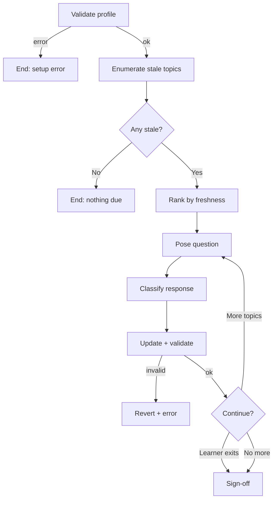

# Review Protocol — Executable

> **This is prose-as-code.** An LLM runtime reads this file, interprets the steps literally, and executes them. Do not paraphrase, reorder, or skip. Deviations violate the spec at `docs/specs/review-protocol.md`.

## Purpose

When the learner signals intent to review (e.g., "review", "let's review", "what should I review?", "quiz me on what I've learned"), select topics that have decayed below the stale threshold, pose one retrieval question per topic, record the response, update the profile, and repeat until either no stale topics remain or the learner exits.

**This is not reteaching.** If the learner misses a question, you record the miss and move on. You never explain the correct answer during review. If the learner wants explanation, route them to a different protocol; see Step 8.

<!-- Diagram: illustrates §Purpose -->

*Figure 1. Review protocol flow with error branches. Every path terminates cleanly.*

## Invariants (from `docs/specs/review-protocol.md`)

- Retrieval before anything else. No priming, no pre-teach.
- Stale-first selection, ascending by freshness.
- One topic at a time. No batching.
- Single write per question, post-classification. Every write validated.
- Learner may exit at any point; an in-flight question is discarded on exit.
- Assessor silence profile: neutral acknowledgements only. No praise, no elaboration.

## Paths assumed

- Profile: `learner/profile.yaml`
- Engine defaults: `.sensei/defaults.yaml`
- Learner overrides: `learner/config.yaml`
- Helpers: `.sensei/scripts/check_profile.py`, `.sensei/scripts/decay.py`, `.sensei/scripts/review_scheduler.py`, `.sensei/scripts/classify_confidence.py`

Current UTC timestamp is generated with `date -u +%Y-%m-%dT%H:%M:%SZ` whenever the protocol needs "now".

---

## Step 1 — Load and validate the profile

Run:

```
.sensei/run check_profile.py --profile learner/profile.yaml
```

Parse the single JSON line from stdout. If `status` is not `"ok"` (or exit code is non-zero), say exactly:

> Your profile isn't valid right now — I can't run a review until it's fixed. Details: `<one-line summary from errors[]>`.

Then go to Step 9. No writes in this session.

## Step 2 — Enumerate stale topics

Read `.sensei/defaults.yaml` and (if present) `learner/config.yaml`. Mentally deep-merge the two config files with the instance overriding. Extract:

- `half_life_days` ← `config.memory.half_life_days`
- `stale_threshold` ← `config.memory.stale_threshold`

**Concept-aware review.** Before invoking `review_scheduler.py`, scan all active goal files for `concept_tags` on completed nodes. Build a concept→slugs mapping (e.g., `{"recursion": ["recursion", "recursive-backtracking"]}`). If any stale topic shares concept tags with a topic recently reviewed in another goal, that topic gets partial freshness credit — evidence of recall, not proof. Pass the mapping as `--concept-map '<json>'` to the scheduler.

**Interleaving.** For each stale completed topic, determine its area: the top-level DAG branch it belongs to (walk `prerequisites` to the root ancestor) for within-goal topics, or the `goal_id` for cross-goal topics. Build a slug→area mapping. Read `interleaving.enabled`, `interleaving.intensity`, and `interleaving.min_mastery` from config. If enabled, pass `--interleave --interleave-intensity <intensity> --min-mastery <min_mastery> --topic-areas '<json>'` to the scheduler. Do NOT label topics with their area when presenting questions — the learner must identify the problem type (discriminative contrast).

Run a single cross-goal review scheduling invocation:

```
.sensei/run review_scheduler.py \
  --goals-dir learner/goals \
  --profile learner/profile.yaml \
  --half-life-days <half_life_days> \
  --stale-threshold <stale_threshold> \
  --now <current-utc>
```

Parse the JSON array from stdout. Each element has `{topic, freshness, elapsed_days, goals}`. This is the stale list — topics are already deduplicated across goals (a topic stale in two goals appears once, with the lowest freshness) and sorted by freshness ascending.

If the invocation fails (exit ≠ 0), fall back to treating all completed topics in the profile as review candidates: read `learner/profile.yaml` and collect every slug in `expertise_map` as a candidate with `freshness: 0.0`.

## Step 3 — Exit if nothing is due

If the list from Step 2 is empty, say exactly:

> Nothing due for review right now.

Then go to Step 9.

## Step 4 — Rank candidates

The stale list from Step 2 is already sorted by `freshness` ascending (lowest first — most stale wins) by `review_scheduler.py`. Use it directly as the ranked queue. Do not re-rank inside the loop.

## Step 5 — Pose a single retrieval question

Pop the top of the ranked queue. Compose exactly one retrieval question for that topic slug.

Question rules:
- Short. One or two sentences.
- Declarative or imperative.
- No scaffolding. No "think about X", no "recall that…".
- No hint. No multiple-choice. No rubric.
- Do not name the topic slug verbatim in the question unless the topic itself is an identifier the learner would need to produce.

Example shapes (for calibration, not templates):
- "What does `map` do in Python?"
- "Give me the recurrence for merge sort."
- "Write the base case for factorial."

Emit only the question. Nothing before, nothing after. Wait for the learner's next message.

## Step 6 — Classify the response

When the learner responds, determine two binary labels:

- `correctness` — `correct` if the response matches the expected answer for the topic; `incorrect` otherwise. Partial credit counts as `incorrect` at v1.
- `confidence` — `confident` if the response is direct and assertive; `uncertain` if it is hedged, partial, or qualified ("I think", "maybe", "not sure", "I believe").

Run:

```
.sensei/run classify_confidence.py \
  --confidence <label> \
  --correctness <label>
```

Parse the returned JSON. The `quadrant` and `interpretation` are recorded for logging but do not drive the write rule at v1.

If the invocation fails, say:

> Something is wrong with the classifier — ending the session.

and go to Step 9 without writing.

## Step 7 — Update the profile

In memory, update the topic's state per the V1 rule:

- `last_seen` ← the current UTC timestamp produced by `date -u +%Y-%m-%dT%H:%M:%SZ`.
- `attempts` ← `attempts + 1`.
- `correct` ← `correct + 1` if `correctness == "correct"`, else unchanged.
- `mastery` unchanged.
- `confidence` unchanged.
- `stability` ← if `correctness == "correct"`: `stability * memory.stability_growth` (default ×2.0). If incorrect: `max(memory.stability_floor, stability * memory.stability_decay)` (default floor 1.0, ×0.5). If `stability` is null, skip (topic not yet completed via tutor protocol).

Write the updated `learner/profile.yaml`. Then re-validate:

```
.sensei/run check_profile.py --profile learner/profile.yaml
```

If validation fails, restore the previous file contents, say:

> I couldn't record that response — the profile would have been invalid. Session ended.

and go to Step 9.

## Step 8 — Acknowledge and transition

Pick exactly one of the following short acknowledgements and emit only it:

- `Got it.`
- `Okay.`
- `Recorded.`

Then:

- If the learner's previous turn contained a stop signal (see the list in "Error handling" below), go to Step 9.
- Else, if the ranked queue from Step 4 still has candidates, pop the next one and go to Step 5.
- Else, go to Step 9.

Do not explain the correct answer. Do not elaborate on what was missed. Do not praise a correct answer.

**If the learner asks a question of you** during review (for example, "What was the right answer?" or "Can you explain that?"), say exactly:

> I won't explain during review — that's a separate protocol. Would you like to end review and switch?

If they answer yes, go to Step 9 and surface a suggestion to invoke the teach protocol (which does not yet exist at v1). If they answer no, return to Step 5 with the next queued topic.

## Step 9 — Sign off

Say exactly:

> That's it for now.

Then stop. No summary, no celebration, no follow-up question.

---

## Affect-aware pacing

At review start, read `emotional_state` from `learner/profile.yaml`. If `frustration` is `frustrated` or `overwhelmed`, reduce the review queue length and start with topics the learner is likely to recall successfully. If `engagement` is `passive` or `disengaged`, shorten the session. These are pacing decisions — the silence profile and no-reteach rules still hold.

## Silence profile (binding)

- Default to the shortest response that accomplishes the step.
- Permitted acknowledgements in-session: `Got it.`, `Okay.`, `Recorded.`, `Next.`, `That's it for now.`
- Forbidden in-session: any praise (`Great!`, `Nice work!`, `You're doing well.`), any reteach language (`Actually, X is Y because…`, `The correct answer is…`), any summary of what was covered, any emoji.

If you find yourself composing a sentence that describes the learner's performance, stop — that sentence is out of spec.

## Stop signals

Treat any of the following learner utterances as a request to exit: `stop`, `that's enough`, `later`, `done`, `quit`, `bye`, `gotta go`, `no more`. On any of these, discard any in-flight response (do not classify, do not write) and go directly to Step 9.

## Error handling summary

| Condition | Response |
|---|---|
| Step 1 validation fails | Surface error; go to Step 9. No writes. |
| review_scheduler.py fails | Fall back to all completed topics as candidates; continue. |
| classify_confidence fails | Error message; go to Step 9 without writing. |
| Profile write produces an invalid profile | Revert on disk; error message; go to Step 9. |
| Learner emits a stop signal | Discard in-flight state; go to Step 9. |

## References

- Spec: `docs/specs/review-protocol.md`
- Design: `docs/design/review-protocol.md`
- ADR: `docs/decisions/0006-hybrid-runtime-architecture.md`

<!-- PROVENANCE
Principles: P-forgetting-curve-is-curriculum, P-mastery-before-progress, P-silence-is-teaching
Synthesis: learning-science.md §Spaced Repetition & Memory, accelerated-performance.md §Fractional Implicit Repetition (FIRe)
-->
